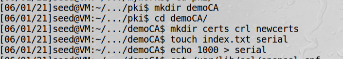
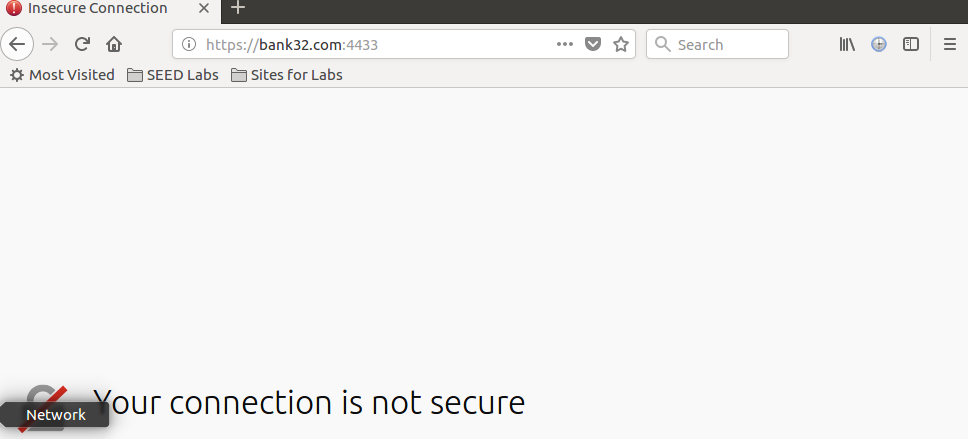

# 认证机构

认证机构（CA）是一个可信的、能够签发数字证书的实体。在签发证书之前，CA需要验证证书申请者的身份。  
公钥基础设施的可信赖性依赖于这个验证过程。  
CA的核心功能有以下两个：  
1、验证Subject域  
2、对证书进行数字签名  

**Subject域验证**，在许多公钥证书中，Subject域包含一个域名，CA需要检查申请者是否拥有这个域名，CA会生成
一个随机数字让申请者放在网站上，如果能做到就证明申请者拥有该域名。有时一些信息不容易验证，CA通常会将验证功能
委托给一个专门的叫做注册机构的实体（RA）

**签名数字证书**，一旦CA验证了证书申请者的身份，它就可以用私钥为这个证书生成一个数字签名。任何人只要拥有
CA的公钥就可以验证证书的真伪。

## 成为认证机构

实验目标是建立一个叫modelCA的认证机构  
实验步骤：  
1、部署CA  
使用openssl来创建一个CA，配置文件/usr/lib/ssl/openssl.cnf已经在虚拟机中配置好了，根据配置，
需要创建如下文件和文件夹：


2、为ModelCA生成公钥-私钥对和证书  
创建公钥-私钥对并生成一个自签名证书：
```bash
openssl req -x509 -newkey rsa:4096 -sha256 -days 3650 -keyout modelCA_key.pem -out modelCA_cert.pem
```
rsa:4096表示4096位的RSA  
公钥和私钥存储在受密码保护的文件modelCA_key.pem中  
选项-x509指明生成一个自签名的公钥证书，而不是一个证书请求  
自签名证书保存在modelCA_cert.pem中  
这个证书3650天有效  

!!! 签名算法

    CA的签名是签在证书的单向哈希值上，openssl默认使用SHA1算法生成单向哈希值，但是2017年SHA1被发现是不安全的，
    因此这里用-sha256，使用SHA2算法

!!! CA证书

    为了验证CA生成的证书，需要用到CA的公钥，因此每一个CA都需要有自己的数字证书。如果CA是一个中间CA，那么它
    的证书必须由其他CA颁发。如果CA是一个根CA，则需要自己给自己颁发公钥证书，也就是自己在公钥证书上签名。这样
    的证书称为自签名证书


## 从CA获取X.509数字证书

**1、生成公钥-私钥对**:  
```bash
openssl genrsa -aes128 -out bank_key.pem 2048
```
不加-aes128则没有密码保护


查看bank_key.pem的实际内容：
```bash
openssl rsa -noout -text -in bank_key.pem
```
可以看到bank_key.pem除了包含公钥、私钥、模数的质因子，还有指数1、指数2和系数等


**2、生成证书签名请求**:  

```bash
openssl req -new -key bank_key.pem -out bank.csr -sha256
```
生成的证书签名请求保存在bank.csr中，这是一个经过编码的文件  


查看csr文件内容：
```bash
openssl req -in bank.csr -text -noout
```

上面证书请求也包含一个数字签名，这个签名是由申请者用自己的私钥生成的。

**3、CA的验证与签名**：  

!!! Note

    现实中，银行提交CSR文件给CA，CA在验证完CSR中的信息后，会给银行签发一个X.509证书。  
    在本模拟实验中，直接用命令生成证书

```bash
openssl ca -in bank.csr -out bank_cert.pem -md sha256 -cert modelCA_cert.pem -keyfile modelCA_key.pem
```
以上命令先用银行的csr文件和来自CA证书的信息modelCA_cert.pem文件生成一个X.509证书，然后用CA的私钥（modelCA_key.pem）
签名证书。生成的证书存储在bank_cert.pem文件中。  
openssl默认使用SHA1不安全，故指定-md sha256  

用Seed Labs指定的虚拟机由于已经配置好了，以上命令可以直接成功。最终生成了bank_cert.pem

!!! openssl配置

    在配置文件/usr/lib/ssl/openssl.cnf中有一条默认的匹配规则policy=policy_match，它要求请求中的subject域
    与CA的一致。可以把这个配置文件复制到当前目录，把默认的匹配规则改为policy=policy_anything  
    苹果电脑在/private/etc/ssl/openssl.cnf  

```bash
openssl ca -in bank.csr -out bank_cert.pem -md sha256 -cert modelCA_cert.pem -keyfile modelCA_key.pem -config openssl.cnf
```

openssl全的配置文件在[openssl.cnf](https://github.com/openssl/openssl/blob/master/apps/openssl.cnf)

## 在网络服务器中部署公钥证书

为了使用openssl自带的服务器，需要将银行的私钥文件和公钥证书合并到一个文件（bank_all.pem）,然后启动服务，脚本如下：
```bash
cp bank_key.pem bank_all.pem
cat bank_cert.pem >> bank_all.pem
openssl s_server -cert bank_all.pem -accept 4433 -www
```


在/etc/hosts文件中配置127.0.0.1  bank32.com便于访问  

因为浏览器没有ModelCA的公钥，因此它无法验证银行证书中的签名  
可以手动加入信任列表：Edit-Preference-Privacy & Security-View Certificates

导入modelCA_cert.pem

再次访问就正常了


除了使用浏览器，也可以使用openssl s_client访问网络服务器，这个命令会输出大量调试信息。

由于客户端无法获得签发者的证书，所以无法验证bank32.com的证书，可以使用-CAfile选项告诉客户端程序ModelCA的证书
```bash
openssl s_client -connect bank32.com:4433 -CAfile modelCA_cert.pem
```


## 使用Apache部署https

```bash
sudo vi /etc/apache2/sites-available/default-ssl.conf
```
```xml
<VirtualHost *:443>
    ServerName bank32.com
    DocumentRoot /var/www/html
    DirectoryIndex index.html
    
    SSLEngine On
    SSLCertificateFile /home/seed/Desktop/myworks/pki/bank_cert.pem
    SSLCertificateKeyFile /home/seed/Desktop/myworks/pki/bank_key.pem
</VirtualHost>
```
```bash
sudo apachectl configtest  // 测试Apache的配置文件，看是否有错误
sudo a2enmod ssl           // 启用SSL
sudo a2ensite default-ssl  // 启用刚才加入的网站
sudo service apache2 restart 
```

这时浏览器的https也生效了
