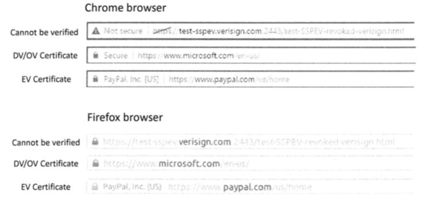

# 防御中间人攻击

Alice通过https访问example.com，当存在中间人攻击时，攻击者可以有三个选择：  
1、转发真实的证书  
攻击者转发来自example.com的真实证书给Alice，Alice的浏览器用example.com的公钥加密，由于攻击者没有
example.com的私钥，无法解密，攻击失败。  
 
2、攻击者伪造一个example.com的证书发给Alice  
其中存放的公钥是自己的公钥，这种情况下攻击者必须要侵入一个CA，才能在伪造的证书上签名。如果创建一个自签名证书，
用户的浏览器会告警，用户如接受则攻击将成功，用户拒绝攻击失败。  

3、攻击者发送自己的证书  
攻击者只能在Subject域放入自己的合法身份，当证书到达Alice的浏览器，验证将通过，因为攻击者证书是有效的，但是
还会有一个额外的验证，浏览器需要知道证书Subject域中的域名是否与用户的目的相同。浏览器知道用户想访问的是example.com,
但是证书Subject域是attacker32.com，这个不匹配会导致浏览器立即中断握手协议。

!!! 浏览器在SSL中的两个验证

    一是核对证书是否有效  
    二是检查证书的通用名称域是否与网站名一致

浏览器在SSL中的两个验证中，第一个验证一般由SSL库执行，但是SSL库不知道用户真正想访问的网站是什么，无法做第二个验证，
第二个验证应由应用程序来完成。研究表明，未对证书中的通用名称域进行核对是非浏览器软件的常见错误。   
为了解决这个问题，新版本openssl提供了辅助机制来帮助应用程序核对通用名称域，但是应用程序仍然需要告诉openssl哪些
通用名称域是有效的。

!!! vpn程序注意点

    开发基于TLS/SSL的VPN程序时，就要自己做通用名称域的校验。
    
## 中间代理人

PKI可以成功抵御中间人攻击，但是在用户和https网站通信中是可以插入中间人的，这种中间人叫https代理。  

攻击原理：  
有些用户会将https代理证书添加到浏览器的信任列表中，这样浏览器会把它当成一个根CA来看待，所有代理签发的证书都将被浏览器接受。

## 公钥基础设施的四个攻击面

### CA的认证  

对于客户端来说，知道接收到的公钥是否属于目的服务器很重要，因为要抵御中间人攻击，故需要靠CA来获知公钥的实际拥有者。  

CA确认一个公钥属于一个特定的主体分为两部分：  
1、验证证书申请者与证书Subject域中主体之间的关系  
CA需要确保申请者拥有这个域名，如果CA认证没做好，攻击者就获得一个伪造的证书，证书中存放的是攻击者的公钥，但subject域
却是攻击目标的域名，就可以实施中间人攻击。  

2、对证书做数字签名  
CA验证一个证书请求的subject域时，会用私钥签发证书，如果CA的私钥被泄露，攻击者可以签发一个subject域为任意数据的证书，这
会生成有效但虚假的证书。

!!! CA如何保护他们的私钥

    大部分CA都把私钥存在特殊硬件设备中，这些设备是防篡改，需要物理接触才能得到密钥，一般存储在严密监视和保护的地方。

### 证书的安全

一旦CA验证了公钥拥有者的身份，CA将为这个拥有者生成一个证书，证书一定不能被伪造和修改，这是由单向哈希值和数字签名算法保证的。

一个好的单向哈希函数应该有两个属性：单向属性和抗碰撞属性。抗碰撞属性确保很难找到两个内容不同但有相同哈希值的消息。  
可以创建两个内容不同的PDF文件，但是他们的哈希值是一样的，对于公钥证书也可以做同样的攻击。  
CA不应该使用任何不安全的单向哈希函数，如MD5或者SHA1，它们应该使用较强的SHA256

### 预加载的可信证书的验证

证书的完整性是由CA的签名保护的，为了验证这个签名，需要CA的公钥，这个公钥要么被客户端预加载，要么由另一个CA的签名保护，
只有可信的公钥才会被预加载。

### 用户确认

客户端需要确保证书中的Subject域与用户想访问的目的地址域一致。  
可以通过对通用名Unicode编码对用户钓鱼攻击，如伪装成apple.com，实际其中字符是unicode编码

## 数字证书的类型

CA最主要的作用是核实证书Subject域的信息，并且证明公钥属于声明的主体，这一步涉及身份核实和验证。由于每一个CA在这个步骤
中负责的具体验证工作不同，因此获取一个证书的价格也是不同的。

主要有三种类型的证书：

### 域名验证型（DV）证书

这是最流行的证书。对于DV证书来说，CA验证域名记录以核对域名是否属于申请者。  
这个过程一般称为域控制验证（DCV），是通过WHOIS数据库（一个在线存储域名注册信息的资料库）中获取的信息来验证包含在证书请求
中的域名。  
DCV一般用如下方法：  
1、通过电子邮件：点击邮件中的链接    
2、通过HTTP：哈希值命名的文件放在指定的域名网站  
3、通过DNS：在解析中增加一条CNAME  

### 机构验证型（OV）证书

OV证书除了验证域名，还需要验证这个机构和申请者的身份信息，这种较少使用，一般要么用DV，要么用扩展验证型  
1、域名控制验证  
2、申请者的身份和地址  
3、申请者和机构的关系  
4、机构的地址  
5、机构的WHOIS记录  
6、机构的电话号码  

### 扩展验证型（EV）证书

1、域名控制验证  
2、验证证书请求中涉及的身份、机构、签名以及和申请者直接的关联  
3、验证组织的物理地址和电话号码  
4、验证组织实际业务的存在性，确保机构直到申请日期还在开展业务  
5、验证机构合法性，确保机构过去没有非法或不良记录  
EV证书更加可信更贵，提供了一个更加彻底的背景调查  

不同证书浏览器展示方式也不同，如下图：
