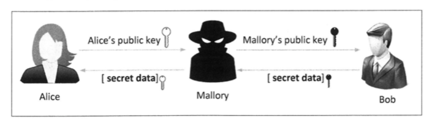

# 攻击公钥加密与公钥证书

公钥加密是当今安全通信的基础，但是当通信的一方向另一方发送公钥时，却容易遭到中间人攻击。根本问题是没有一个简单的方式
验证公钥所有者的身份。公钥基础设施（PKI）就是解决这个问题的一个方案。

## 攻击公钥加密

在发明公钥加密之前，加密依赖私用密钥，这种加密方法的挑战在于密钥交换，也就是在加密通道建立之前，如何让通信双方把密钥
确定下来

### 中间人攻击

中间人（MITM）攻击发生在两个设备之间的流量被截获的情况下。

正常通过公钥加密通信过程：Alice把她的公钥发给Bob，Bob可以生成一个密钥，并用Alice的公钥加密后发给Alice，
Alice可以用自己的私钥解密。

中间人介入后：Mallory截获Alice的公钥，并用自己的公钥代替，Bob无法判断公钥来源，因此就用收到的公钥来加密自己的随机密钥，
Mallory就可以得到Bob的消息，之后他用Alice的公钥加密后发给Alice



### 防御中间人攻击

如果能够提供一个机制把公钥和所有者的身份绑定在一起，就可以解决中间人攻击问题

!!! 数字签名

    数字签名是基于公钥密码学的，它用签名者的私钥签名，任何知道签名者公钥的人都可以验证它，如果消息被篡改，
    数字签名就失效了。

可以用数字签名技术防御中间人攻击。  
Alice会向一个信任方提交身份证和公钥，信任方会给她一个数字文件（有Alice名字和公钥、过期时间等信息），并对数字文件
进行数字签名。这个数字文件和数字签名被称为证书。  
Alice发给Bob的信息除了公钥还有证书，Mallory还可能截获证书，但是他无法做到用自己的公钥代替Alice的公钥而仍然保持
Alice的名字。  
而为了验证Alice证书上的签名，Bob需要获得信任方的公钥。

### 公钥基础设施

公钥基础设施就是上面信任方的功能，有两个重要的组件：  
1、认证机构（CA）： 负责验证用户的身份并且提供经由它们签名的数字证书。  
2、数字证书：提供了一个公钥以及与这个公钥相关的信息，也称为公钥证书。  

## 公钥证书

公钥证书主要由公钥和它的拥有者，以及认证机构的签名组成。证书接收者可以验证签名以确保证书的完整性，在认证成功后，
接收者可以得知公钥的真正拥有者。

### X.509数字证书

公钥证书的形式是由X.509标准制定的。

完整Paypal的X.509证书：
```text
Certificate:
    Data:
        Version: 3 (0x2)
        Serial Number:
            0c:79:a9:44:b0:8c:11:95:20:92:61:5f:e2:6b:1d:83
    Signature Algorithm: sha256WithRSAEncryption
        Issuer: C=US, O=DigiCert Inc, OU=www.digicert.com, CN=DigiCert High Assurance EV Root CA
        Validity
            Not Before: Oct 22 12:00:00 2013 GMT
            Not After : Oct 22 12:00:00 2028 GMT
        Subject: C=US, O=DigiCert Inc, OU=www.digicert.com, CN=DigiCert SHA2 Extended Validation Server CA
        Subject Public Key Info:
            Public Key Algorithm: rsaEncryption
                Public-Key: (2048 bit)
                Modulus:
                    00:d7:53:a4:04:51:f8:99:a6:16:48:4b:67:27:aa:
                    93:49:d0:39:ed:0c:b0:b0:00:87:f1:67:28:86:85:
                    8c:8e:63:da:bc:b1:40:38:e2:d3:f5:ec:a5:05:18:
                    b8:3d:3e:c5:99:17:32:ec:18:8c:fa:f1:0c:a6:64:
                    21:85:cb:07:10:34:b0:52:88:2b:1f:68:9b:d2:b1:
                    8f:12:b0:b3:d2:e7:88:1f:1f:ef:38:77:54:53:5f:
                    80:79:3f:2e:1a:aa:a8:1e:4b:2b:0d:ab:b7:63:b9:
                    35:b7:7d:14:bc:59:4b:df:51:4a:d2:a1:e2:0c:e2:
                    90:82:87:6a:ae:ea:d7:64:d6:98:55:e8:fd:af:1a:
                    50:6c:54:bc:11:f2:fd:4a:f2:9d:bb:7f:0e:f4:d5:
                    be:8e:16:89:12:55:d8:c0:71:34:ee:f6:dc:2d:ec:
                    c4:87:25:86:8d:d8:21:e4:b0:4d:0c:89:dc:39:26:
                    17:dd:f6:d7:94:85:d8:04:21:70:9d:6f:6f:ff:5c:
                    ba:19:e1:45:cb:56:57:28:7e:1c:0d:41:57:aa:b7:
                    b8:27:bb:b1:e4:fa:2a:ef:21:23:75:1a:ad:2d:9b:
                    86:35:8c:9c:77:b5:73:ad:d8:94:2d:e4:f3:0c:9d:
                    ee:c1:4e:62:7e:17:c0:71:9e:2c:de:f1:f9:10:28:
                    19:33
                Exponent: 65537 (0x10001)
        X509v3 extensions:
            X509v3 Basic Constraints: critical
                CA:TRUE, pathlen:0
            X509v3 Key Usage: critical
                Digital Signature, Certificate Sign, CRL Sign
            X509v3 Extended Key Usage:
                TLS Web Server Authentication, TLS Web Client Authentication
            Authority Information Access:
                OCSP - URI:http://ocsp.digicert.com

            X509v3 CRL Distribution Points:

                Full Name:
                  URI:http://crl4.digicert.com/DigiCertHighAssuranceEVRootCA.crl

            X509v3 Certificate Policies:
                Policy: X509v3 Any Policy
                  CPS: https://www.digicert.com/CPS

            X509v3 Subject Key Identifier:
                3D:D3:50:A5:D6:A0:AD:EE:F3:4A:60:0A:65:D3:21:D4:F8:F8:D6:0F
            X509v3 Authority Key Identifier:
                keyid:B1:3E:C3:69:03:F8:BF:47:01:D4:98:26:1A:08:02:EF:63:64:2B:C3

    Signature Algorithm: sha256WithRSAEncryption
         9d:b6:d0:90:86:e1:86:02:ed:c5:a0:f0:34:1c:74:c1:8d:76:
         cc:86:0a:a8:f0:4a:8a:42:d6:3f:c8:a9:4d:ad:7c:08:ad:e6:
         b6:50:b8:a2:1a:4d:88:07:b1:29:21:dc:e7:da:c6:3c:21:e0:
         e3:11:49:70:ac:7a:1d:01:a4:ca:11:3a:57:ab:7d:57:2a:40:
         74:fd:d3:1d:85:18:50:df:57:47:75:a1:7d:55:20:2e:47:37:
         50:72:8c:7f:82:1b:d2:62:8f:2d:03:5a:da:c3:c8:a1:ce:2c:
         52:a2:00:63:eb:73:ba:71:c8:49:27:23:97:64:85:9e:38:0e:
         ad:63:68:3c:ba:52:81:58:79:a3:2c:0c:df:de:6d:eb:31:f2:
         ba:a0:7c:6c:f1:2c:d4:e1:bd:77:84:37:03:ce:32:b5:c8:9a:
         81:1a:4a:92:4e:3b:46:9a:85:fe:83:a2:f9:9e:8c:a3:cc:0d:
         5e:b3:3d:cf:04:78:8f:14:14:7b:32:9c:c7:00:a6:5c:c4:b5:
         a1:55:8d:5a:56:68:a4:22:70:aa:3c:81:71:d9:9d:a8:45:3b:
         f4:e5:f6:a2:51:dd:c7:7b:62:e8:6f:0c:74:eb:b8:da:f8:bf:
         87:0d:79:50:91:90:9b:18:3b:91:59:27:f1:35:28:13:ab:26:
         7e:d5:f7:7a
```
数字证书中的主要域：  
1、Issuer，提供签发该证书的认证机构信息  
2、Subject，该证书拥有者信息  
3、Subject Public Key Info，这个域包含的实际的公钥（RSA公钥）  
4、Signature Algorithm，签发者的数字签名（生成签名算法是SHA256和RSA）  
5、Validity，证书的有效时间  
6、Serial Number，每个证书都有一个独特的序列号  
7、Extensions，新版本的X.509证书包含可选扩展域  

### 从真实服务器获取证书

!!! 509证书需要编码

    X.509证书使用的是二进制数据，其中有很多不能打印的字符，也无法复制和粘贴。因为这些原因，当把X.509证书
    存储到文件时，通常要对其中的数据进行编码，把它变成一个文本文件。常用的X.509证书编码方案是Base64，编码后
    的X.509证书一般存储在PEM文件中。

可以使用下面的命令从真实的网站获取证书
```bash
openssl s_client -showcerts -connect www.paypal.com:443 </dev/null
```
openssl s_client是开启一个https客户端  
-showcerts选项可以打印出所有从paypal服务器接收到的证书  
</dev/null，把打印丢弃，因获取的信息要筛选  

把打印的以下内容保存到paypal.pem，即编码后的X.509证书  
```text
-----BEGIN CERTIFICATE-----
-----END CERTIFICATE-----
```

可以把pem文件解码为原始二进制数据
```bash
openssl x509 -in paypal.pem -outform der > paypal.der
```
解码后的文件用bless查看

直接查看X.509证书的原始二进制数据和Base64编码后的数据，看到的都是乱码，可以用以下命令转成可读形式：
```bash
openssl x509 -in paypal.pem -text -noout
```