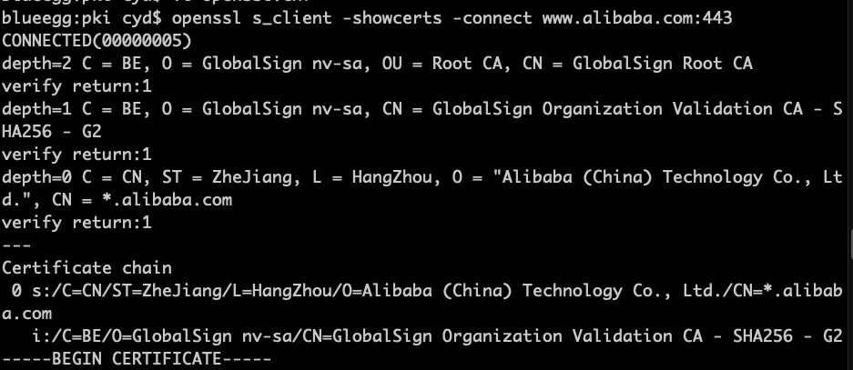
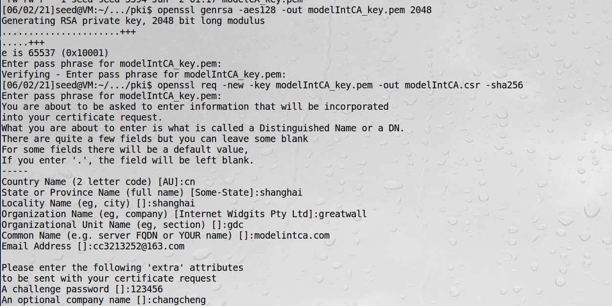
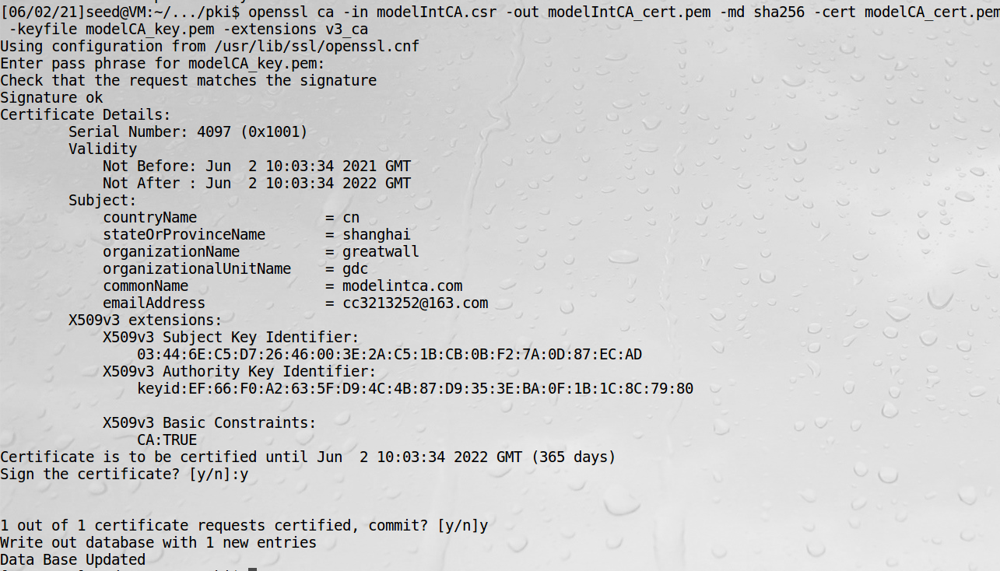
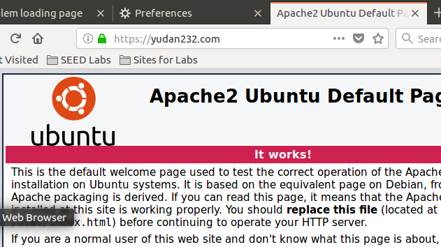
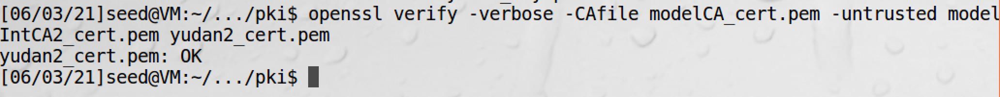

# 根与中间CA

## 根CA和自签名证书

为了验证根CA签发的证书，需要有根CA的公钥，问题是如何安全地获取它，因为有中间人攻击的问题。根CA的公钥一般通过特殊渠道
分发给用户，可能是被预装进操作系统、浏览器或者其他软件，这些软件为根CA的公钥进行担保，信任这些软件也就信任了公钥。  

根CA的公钥也存储在一个X.509证书中，但是这个证书没有被其他CA签名，而是自签名。在自签名的X.509证书中，证书签发者
和拥有者是同一个实体。

## 中间CA与信任链

根CA可以将证书签发功能委派给它信任的中间CA，然而这些中间CA的公钥不一定被外界所知，因此根CA必须为它们的公钥进行担保，
也就是为中间CA签发公钥证书。

信任链实验：  
查看阿里巴巴的证书：
```bash
openssl s_client -showcerts -connect www.alibaba.com:443
```

上面第一行是根CA，第二行是中间CA，第三行是阿里证书  
其中Alibaba公司的证书，它是由名为GlobalSign Organization Validation CA签发的，是一个中间CA  
还有一个证书是该中间CA自己的证书，它是由名为GlobalSign Root CA的CA签发的，这是一个根CA  

浏览器通过以下步骤验证证书：  
1、检查根CA是否在浏览器的信任CA列表中，如果在，说明浏览器已经有了根CA的公钥  
2、用根CA的公钥验证中间CA的证书  
3、用中间CA的公钥验证Alibaba公司的证书  

可以openssl手动验证证书链，假设我拥有阿里证书Alibaba.pem，中间CA证书GlobalSign-G2.pem，根CA的自签名证书
GlobalSignRootCA.pem，可以用下面命令验证Alibaba公司证书
```bash
openssl verify -verbose -CAfile GlobalSignRootCA.pem -untrusted GlobalSign-G2.pem Alibaba.pem
```
-untrusted提供了一个证书链，该链的最后一个元素必须是域名服务器的证书  
-CAfile提供了一个可信任的CA证书（必须是自签名证书）

## 为中间CA制作证书

1、中间CA生成自己的公钥和私钥
```bash
openssl genrsa -aes128 -out modelIntCA_key.pem 2048
```
2、中间CA生成公钥证书请求
```bash
openssl req -new -key modelIntCA_key.pem -out modelIntCA.csr -sha256
```
3、根CA（ModelCA）给中间CA（ModelIntCA）颁发公钥证书
```bash
openssl ca -in modelIntCA.csr -out modelIntCA_cert.pem -md sha256 -cert modelCA_cert.pem -keyfile modelCA_key.pem -extensions v3_ca
```
-extensions v3_ca这个字段指明这个证书是否能用来验证其他证书，这样表示可以  




## Apache服务器部署

如果网络服务器证书是由中间CA颁发的，当客户端请求它的证书时，应该给出所有涉及中间CA的证书，并放在同一个文件中

实验：用中间CA给网站yudan32.com颁发证书并部署    
1、生成公钥私钥对  
```bash
openssl genrsa -aes128 -out yudan_key.pem 2048
```
2、生成证书签名请求  
```bash
openssl req -new -key yudan_key.pem -out yudan.csr -sha256
```
3、中间CA给网站颁发证书  
```bash
openssl ca -in yudan.csr -out yudan_cert.pem -md sha256 -cert modelIntCA_cert.pem -keyfile modelIntCA_key.pem
```
4、所有涉及中间CA的证书放在一个文件  
```bash
cp yudan_cert.pem all_cert.pem
cat modelIntCA_cert.pem >> all_cert.pem
```
注意这个顺序不能反  
5、配置Apache  
```bash
sudo vi /etc/apache2/sites-available/default-ssl.conf
```
```xml
<VirtualHost *:443>
    ServerName yudan32.com
    DocumentRoot /var/www/html
    DirectoryIndex index.html
    
    SSLEngine On
    SSLCertificateFile /home/seed/Desktop/myworks/pki/all_cert.pem
    SSLCertificateKeyFile /home/seed/Desktop/myworks/pki/yudan_key.pem
</VirtualHost>
```
```bash
sudo apachectl configtest  // 测试Apache的配置文件，看是否有错误
sudo a2enmod ssl           // 启用SSL
sudo a2ensite default-ssl  // 启用刚才加入的网站
sudo service apache2 restart 
```
6、修改/etc/hosts  
7、浏览器导入中间CA证书
8、由中间CA颁发的证书成功生效


现在就可以利用之前的方法，用命令行的方式来验证证书了：


## 现实世界中的可信CA

根据市场份额依次是：Comodo、IdenTrust、Symantec、GoDaddy、GlobalSign、DigiCert

**查看浏览器可信CA**：
Chrome浏览器： Chrome-偏好设置-隐私设置和安全性-管理证书  
火狐浏览器：Edit-preferences-View Certificates