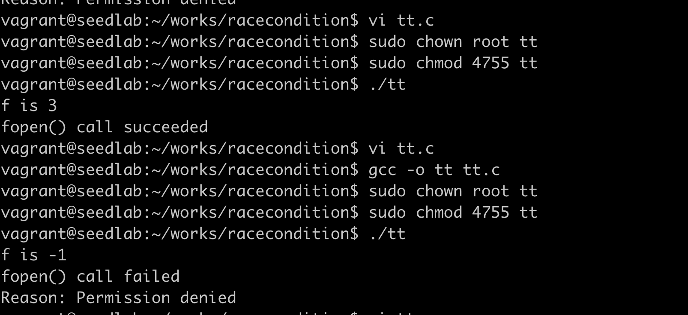

# 防御措施

## 原子操作

文件操作原子化一般通过上锁来实现。但操作系统如果强制给文件上锁，那么恶意用户可以用它锁上很多文件，导致其他用户无法正常使用。  
一般操作系统使用软锁，给愿意遵守规则的进程使用。  

!!! 可行的原子化

    把检查和使用放在一个系统调用中，可以利用内核的上锁机制实现原子化。  
    比如open()系统调用中提供了一个O_EXCL选项，当和O_CREAT结合使用，当文件已经存在情况下，不会打开指定文件。  
    并且这期间符号链接的操作也会失败。故如下代码是安全的：  
    f = open(file, O_CREAT | O_EXCL);

## 重复检查和使用

竟态条件漏洞依赖攻击者在检查和使用之间的时间窗口内赢得竞争，如果能让竞争变得很难，即使不能消除竟态条件，
程序仍然是安全的。  
重复检查和使用就是用这个思路，在程序中多次打开这个文件，并检查打开的是否是同一个文件。

## 粘滞符号链接保护

就是上一节提到的禁用符号链接

!!! 粘滞目录

    在linux系统中，文件目录有一个特殊的比特位叫做粘滞比特位。当设置了这个比特位时，只有文件所有者、
    目录所有者或者root用户才能重命名或删除这个目录中的文件。/tmp目录设置了粘滞比特位。

```c
#include <unistd.h>
#include <stdio.h>
#include <string.h>
#include <errno.h>

int main()
{
    char *fn = "/tmp/XYZ";
    FILE *fp;
    
    fp = fopen(fn, "r");
    if (fp == NULL)
    {
        printf("fopen() call failed \n");
        printf("Reason: %s\n", strerror(errno));
    }else{
        printf("fopen() call succeeded \n");
    }
    fclose(fp);
    return 0;
}
```

!!! warning

    上面程序中/tmp/XYZ是一个符号链接，不是文件
    
**跟随者是进程的有效用户id**
创建符号链接命令：
```bash
ln -s /home/vagrant/works/seven/testlink.c /tmp/XYZ 
```
### 跟随者、目录所有者、符号链接所有者都是vagrant，打开成功

首先是开启粘滞符号链接保护


### 跟随者root，目录所有者、符号链接所有者都是vagrant，打开成功


### 跟随者root，目录所有者vagrant，符号链接所有者root，打开成功


### 跟随者vagrant，目录所有者vagrant，符号链接所有者root，失败


!!! warning

    结论： 符号链接所有者要么跟跟随者相同，要么跟目录所有者相同，其他情况一律失败

## 最小权限原则

上述代码的一个根本问题是程序拥有过大的权限，违反了最小权限原则，解决这个问题可以加入seteuid(getuid())
设置有效id为真实用户id，关闭root权限。

```c
#include <unistd.h>
#include <stdio.h>
#include <string.h>
#include <errno.h>

int main()
{
    char *fn = "/tmp/XYZ";
    FILE *fp;
    
    seteuid(getuid());
    fp = fopen(fn, "r");
    if (fp == NULL)
    {
        printf("fopen() call failed \n");
        printf("Reason: %s\n", strerror(errno));
    }else{
        printf("fopen() call succeeded \n");
    }
    fclose(fp);
    return 0;
}
```



!!! warning

    以上实验跟随者vagrant，目录所有者root，符号链接所有者root，本来有读取权限。加入最小权限后，还是有读取权限。
    该实验没有做成功。

```c
#include <unistd.h>
#include <stdio.h>
#include <string.h>
#include <errno.h>
#include <fcntl.h>

int main()
{
    char *fn = "/tmp/XYZ";
    int fp;
    
    // seteuid(getuid());
    fp = open(fn, O_WRONLY);
    if (fp != -1)
    {
        printf("fopen() call succeeded \n");
    }else{
        printf("fopen() call failed \n");
        printf("Reason: %s\n", strerror(errno));
    }
    fclose(fp);
    return 0;
}
```


!!! warning

    改用书中程序，结果也是一样，seteuid(getuid())没有起作用。