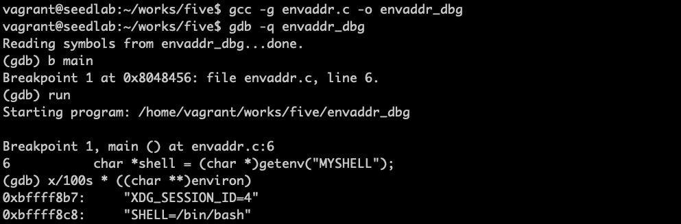

# 发起return-to-libc攻击

## 攻击三个阶段

最终目标是跳转到system()函数，执行/bin/sh，就是执行system("/bin/sh")  
为此，划分为三个阶段：  
1、找到system()函数的地址  
2、找到字符串/bin/sh的地址  
3、system()函数的参数  

## 第一阶段


gdb中，需要使用run指令来执行目标程序，否则libc函数库不会被加载到内存中

!!! gdb指令

    -q选项是指安静模式，即不必要的信息不打印

## 第二阶段

```bash
export MYSHELL="/bin/sh"
```

```c
#include <stdio.h>
#include <stdlib.h>

int main()
{
    char *shell = (char *)getenv("MYSHELL");
    if (shell)
    {
        printf(" Value: %s \n", shell);
        printf(" Address: %x\n", (unsigned int)shell);
    }
    return 1;
}
```


***这个地址与程序名称有关***

环境变量保存在程序的栈中，在压入栈之前，是程序名称先入栈




根据之前缓冲区溢出中程序原理图，小端序高字节保存在内存高地址，而栈的方向是从高地址往低地址，
故是函数名称先入栈。