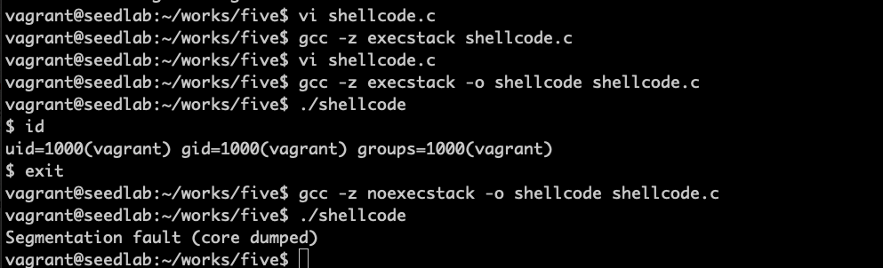
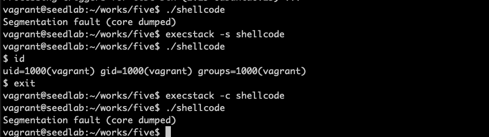
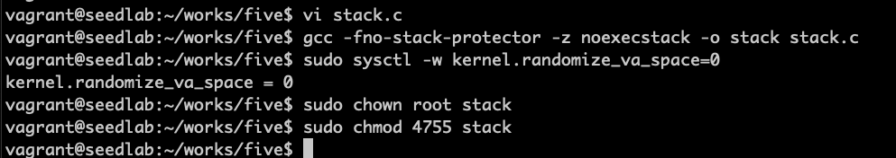

# return-to-libc攻击背景

缓冲区溢出漏洞是把恶意代码注入到目标程序栈中发动攻击。为了抵御这种攻击，操作系统采用一个称为***不可执行栈***
的防御措施。这种防御措施能被另一种无须在栈中运行代码的攻击方法绕过，这种方法叫return-to-libc攻击。

## gcc指令控制栈执行

```c
#include <string.h>

const char code[] = 
    "\x31\xc0"
    "\x50"
    "\x68""//sh"
    "\x68""/bin"
    "\x89\xe3"
    "\x50"
    "\x53"
    "\x89\xe1"
    "\x99"
    "\xb0\x0b"
    "\xcd\x80";

int main(int argc, char **argv)
{
    char buffer[sizeof(code)];
    strcpy(buffer, code);
    ((void(*)())buffer)();
}
```
这段代码是将一段shellcode放入栈中缓冲区，然后将缓冲区转换为函数，接着调用这个函数，产生一个shell。


可以看到gcc编译指令可以控制栈是否可以执行。

## execstack控制已编译程序

```bash
sudo apt-get install execstack -y
```


## 程序运行不经过栈可行性

内存中有一个区域存放着很多代码，主要是标准C语言库函数。在linux中，该库被称为libc，它是一个动态链接库。
操作系统会把libc库加入内存中。  
问题就变成是否存在一个libc函数可供利用，让有漏洞的程序跳转到该libc函数。  
容易利用的函数是system()，如果想在缓冲区溢出后运行一个shell，无须自己编写shellcode，只需要跳转到
system()函数，让它来运行指定的/bin/sh程序即可。这个攻击策略叫return-to-libc攻击。

## 攻击环境准备

```c
#include <stdlib.h>
#include <stdio.h>
#include <string.h>

int foo(char *str)
{
    char buffer[100];
    strcpy(buffer, str);
    return 1;
}

int main(int argc, char **argv)
{
    char str[400];
    FILE *badfile;
    
    badfile = fopen("badfile", "r");
    fread(str, sizeof(char), 300, badfile);
    foo(str);
    
    printf("Returned Properly\n");
    return 1;
}
```

关闭StackGuard，打开不可执行栈，关闭ASLR，变成set-uid程序