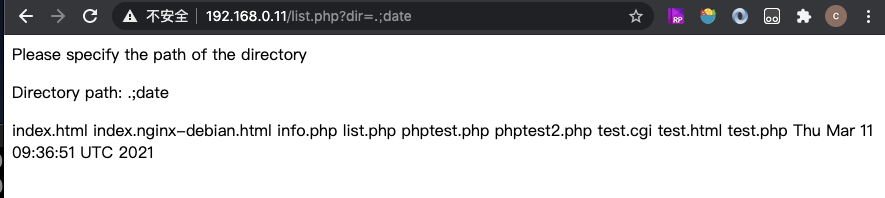

# 攻击php调外部命令

!!! 程序语言调外部命令攻击点

    Perl程序有open()函数，是通过shell实现的  
    PHP有system()函数，工作原理和c类似

```bash
vi /var/www/html/list.php
```
```php
<?php
    print("Please specify the path of the directory");
    print("<p>");
    $dir=$_GET['dir'];
    print("Directory path: " . $dir . "<p>");
    system("/bin/ls $dir");
?>    
```

通过php成功hacker到了系统信息：


!!! 安全中两个重要原则

    数据与代码分离原则：system没有做到这个原则，而execve做到了  
    最小特权原则：Set-UID没有做到这个原则