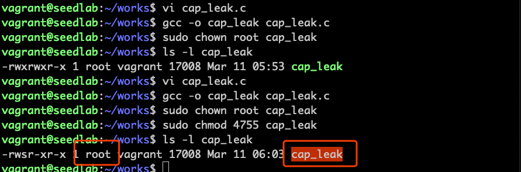
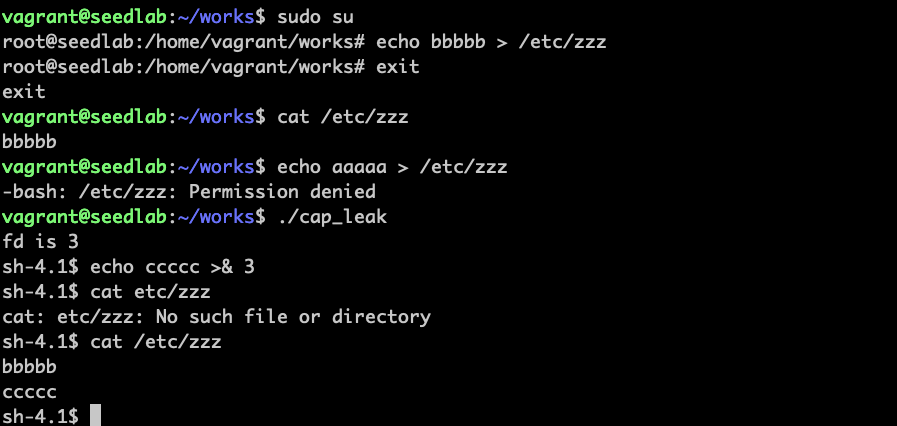

# Set-UID的主要攻击面

## 用户输入

特权程序如果没有很好地校验输入，将容易受到攻击。比如chsh出过一个漏洞，修改/etc/passwd时，没有考虑到用户可能
会输入两行字符，输入两行时相当于新建了一个用户，这样就可以建一个root用户。

## 系统输入

如特权程序需要修改系统某一个文件，但这个文件有可能被软链接到/etc/shadow

## 环境变量

如system("ls")，这个ls不提供具体路径就是一个不安全的方式，可以在环境变量中设置一个恶意的ls程序攻击。

## 权限泄露

!!! su程序原理

    linux的su程序是特权程序，用于用户切换，切换成第二个用户后，将抛弃进程的特权，再运行第二个用户默认的shell程序，
    如果程序写的有问题，抛弃进程特权这个步骤没做好的话，就会出现权限泄露的问题。
    
### 文件句柄没关闭导致权限泄露

```bash
vi cap_leak.c
```
程序如下：
```c
#include <unistd.h>
#include <stdio.h>
#include <stdlib.h>
#include <fcntl.h>

void main()
{
    int fd;
    char *v[2];
    fd = open("/etc/zzz", O_RDWR | O_APPEND);
    if (fd == -1) {
        printf("Cannot open /etc/zzz\n");
        exit(0);
    }
    printf("fd is %d\n", fd);
    setuid(getuid());
    v[0] = "/bin/sh";
    v[1] = 0;
    execve(v[0], v, 0);
}
```

!!! 程序解读

    首先程序打开了一个只有root用户可以修改的文件  
    setuid(getuid());这行作用是将有效用户id（root）变成真实用户id，降低权限  
    execve打开了一个shell程序  
    
先把cap_leak变成set-uid程序：


用泄露的权限使普通用户可以修改受保护的文件：


!!! 实验结论

    运行set-uid程序前无法修改文件，运行set-uid程序获得了文件描述符后，可以成功修改文件。
    这个泄露完全是没有关闭文件句柄导致。