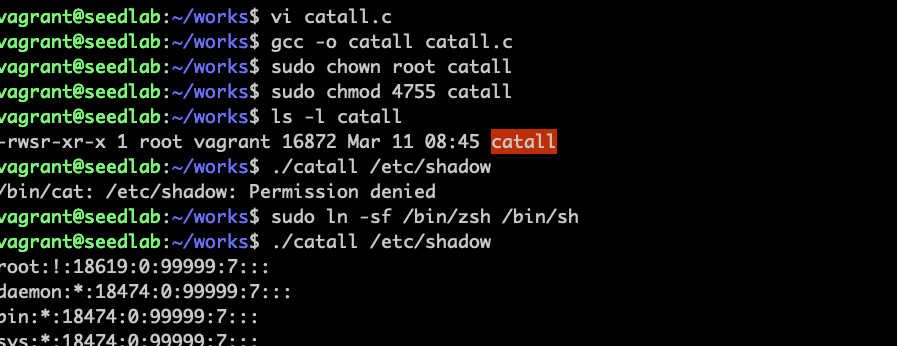
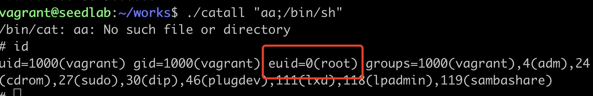

# 通过system函数攻击

!!! system函数原理

    通过man system命令得知，system()是调用/bin/sh -c command来执行外部命令的。或者说外部
    命令不是直接执行，而是shell程序首先被执行，然后shell将command作为输入并解析它。而shell程序
    非常灵活，只要将命令用分号分隔就可以执行额外的指令。
    
!!! 程序设计背景

    比如审计一家公司是否欺诈，需要查看linux所有文件，但为了保护系统不被修改，需要开发一个程序
    只能看不能改。

```bash
vi catall.c
```
```c
#include <string.h>
#include <stdio.h>
#include <stdlib.h>

int main(int argc, char *argv[])
{
    char *cat="/bin/cat";
    if (argc < 2)
    {
        printf("Please type a file name.\n");
        return 1;
    }
    char *command = malloc(strlen(cat) + strlen(argv[1]) + 2);
    sprintf(command, "%s %s", cat, argv[1]);
    system(command);
    return 0;
}
```



!!! warning

    Ubuntu 16.04以上版本，/bin/sh实际上是一个指向/bin/dash的链接文件，dash实现了
    一个保护机制，当它发现自己在一个Set-UID的进程中运行时，会立刻把有效用户id变成实际
    用户id，主动放弃特权。故利用/bin/sh发起的攻击不会成功。这也是上面显示Permission denied
    的原因    
    需要安装一个zsh的shell程序来做这个实验  
    sudo apt install zsh  
    sudo ln -sf /bin/zsh /bin/sh

通过在shell程序后面跟上/bin/sh成功hacker到有效用户id的shell窗口  


!!! warning

    实验结束记得运行： sudo ln -sf /bin/dash /bin/sh 改回来
