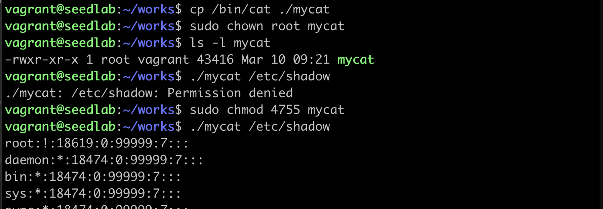

# Set-UID攻击

## Set-UID背景

!!! 特权程序必要性

    linux的密码是存储在/etc/shadow这个影子文件中的，这个文件的权限设置成只有root用户
    才可以访问，但是修改密码必须要修改该文件，那普通用户如何实现修改自己的密码呢？多数系统
    用特权程序来解决这个问题，这个特权程序叫passwd

!!! Set-UID原理

    特权程序的实现方式有两种，守护进程和Set-UID程序。守护进程用root身份运行，普通程序向他发请求解决。
    Set-UID用一个比特位告诉操作系统区别对待。Set-UID的好处是不用另起root程序，普通用户就可以完成
    修改密码操作。而赋予Set-UID权限后，普通用户只能执行Set-UID中定义好的操作。

!!! Set-UID不安全的地方

    /bin/sh变成Set-UID不是安全做法，因该程序可以执行用户指定的任意命令  
    vi程序变成Set-UID也不是安全做法，因允许用户在编辑器内执行任意外部命令  

## Set-UID改变有效用户id

!!! linux进程的三个用户id

    真实用户id（uid）: 运行进程的用户，运行命令/bin/id  
    有效用户id（euid）: 访问控制中使用的id，就是程序的所有者  
    保留用户id    

这个实验说明，只有当文件所有者为root用户时，才能通过Set-UID改变其有效用户id。而4755中的4设置了
Set-UID比特，使有效用户id（euid）为0，成为特权程序。***这种情况下，即使该进程由普通用户执行，也拥有root用户权限***

这个实验说明，即使所有者是root，只要有效用户id不为0，还是一个非特权程序。同样，如果只是设置Set-UID，文件所有
者不是root，也是非特权程序。

!!! warning

    chown命令会自动清空Set-UID比特，做实验时要注意先输入chown，再输入chmod  