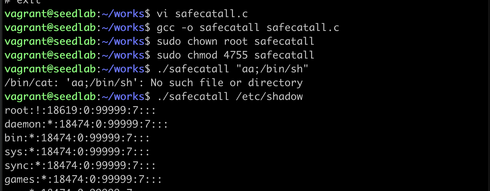

# 用execve代替system

!!! execve不会调用shell

    和system不同的是execve不会调用shell程序，而是直接运行指令  
    execve的三个参数分别是：1、运行的指令 2、指令的参数 3、传入新程序
    的环境变量
    
```c
#include <unistd.h>
#include <stdio.h>

int main(int argc, char *argv[])
{
    char *v[3];
    if (argc < 2)
    {
        printf("please type a file name.\n");
        return 1;
    }
    v[0] = "/bin/cat";
    v[1] = argv[1];
    v[2] = 0;
    execve(v[0], v, 0);
    return 0;
}
```



!!! 实验说明

    如果第二个参数加了额外的参数，他们只会被作为一个参数