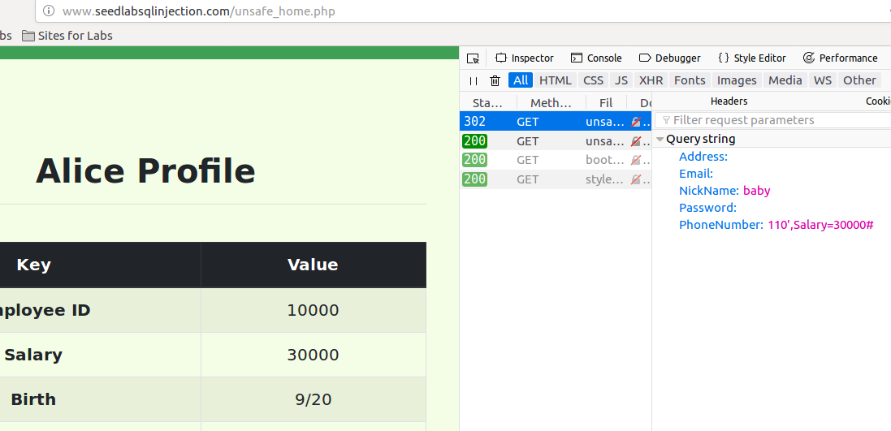

# SQL注入攻击

## 注入攻击admin账号

系统主路径下有unsafe_home.php


观察这个文件，可以看到有sql注入漏洞：


只要username输入admin'#，无论输入什么密码都登陆成功  


### 改用curl进行攻击

观察上一个登陆url为：
```bash
http://www.seedlabsqlinjection.com/unsafe_home.php?username=admin'#
```

!!! curl中特殊字符需要转义

    撇号：%27  
    空格: %20  
    井号：%23

curl攻击语句为：  
```bash
curl http://www.seedlabsqlinjection.com/unsafe_home.php?username=admin%27%23
```

可见用curl也达到了一样的攻击效果。

## 修改Alice的工资


得知修改的文件是unsafe_edit_frontend.php  

查看这个文件  

得知form表单提交后，处理的脚本是unsafe_edit_backend.php  

打开unsafe_edit_backend.php  

得知用户输入被用作构造sql语句，存在sql注入漏洞

alice原工资为20000


只要把Phone Number栏输入  110',Salary=30000# ，就能修改工资  

以上输入会导致修改掉所有人账户信息

!!! warning

    这章书中和网站上内容完全不一样。书只能参考，如按书中语句直接输入，会导致修改掉所有账户的信息。  
    如想只修改Alice工资不影响别人，应输入 110',Salary='30001

## 惩罚boby改工资为0

必须知道boby的id为2，只需在任何一个人的Profile Edit中phone number字段输入如下：
```text
110', Salary=0 where ID=2#
```
就能把boby工资改成0  

## 执行多条SQL语句

mysql本身支持多条sql语句输入，但是php中mysqli扩展的query()函数不允许在数据库服务器中运行多条语句，
这时对sql注入攻击的一种防护措施。

## 根本原因

跨站脚本攻击、system()函数攻击、格式化字符串攻击、sql注入攻击根本原因都是数据和代码混在一起。  

!!! c语言程序较好做到了数据和代码分离

    c语言程序在执行前，源代码首先需要被编译成二进制代码。编译期间还没有用户数据，因而也不存在用户
    提供的数据与源代码混合的问题。程序执行时接收用户数据，不过数据不会再次进入编译器，所以数据还是
    数据。

但是C语言依然有代码注入风险，但都不是c语言编译器的问题，system函数是shell解析器的问题，格式化字符串
是格式化字符串解析器的问题。  
缓冲区溢出漏洞本质上也是数据和代码没有分开的问题。