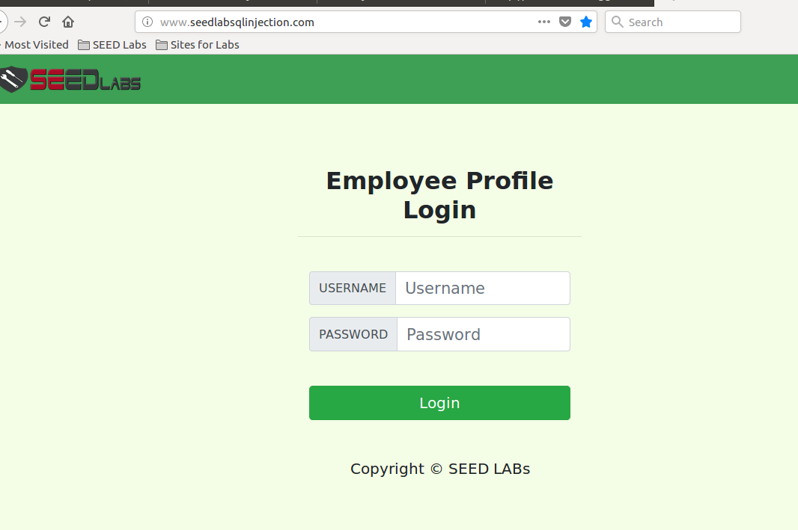
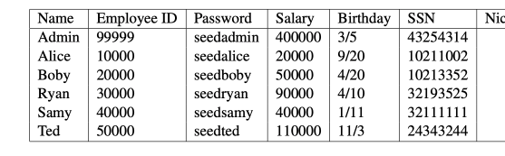

# sql注入背景

这部分书上没有关于实验环境的描述，要看[Seed Lab资料](https://seedsecuritylabs.org/Labs_16.04/PDF/Web_SQL_Injection.pdf)  
seed自带虚拟机已经安装好了mysql服务，root密码是seedubuntu

!!! mysql的三种注释

    select * from employee; # Comment  
    select * from employee; -- Comment  
    select * from /* Comment */ employee;

虚拟机提供的服务过程经过抽象相当于填如下SQL语句模板：  
```sql
select Name, Salary, SSN from employee where eid='   ' and password = '    ';
```
如果eid输入了EID5002'#, 那么sql语句等同于： 
```sql
select Name, Salary, SSN from employee where eid='EID5002';
```

如果不知道任何一个eid，输入a' OR 1=1#，就可以获取所有记录, sql语句等同于：
```sql
select Name, Salary, SSN from employee where eid='a' or 1=1;
```

## 准备实验环境

系统已经配置好了，总的来说有如下配置：  
1、访问URL： http://www.SEEDLabSQLInjection.com  
2、服务目录： 
```bash
/var/www/SQLInjection/
```
3、配置hosts  
```bash
vi /etc/hosts

```
4、配置apache  
```bash
vi /etc/apache2/sites-available/000-default.conf
```
```xml
<VirtualHost *:80>
        ServerName http://www.SeedLabSQLInjection.com
        DocumentRoot /var/www/SQLInjection
</VirtualHost>
```

访问实验环境：  


预置账号：


