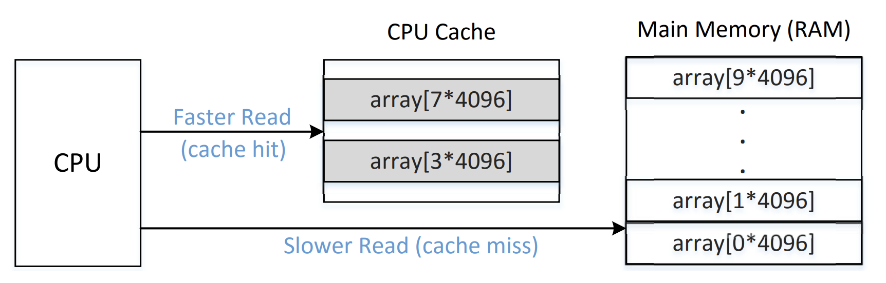
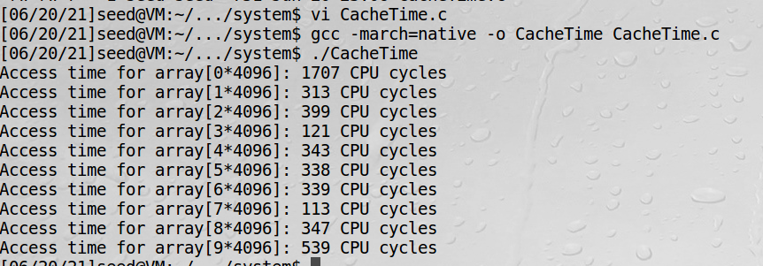
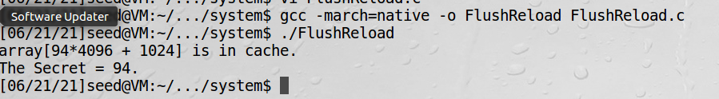

# 刷新和重载攻击

这一节更确切的名字是：在用户空间利用刷新和重载找出CPU缓存的值  
Meltdown这个漏洞是2017年发现，2018年1月份公开的。这个漏洞在intel和arm处理器上广泛存在。漏洞允许用户程序来读取内核数据。
由于这个漏洞是硬件的问题，很难从根本上解决这个问题，除非换掉cpu。

!!! 实验环境

    这个实验无法在基于AMD处理器的电脑上做，cpu必须是intel系列的。操作系统20.04可以做实验1到6，无法做7到8，
    这里我们统一用16.04

!!! gcc编译指令

    加上-march=native表示启用所有指令集

# 侧通道攻击CPU缓存

这个任务的目的是用侧通道从CPU缓存中取保护数据，这个攻击有个名字叫FLUSH+RELOAD。  
CPU的cache是一个硬件的cache用于加快计算速度的，读CPU的缓存比读主内存要快。当数据从主内存读取后，会存在CPU的缓存中，
当读取时，会先读CPU缓存，如果缓存命中，就直接取数据了。

下图就是缓存命中情况和不命中情况读取逻辑：


### task1: 从cache读和内存读对比

!!! volatile关键字

    顾名思义，易变的。告诉编译器不要优化，如果优化后，可能会从寄存器读，如果被别的程序更新，将导致冲突。

!!! 寄存器变量

    寄存器变量是放在CPU的寄存器里的，特点是运算速度快，不能取地址。频繁使用的变量适合使用寄存器变量

!!! 时间戳计数器TSC

    它记录自启动以来处理器消耗的时钟周期数。
    
CacheTime.c如下：
```c
#include <stdio.h>
#include <stdlib.h>
#include <stdint.h>
#include <emmintrin.h>
#include <x86intrin.h>

uint8_t array[10*4096];

int main(int argc, const char **argv) {
  int junk=0;
  register uint64_t time1, time2;
  volatile uint8_t *addr;
  int i;
  
  // Initialize the array
  for(i=0; i<10; i++) array[i*4096]=1;

  // FLUSH the array from the CPU cache
  for(i=0; i<10; i++) _mm_clflush(&array[i*4096]);

  // Access some of the array items
  array[3*4096] = 100;
  array[7*4096] = 200;

  for(i=0; i<10; i++) {
    addr = &array[i*4096];
    time1 = __rdtscp(&junk);                
    junk = *addr;
    time2 = __rdtscp(&junk) - time1;       
    printf("Access time for array[%d*4096]: %d CPU cycles\n",i, (int)time2);
  }
  return 0;
}
```
程序解读：  
time1,time2因为是频繁操作，又不用取地址，适合用寄存器变量  
读操作远大于写操作时，用volatile可以避免加锁，故addr适合定义成volatile  
_mm_clflush这个函数调用一下，确保没有被CPU缓存  
time1 = __rdtscp(&junk); 表示读取junk到内存，并返回TSC  


实验结果表明，数组3和7是从CPU的cache读的时间最少

### task2: 缓存作为侧通道

FlushReload.c如下：  
```c
#include <stdio.h>
#include <stdlib.h>
#include <stdint.h>
#include <emmintrin.h>
#include <x86intrin.h>

uint8_t array[256*4096];
int temp;
unsigned char secret = 94;

/* cache hit time threshold assumed*/
#define CACHE_HIT_THRESHOLD (150)
#define DELTA 1024

void flushSideChannel()
{
  int i;

  // Write to array to bring it to RAM to prevent Copy-on-write
  for (i = 0; i < 256; i++) array[i*4096 + DELTA] = 1;

  //flush the values of the array from cache
  for (i = 0; i < 256; i++) _mm_clflush(&array[i*4096 + DELTA]);
}

void victim()
{
  temp = array[secret*4096 + DELTA];
}

void reloadSideChannel() 
{
  int junk=0;
  register uint64_t time1, time2;
  volatile uint8_t *addr;
  int i;
  for(i = 0; i < 256; i++){
     addr = &array[i*4096 + DELTA];
     time1 = __rdtscp(&junk);
     junk = *addr;
     time2 = __rdtscp(&junk) - time1;
     if (time2 <= CACHE_HIT_THRESHOLD){
         printf("array[%d*4096 + %d] is in cache.\n",i,DELTA);
         printf("The Secret = %d.\n",i);
     }
  }	
}

int main(int argc, const char **argv) 
{
  flushSideChannel();
  victim();
  reloadSideChannel();
  return (0);
}
```
程序解读：  
程序设定了一个阈值，当时间小于这个阈值，说明被CPU缓存了，这时这个值肯定是调用victim函数的那个值，可以把该值读取出来。  
乘4096只是为了把cache块隔开，4096大于一个典型的64字节的内存块  
由于缓存是块级缓存的，故不能简单定义array[256]

!!! 为何循环256次

    要取的秘密值是一个字节，一个字节8位，一位不是0就是1，2的8次方是256，一共有256种可能

!!! 为何加一个DELTA

    由于array[0*4096]可能会和其他变量使用同一个内存块，会因变量而缓存起来，为了避免这种情况同时保持程序一致性，
    在所有数组上都加一个偏移
    
!!! CACHE_HIT_THRESHOLD多少合适

    这个值应通过前一个实验估计出来，按我这边上一个实验结果，TSC小于150可以认定为是从寄存器读的，故150较为合适


真实场景下，victim对于我来说是一个黑盒，我只知道运行一下会有一个secret值发生变化，通过这种方式可以把值猜出来。

