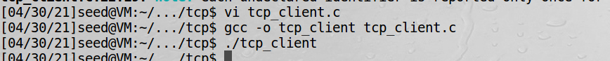
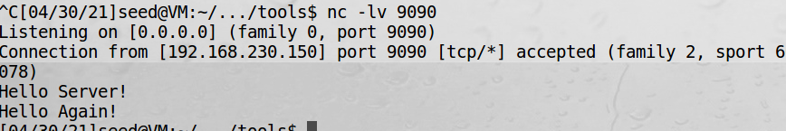
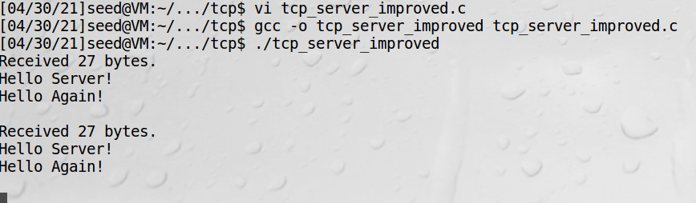
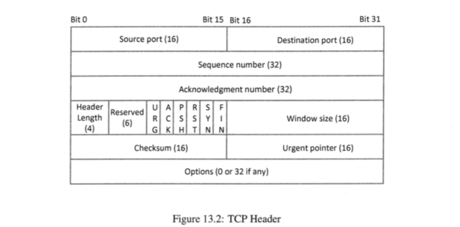

# TCP攻击背景

TCP是传输控制协议(transmission control protocol)，是因特网协议簇中的一个核心协议。  
TCP协议的应用：浏览器、SSH、Telnet、邮件等。  
TCP/IP协议簇中有两种传输层协议：TCP和UDP(user datagram protocol，用户数据报协议)

tcp连接的通信管道是逻辑上的不是物理上的，最初进行TCP设计时并没有在协议中建立安全机制，因此本质上
TCP连接是不受保护的，这使得攻击者有可能窃听连接，向连接注入伪造信息，破坏劫持连接等。

## TCP客户端程序

```c
// tcp_client.c
#include <unistd.h>
#include <stdio.h>
#include <string.h>
#include <sys/socket.h>
#include <netinet/ip.h>
#include <arpa/inet.h>

int main()
{
    int sockfd = socket(AF_INET, SOCK_STREAM, 0);
    struct sockaddr_in dest;
    memset(&dest, 0, sizeof(struct sockaddr_in));
    dest.sin_family = AF_INET;
    dest.sin_addr.s_addr = inet_addr("192.168.230.151");
    dest.sin_port = htons(9090);
    
    connect(sockfd, (struct sockaddr *)&dest, sizeof(struct sockaddr_in));
    
    char *buffer1 = "Hello Server!\n";
    char *buffer2 = "Hello Again!\n";
    write(sockfd, buffer1, strlen(buffer1));
    write(sockfd, buffer2, strlen(buffer2));
    close(sockfd);
    return 0;
}
```

建立socket时TCP用SOCK_STREAM，UDP用SOCK_DGRAM。  
发送数据可用的函数有：write()、send()、sendto()、sendmsg()  
接收数据可用的函数有：read()、recv()、recvfrom()  

测试：  
1、虚拟机2起tcp服务：
```bash
nc -lv 9090
```
2、虚拟机1运行客户端：


3、虚拟机2收到消息：


## TCP服务端程序

```c
// tcp_server.c
#include <unistd.h>
#include <stdio.h>
#include <string.h>
#include <sys/socket.h>
#include <netinet/ip.h>
#include <arpa/inet.h>

int main()
{
    int sockfd, newsockfd;
    struct sockaddr_in my_addr, client_addr;
    char buffer[100];
    
    sockfd = socket(AF_INET, SOCK_STREAM, 0);
    memset(&my_addr, 0, sizeof(struct sockaddr_in));
    my_addr.sin_family = AF_INET;
    my_addr.sin_port = htons(9090);
    bind(sockfd, (struct sockaddr *)&my_addr, sizeof(struct sockaddr_in));
    
    listen(sockfd, 5);
    
    int client_len = sizeof(client_addr);
    newsockfd = accept(sockfd, (struct sockaddr *)&client_addr, &client_len);
    
    memset(buffer, 0, sizeof(buffer));
    int len = read(newsockfd, buffer, 100);
    printf("Received %d bytes: %s", len, buffer);
    
    close(newsockfd);
    close(sockfd);
    return 0;
}
```

listen(sockfd, 5);第二个参数是可以接受的连接数 
启动服务，用tcp_client发数据，可以收到数据：


上面程序有一个问题，只能建立一个连接。TCP服务端程序应该允许多个客户端连接它，改进后如下：
```c
// tcp_server_improved.c
#include <unistd.h>
#include <stdio.h>
#include <string.h>
#include <sys/socket.h>
#include <netinet/ip.h>
#include <arpa/inet.h>

int main()
{
    int sockfd, newsockfd;
    struct sockaddr_in my_addr, client_addr;
    char buffer[100];
    
    sockfd = socket(AF_INET, SOCK_STREAM, 0);
    memset(&my_addr, 0, sizeof(struct sockaddr_in));
    my_addr.sin_family = AF_INET;
    my_addr.sin_port = htons(9090);
    bind(sockfd, (struct sockaddr *)&my_addr, sizeof(struct sockaddr_in));
    
    listen(sockfd, 5);
    
    int client_len = sizeof(client_addr);
    while (1)
    {
        newsockfd = accept(sockfd, (struct sockaddr *)&client_addr, &client_len);
    
        if (fork() == 0)
        {
            // 子进程运行
            close(sockfd);
            memset(buffer, 0, sizeof(buffer));
            int len = read(newsockfd, buffer, 100);
            printf("Received %d bytes.\n%s\n", len, buffer);
    
            close(newsockfd);
            return 0;
        }else{
            // 父进程运行
            close(newsockfd);
        }
    }
    return 0;
}
```

!!! fork

    系统调用fork()通过复制调用进程创建一个新进程。这两个进程会运行同样的代码，但父进程运行的fork()会
    返回子进程的进程ID，而子进程运行的fork()则返回0

上述程序，sockfd没有在子进程中使用，所以它需要被关闭。同样，newsockfd没有在父进程使用，也需要关闭。
现在可以多次接收数据了：


## 数据传输的底层原理

连接建立后，操作系统分配两个缓冲区：发送缓冲区和接收缓冲区。TCP是双工的，两端可以发送和接收数据。  
当应用发送数据时，它不直接构建一个数据包，而是将数据放在TCP发送缓冲区中，然后由操作系统的TCP协议栈代码
将数据打包发出。  

**数据包即使不按顺序到达，也能按序排列**：在TCP数据包头部有一个字段叫序列号，表示载荷中的第一个字节对应的
序列号。当数据包到达接收端时，TCP利用TCP数据头部的序列号将数据放进接收缓冲区的正确位置。

TCP中，一旦数据放入接收缓冲区，它们会被合并成一条数据流，数据包边界将会消失，而UDP不是这样。

接收端会告诉发送端数据已经收到，会发送确认包，出于效率考虑，不是对每个包都发送确认包，而是告知发送端下一个希望
收到的数据的序列号。

## TCP头部



TCP头部长度用32位字的数量来计量，因此将这个域的值乘以4才得到TCP头部字节数。  
窗口大小用来表明TCP段的发送者希望接收的字节数的上限。流量控制用的。  
检验和计算范围包括IP头部、TCP头部、TCP数据。  
紧急指针用于紧急/优先级的目的。紧急数据不需要排队。  