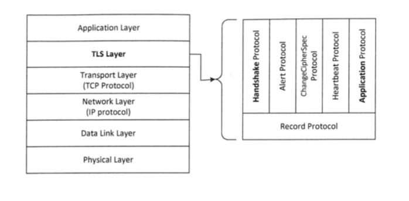
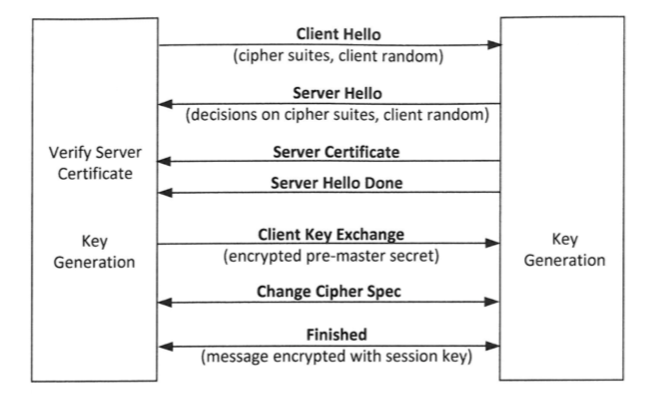
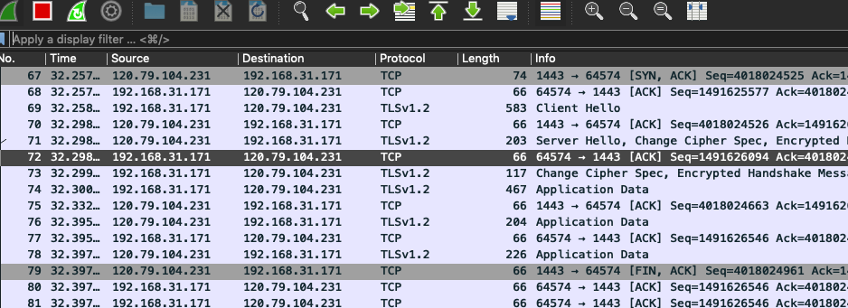
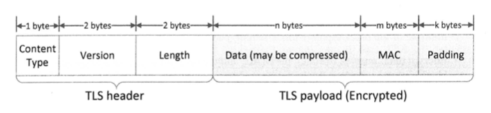

# 传输层安全

为了在互联网中安全地传输数据，需要加密数据，但是加密算法有很多，即使同一种加密算法也有不同的参数，所以需要遵循一个共同的
标准，传输层安全协议（transport layer security, TLS）就是这样一个标准。

## TLS概述

TLS是从SSL发展来的，并逐渐取代SSL。安全套接字（Secure Socket Layer, SSL）协议是web浏览器与web服务器之间安全
交换信息的协议，提供两个基本的安全服务：鉴别与保密。鉴别是指可选的客户端认证和强制的服务端认证。  

!!! TLS由来

    SSL是由Netscape公司开发的，当SSL协议由IETF（因特网工程任务组）标准化时，它被重新命名为传输层安全协议TLS。
    术语SSL、TLS或TLS/SSL可以互换使用。
    
传输层安全协议提供的安全通道有三个属性：  
1、保密性  
2、完整性：如果篡改，通道能检测到  
3、身份验证：至少服务端身份需要被验证

TLS位于应用层和传输层之间，应用程序将未受保护的数据传递给TLS层，TLS层负责加密、解密和完整性检查，然后TLS将
受保护的数据提供给传输层进行传输。  
TLS的设计是建立在TCP传输层上的，也可以用在UDP上，建立在UDP上的TLS叫做DTLS  
TLS由两层组成，底层称为记录层，该层协议称为TLS记录协议，每个记录包含一个头部、一个有效载荷、一个可选的MAC和一个
填充。  
TLS中有5种消息协议，包括握手协议（handshake）、警报协议（alert）、更改密码规范协议（change cipher spec）、
心跳协议（heartbeat）和应用协议（application）

警报协议，目的是向对方报告失败原因  
更改密码规范协议，用于通知对方改变正在使用的加密方法，它通常在握手协议结束后用来告知对方从公钥加密模式切换到密钥加密
模式  
握手协议复制建立安全通道  
应用协议用于通道的实际数据传输  
本章只关注最关键的握手协议和应用协议  

## TLS握手

  
1、客户端发送hello。表明支持哪些密码套件，提供客户端随机数（用来在密钥生成时用来作为nonce，即一次性随机数）  
2、服务端回复hello。决定一个都支持的密码套件，提供服务端随机数  
3、服务端发送公钥证书。  
4、服务端发送握手完成。  
5、客户端发送密钥交换消息。客户端生成一个随机的预主密钥，然后用服务器的公钥对其进行加密，并将加密后的密钥发给服务端。
客户端和服务器首先使用预主密钥生成主密钥，然后再使用主密钥生成会话密钥，这将用于保护客户端和服务器之间的通信。    
6、互相发送更改密码规范消息，告诉将加密  
7、互相发送加密完成消息。必须包含一个哈希值和MAC（报文认证码）值

wireshark抓包TLS实验：  
1、启动一台虚拟机ip地址为192.168.31.208，查看宿主机同网卡ip地址为192.168.31.171  
2、打开wireshark  
3、在宿主机用web访问http://192.168.31.208  
4、wireshark可看到抓包结果  

### 证书验证

上述第五个步骤中，如果直接发送公钥会受到中间人攻击，因此服务器应该发送一个公钥证书，证书中包含服务器的公钥、身份
信息、截止日期、CA的签名以及其他相关信息。  
客户端收到证书，要验证证书是否有效，包括截止日期、签名是否有效等，故需要事先加载可信CA证书列表。  
如果签名CA在这个列表中，则可以直接验证证书，如果不在，则服务器需要提供所有中间CA的证书。  

应注意的是，上述TLS验证仅检查证书是否有效，并不检查证书中包含的身份信息是否与目标服务器的身份匹配。是否匹配应由
应用程序来做。

### 密钥生成和交换

上述第六个步骤，之所以要更改密码规范，是因为公钥加密算法比密钥加密算法慢很多，故要切换到密钥加密算法  
密钥生成过程有三步：  
1、生成预主密钥，就是客户端和服务器两个随机数    
2、生成主密钥，长度48字节    
3、生成会话密钥  

!!! 会话过程中简化握手协议

    TLS允许客户端和服务器在会话过程中改变加密参数，这只需要简化的握手协议，重新生成两个新的随机数，
    重复主密钥扩展和会话密钥生成步骤

## TLS数据传输

完成握手协议后，就交换数据了。数据被放在一个TLS记录中传输，TLS记录不仅传数据还传握手协议和子协议消息。
每条记录包含一个头部和一个有效载荷。  
头部有三个字段：  
1、内容类型，表示当前记录携带哪个协议数据  
2、版本字段  
3、长度字段，载荷的长度，不包括头部    

记录格式：  

应用程序写入数据用SSL_write函数，接收数据用SSL_read函数