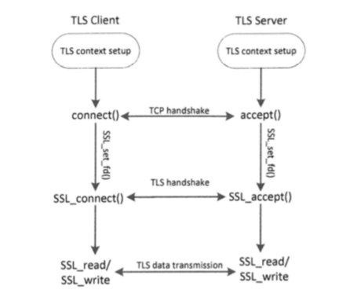
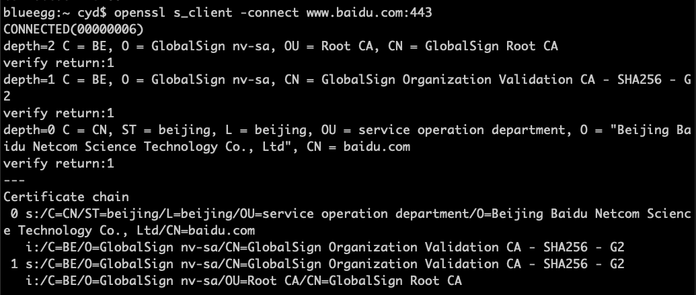
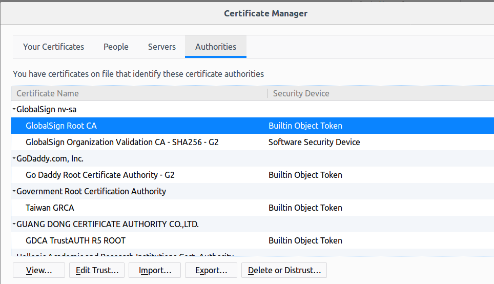
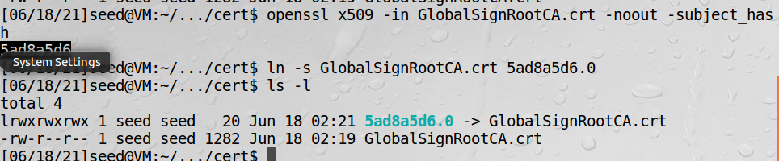
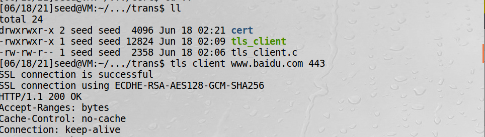
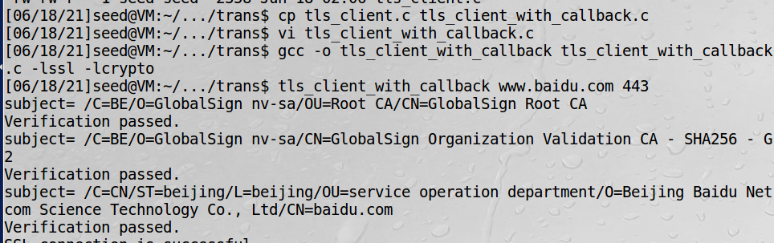

# TLS编程

  
TLS编程的四个步骤：  
1、建立TLS上下文：包括加载加密算法和私钥，决定TLS版本，决定是否验证对方的证书等  
2、建立TCP连接  
3、TLS握手  
4、数据传输  

## 客户端程序

tls_client.c：  
```c
#include <arpa/inet.h>
#include <openssl/ssl.h>
#include <openssl/err.h>
#include <netdb.h>

#define CHK_SSL(err) if ((err) < 1) { ERR_print_errors_fp(stderr); exit(2); }

SSL* setupTLSClient(const char* hostname)
{
   // Step 0: OpenSSL library initialization
   // This step is no longer needed as of version 1.1.0.
   SSL_library_init();
   SSL_load_error_strings();

   // Step 1: SSL context initialization
   SSL_METHOD *meth = (SSL_METHOD *)TLSv1_2_method();
   SSL_CTX* ctx = SSL_CTX_new(meth);
   SSL_CTX_set_verify(ctx, SSL_VERIFY_PEER, NULL);
   SSL_CTX_load_verify_locations(ctx, NULL, "./cert");

   // Step 2: Create a new SSL structure for a connection
   SSL* ssl = SSL_new (ctx);

   // Step 3: Enable the hostname check
   X509_VERIFY_PARAM *vpm = SSL_get0_param(ssl);
   X509_VERIFY_PARAM_set1_host(vpm, hostname, 0);

   return ssl;
}

int setupTCPClient(const char* hostname, int port)
{
   struct sockaddr_in server_addr;

   // Get the IP address from hostname
   struct hostent* hp = gethostbyname(hostname);

   // Create a TCP socket
   int sockfd= socket(AF_INET, SOCK_STREAM, IPPROTO_TCP);

   // Fill in the destination information (IP, port #, and family)
   memset (&server_addr, '\0', sizeof(server_addr));
   memcpy(&(server_addr.sin_addr.s_addr), hp->h_addr, hp->h_length);
   server_addr.sin_port   = htons (port);
   server_addr.sin_family = AF_INET;

   // Connect to the destination
   connect(sockfd, (struct sockaddr*) &server_addr,
           sizeof(server_addr));

   return sockfd;
}


int main(int argc, char *argv[])
{
   char *hostname = "example.com";
   int port = 443;

   if (argc > 1) hostname = argv[1];
   if (argc > 2) port = atoi(argv[2]);

   // TLS initialization and create TCP connection
   SSL *ssl   = setupTLSClient(hostname);
   int sockfd = setupTCPClient(hostname, port);

   // TLS handshake
   SSL_set_fd(ssl, sockfd);
   int err = SSL_connect(ssl); CHK_SSL(err);
   printf("SSL connection is successful\n");
   printf ("SSL connection using %s\n", SSL_get_cipher(ssl));

   // Send and Receive data
   char buf[9000];
   char sendBuf[200];

   sprintf(sendBuf, "GET / HTTP/1.1\nHost: %s\n\n", hostname);
   SSL_write(ssl, sendBuf, strlen(sendBuf));

   int len;
   do {
     len = SSL_read (ssl, buf, sizeof(buf) - 1);
     buf[len] = '\0';
     printf("%s\n",buf);
   } while (len > 0);
}
```
程序解读：  
setupTLSClient函数是TLS初始化  
setupTCPClient函数是TCP连接设置，默认端口号443    
SSL_library_init，注册可用的密码和摘要  
SSL_load_error_strings，载入错误字符串，因此当TLS库发送错误时，可以打印更有意义的文本消息  
（openssl版本在1.1.0以上会自动分配所有资源，不需要调这两函数了，ubuntu 16.04也不需要）  
SSL_CTX_set_verify，告诉TLS是否进行证书验证，SSL_VERIFY_PEER表示要验证  
SSL_CTX_load_verify_locations，载入可信CA证书  
下面两行是启用主机名检查非常重要  
```c
X509_VERIFY_PARAM *vpm = SSL_get0_param(ssl);
X509_VERIFY_PARAM_set1_host(vpm, hostname, 0);
```
SSL_set_fd函数将SSL层绑定到一个TCP连接上  
SSL_connect启动与服务器的TLS握手协议  
CHK_SSL是一个宏，如果握手失败打印错误信息  

### 创建证书文件夹

在使用真实的网站来测试客户端程序之前，必须有一个被信任的CA证书，并且需要把它们存放于./cert文件夹中。  
查看哪些可信的CA证书可以来验证百度服务器的证书：  

说明百度证书是由GlobalSign Organization Validation CA这个中间CA签发的，这个中间CA证书是由
GlobalSign Root CA这个根CA签发的  

火狐浏览器导出步骤：  
Edit-Privacy-view certificates-选中百度证书-export


!!! 命名证书文件

    当TLS验证一个证书时，它会用该证书发行者域（Issuer）的信息生成一个哈希值，然后在指定的目录中寻找以该
    哈希值命名的证书。为了让TLS客户端程序找到这个CA的证书，需要用该CA证书的拥有者域（Subject）生成的
    哈希值来命名证书文件。

可以用openssl x509命令的-subject_hash选项生成该哈希值，然后用它作为符号链接来指向该CA证书
```bash
openssl x509 -in GlobalSignRootCA.crt -noout -subject_hash
```


### 验证实验 

编译程序：
```bash
gcc -o tls_client tls_client.c -lssl -lcrypto
```
-lssl和-lcrypto告诉编译器需要用到openssl的ssl库和crypto库  

测试证书是否设置正确：
```bash
tls_client www.baidu.com 443
```
如下图则为设置正确：


!!! warning

    注意导出必须是根证书，不能是中间CA证书，否则实验失败

## 校验服务器主机名

以上客户端程序有一个问题，就是没有校验服务器的主机名，解决这个问题需要修改一行代码并增加一个函数
```c
SSL_CTX_set_verify(ctx, SSL_VERIFY_PEER, NULL);
```
改成
```c
SSL_CTX_set_verify(ctx, SSL_VERIFY_PEER, verify_callback);
```
TLS每检验完一个证书，无论成功与否，都会调用该函数。
```c
int verify_callback(int preverify_ok, X509_STORE_CTX *x509_ctx)
{
    char  buf[300];

    X509* cert = X509_STORE_CTX_get_current_cert(x509_ctx); 
    X509_NAME_oneline(X509_get_subject_name(cert), buf, 300);
    printf("subject= %s\n", buf);    

    if (preverify_ok == 1) {
       printf("Verification passed.\n");
    } else {
       int err = X509_STORE_CTX_get_error(x509_ctx);
       printf("Verification failed: %s.\n",
                    X509_verify_cert_error_string(err)); 
    }

    /* For the experiment purpose, we always return 1, regardless of
     * whether the verification is successful or not. This way, the
     * TLS handshake protocol will continue. This is not safe!
     * Readers should not blindly copy the following line. We will
     * discuss the correct return value later.
     */
    return 1;
}
```
回调函数的两个参数，一个是确认的状态，另一个是指向用于校验证书链完整性的上下文指针。  
X509_STORE_CTX_get_current_cert，从指针中获得当前的证书  
X509_NAME_oneline，把证书主题域存到buf中  

可以看到有校验成功的打印了