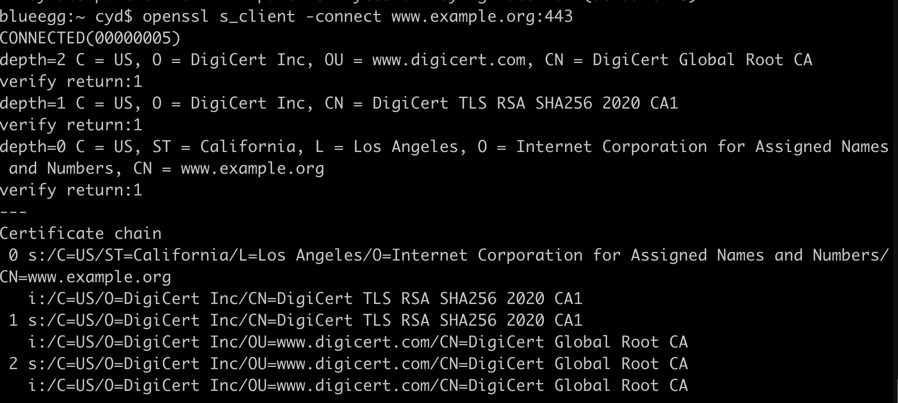
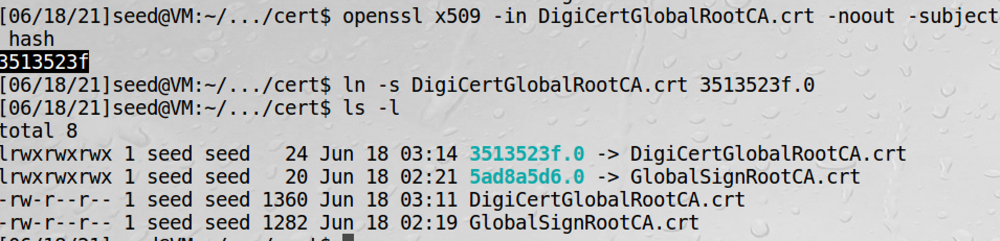
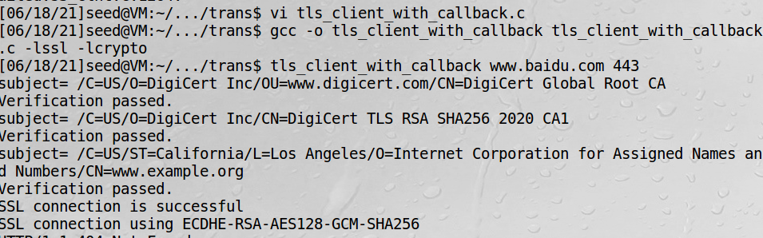
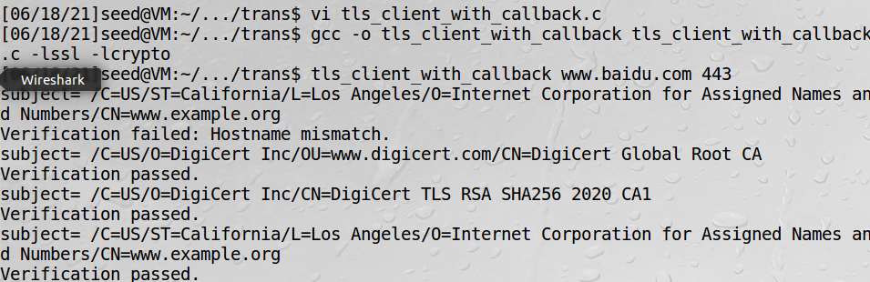
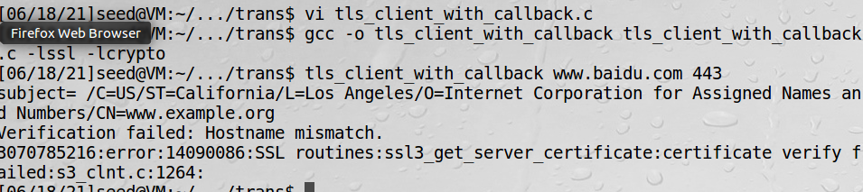

# 中间人攻击没主机校验的服务

实验针对一个要访问www.baidu.com的用户，假设www.example.org是恶意的中间人，想获取百度的账户密码

## 1、引导到错误网站

让受害者访问www.baidu.com时，实际访问的是www.example.org，正常应通过DNS缓存攻击来做到，这里只修改/etc/hosts
达到同样的效果
```bash
93.184.216.34 www.baidu.com
```

## 2、保存两个网站证书

把www.example.org的证书也保存到cert目录中




## 3、去掉主机校验，每一次TLS验证都是成功的

下面两行注释掉，重新编译，再测试
```c
X509_VERIFY_PARAM *vpm = SSL_get0_param(ssl);
X509_VERIFY_PARAM_set1_host(vpm, hostname, 0);
```


## 4、恢复校验，验证失败




上面第四步实验可以看到，恢复检查后，主机名不匹配，最后还是提示校验成功，那是因为之前始终返回1的缘故，
故需要改一下返回逻辑
```c
int verify_callback(int preverify_ok, X509_STORE_CTX *x509_ctx)
{
    char  buf[300];

    X509* cert = X509_STORE_CTX_get_current_cert(x509_ctx); 
    X509_NAME_oneline(X509_get_subject_name(cert), buf, 300);
    printf("subject= %s\n", buf);    

    if (preverify_ok == 1) {
       printf("Verification passed.\n");
       return 1;
    } else {
       int err = X509_STORE_CTX_get_error(x509_ctx);
       printf("Verification failed: %s.\n",
                    X509_verify_cert_error_string(err)); 
       return 0;
    }
}
```
上面返回1表示继续TLS握手协议，0则终止握手

以上结果表明，成功检查到了中间人攻击不匹配，终止了程序。