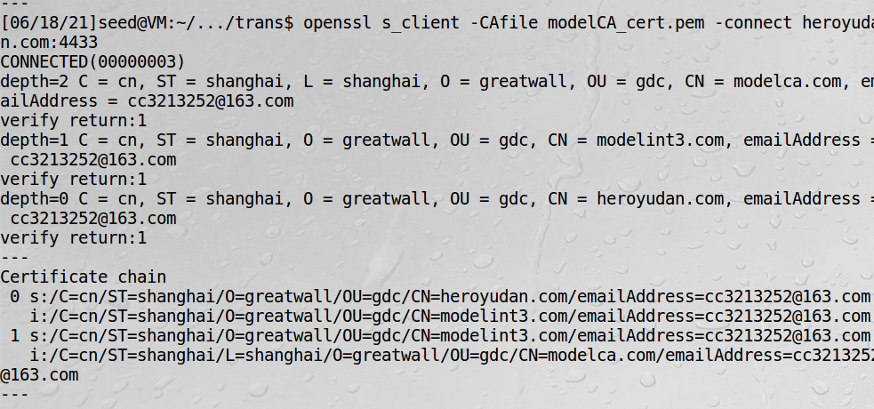

# TLS服务器编程

实现一个和浏览器简单交互的服务，接收浏览器请求，回复一个hello,world

```c
#include <unistd.h>
#include <arpa/inet.h>
#include <openssl/ssl.h>
#include <openssl/err.h>
#include <netdb.h>

#define CHK_SSL(err) if ((err) < 1) { ERR_print_errors_fp(stderr); exit(2); }
#define CHK_ERR(err,s) if ((err)==-1) { perror(s); exit(1); }

void processRequest(SSL* ssl, int sock)
{
    char buf[1024];
    int len = SSL_read (ssl, buf, sizeof(buf) - 1);
    buf[len] = '\0';
    printf("Received: %s\n",buf);

    // Construct and send the HTML page
    char *html =
      "HTTP/1.1 200 OK\r\n"                        
      "Content-Type: text/html\r\n\r\n"
      "<!DOCTYPE html><html>"
      "<head><title>Hello World</title>"
      "<style>body {background-color: black}"
      "h1 {font-size:3cm; text-align: center; color: white;"
      "text-shadow: 0 0 3mm yellow}</style></head>"
      "<body><h1>Hello, world!</h1></body></html>"; 
    SSL_write(ssl, html, strlen(html));
    SSL_shutdown(ssl);  SSL_free(ssl);
}


int setupTCPServer()
{
    struct sockaddr_in sa_server;
    int listen_sock, err, tr = 1;

    // Create a listening socket
    listen_sock= socket(PF_INET, SOCK_STREAM, IPPROTO_TCP);
    err = setsockopt(listen_sock, SOL_SOCKET, SO_REUSEADDR,
                     &tr, sizeof(int));
    CHK_ERR(err, "setsockopt");

    // Prepare for address structure
    memset (&sa_server, '\0', sizeof(sa_server));
    sa_server.sin_family      = AF_INET;
    sa_server.sin_addr.s_addr = INADDR_ANY;
    sa_server.sin_port        = htons (4433);

    // Bind the socket to a port
    err = bind(listen_sock, (struct sockaddr*)&sa_server,
                                 sizeof(sa_server));
    CHK_ERR(err, "bind");

    // Listen to connections
    err = listen(listen_sock, 5);
    CHK_ERR(err, "listen");
    return listen_sock;
}

int main()
{
  const SSL_METHOD *meth;
  SSL_CTX* ctx;
  SSL* ssl;

  // Step 0: OpenSSL library initialization
  SSL_library_init();
  SSL_load_error_strings();

  // Step 1: SSL context initialization
  meth = (SSL_METHOD *)TLSv1_2_method();
  ctx = SSL_CTX_new(meth);
  SSL_CTX_set_verify(ctx, SSL_VERIFY_NONE, NULL);

  // Step 2: Set up the server certificate and private key
/*  SSL_CTX_use_certificate_file(ctx, "./cert_server/heroyudan_cert.pem",
                                SSL_FILETYPE_PEM); */
  SSL_CTX_use_certificate_chain_file(ctx, "./cert_server/hero_cert.pem");
  SSL_CTX_use_PrivateKey_file(ctx, "./cert_server/heroyudan_key.pem",
                                SSL_FILETYPE_PEM);

  // Step 3: Create a new SSL structure for a connection
  ssl = SSL_new (ctx);

  struct sockaddr_in sa_client;
  size_t client_len;

  int listen_sock = setupTCPServer();
  while (1) {
    int sock = accept(listen_sock, (struct sockaddr*)&sa_client, &client_len);
    printf ("TCP connection established!\n");
    if (fork() == 0) { // Child process
       close (listen_sock);

       SSL_set_fd (ssl, sock);
       int err = SSL_accept (ssl);
       CHK_SSL(err);
       printf ("SSL connection established!\n");

       processRequest(ssl, sock);
       close(sock);
       return 0;
    } else { // Parent process
        close(sock);
    }
  }
}
```
程序解读：  
建立上下文时用了SSL_VERIFY_NONE，说明服务器不要求客户端发送证书  
SSL_CTX_use_certificate_file，加载证书文件
SSL_CTX_use_PrivateKey_file，加载私钥  

!!! 服务器证书

    服务器把所有的证书按顺序放在一个单独的PEM格式文件中，这个顺序应与证书链中的顺序相同，即服务器自己的证书放在
    第一位，中间CA证书紧跟其后

## 测试

在公钥基础设施-根与中间CA一章，我们生成了heroyudan.com这个网站的公钥证书和私钥文件

1、把heroyudan_cert.pem和heroyudan_key.pem拷贝到cert_server目录中  
2、在客户端把heroyudan.com映射到服务端，这里是本机测试，修改hosts文件  
3、由于heroyudan.com证书是根modelca.com颁发的，故把modelca.com导出到cert目录  
4、生成客户端哈希命名文件

5、把根CA证书（modelCA_cert.pem）拷贝过来  
6、启动服务器

7、在客户端用openssl交互
```bash
openssl s_client -CAfile modelCA_cert.pem -connect heroyudan.com:4433
```

出现上述问题的原因是：因为我用的是一个中间CA颁发的证书，那就必须用校验证书链这个函数。
SSL_CTX_use_certificate_file只适用于根CA颁发的证书，改正代码后，如下结果才是正确的


8、在客户端用自己编写的程序和服务器交互  
