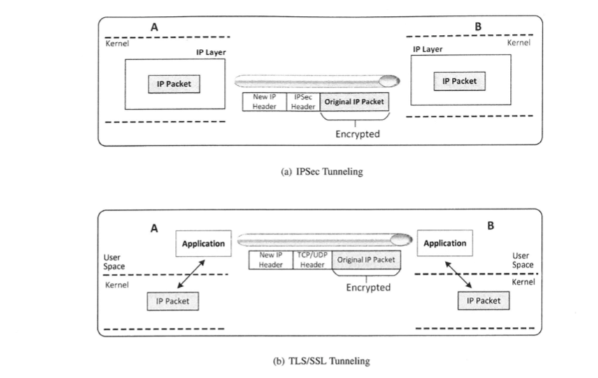

# 虚拟专用网络基本概念

私有网络的三个特性：  
1、用户认证  
2、内容保护  
3、完整性保护  
如果不需要把计算机放在一个内部网络内也能实现这些特性，那么内网和外网就不那么重要了。如果能创建一个既包含内网又包含外网
的私有网络，就称这个网络为虚拟专用网络。虚拟专用网络是为了能在公共基础设施之上提供企业的私有网络服务而提出的。  

## 虚拟专用网络的工作原理

VPN的另一个重要特性是透明性，透明性最佳实现方式是通过IP层。故实现VPN就变成如何安全地在虚拟专用网络内的主机
A和B之间发送IP数据包。  
难点在于IP数据包的所有部分都要被加密保护，然而加密的IP数据包是不能经由因特网传输的，
因为路由器不能读取加密数据包的头部，也无法修改数据包的头部（路由器需要修改存活时间和校验和）  
一种解决方法是把受保护的IP数据包作为载荷放入一个新的IP数据包中，这个新的数据包头是不加密的。它的任务是从A到B
传输受保护的原始IP数据包，一旦到达A或B，新数据包头被丢弃。这个技术叫做IP隧道（IPSec tunneling）

有多种方法可实现IP隧道，最具代表性的两种方法是IPSec隧道和TLS/SSL隧道。IPSec隧道使用了互联网络层安全协议（IPSec）  
IPSec有一个模式叫做隧道模式，在这个模式下，整个原始IP数据包被封装在一个新的IP数据包内，并且添加一个新的头部，
这是在IP层完成的。这种方法已经被用来实现VPN。  

另一种实现隧道的方法是不在内核实现，而在应用内部实现。它的做法是把每个属于VPN的IP数据包传递给特定的应用程序，
这个应用程序把数据包放入TCP或者UDP包（一个新的数据包）内，然后把新数据包发送给应用程序在隧道另一端的对接程序，
对接程序将原始数据包从TCP或者UDP包的载荷中提取出来，并发送到私有网络内。  
为了保护数据包的安全，隧道的两端使用TLS/SSL通信，因此这个技术被称为TLS/SSL隧道，也被称为传输层隧道。这个隧道
更加流行，是因为它在应用程序中实现，而不是在内核中实现。应用层面实现更容易，更容易更新。

## TLS/SSL VPN原理概述

建立虚拟线路需要两台计算机，一台VPN客户端，一台VPN服务器  
VPN客户端和服务器的主要任务如下：  
1、建立一条安全的隧道  
2、转发由隧道一端到另一端的IP数据包  
3、在隧道另一端接收到IP数据包后，把数据包发送到私有网络内，这样数据包可以到达最终的目的地  

### 建立一个TLS/SSL隧道

需要互相认证，验证通常通过公钥证书来实现，TLS/SSL信道中的数据是加密的，因此是安全的信道

### 转发IP数据包

例如，10.0.7.0/24作为客户端的子网，10.0.8.0/24作为服务端的子网，这两子网可以不属于同一个网络，无论网络
配置多么复杂，只需设置好路由器，让两个子网的流量都先发往vpn服务器。  
vpn收到客户端数据包后，要通过专用安全信道发送给服务器，但是系统如何把数据包传递给运行在用户空间的应用程序是
一个问题  
有两个原因让隧道应用程序难以得到这个数据包，一是操作系统不会把数据包交给它自己的应用程序，二是即使vpn客户端
决定在网络协议栈中把数据包交给它自己的应用程序，但只有数据部分会被传递给应用程序，IP头和传输层头都会被丢弃。
而基于IPSec的vpn则不会有这个问题，因为隧道是在内核内部的。

!!! TUNTAP技术

    解决上述问题的一个设想是假定隧道应用程序是一台计算机（而不是一个应用程序），这台计算机与VPN客户端通过
    网络接口连接，然后设置vpn客户端内部的路由表，让所有去往10.0.8.0/24的数据包都被路由到这台计算机，因为
    隧道应用程序是通过路由器得到数据包的，因此它能得到完整的数据包，包括IP头部。  
    TUN/TAP技术就是这样一个技术，使一个应用程序成为一台虚拟机，并通过虚拟网络接口连接到vpn客户端。

### 传递IP数据包

新数据包通过信道到达VPN服务器，VPN服务器的网络协议栈会剥掉新头部，把载荷（即加密的IP数据包）交给隧道应用程序。
在解密原始IP数据包并且验证它的完整性后，隧道应用程序需要把它交给内核，内核再把这个数据包路由给终点V。  
这里的一个问题是应用程序如何把IP数据包传递给系统内核呢，答案是用TUN/TAP技术