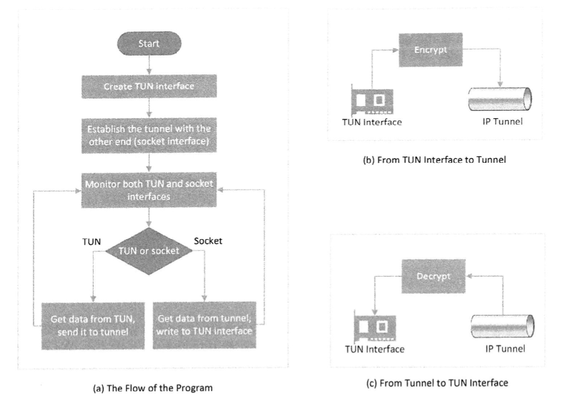
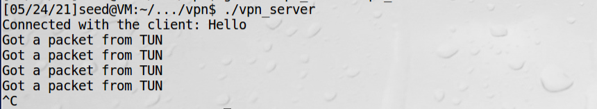
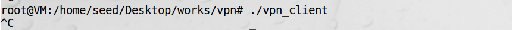

# 开发VPN程序

vpn程序原理如下：


Linux中有一个叫做select()的系统调用，可以让程序同时监控多个文件描述符。  
为了使用select()系统调用，需要把所有要监控的文件描述符用宏FD_SET存储在一个集合中，然后把这个集合传给
select()系统调用，它会阻塞进程，直到集合中的一个文件描述符内有数据为止。  
程序用宏FD_ISSET来确定哪一个文件描述符获得了数据。  
FD_ZERO，将指定的文件描述符清空  

服务端代码：
```c
// vpn_server.c
#include <unistd.h>
#include <stdio.h>
#include <stdlib.h>
#include <string.h>
#include <fcntl.h>
#include <arpa/inet.h>
#include <linux/if.h>
#include <linux/if_tun.h>
#include <sys/ioctl.h>

#define PORT_NUMBER 55555
#define SERVER_IP "192.168.230.150"
#define BUFF_SIZE 2000
struct sockaddr_in peerAddr;

int createTunDevice()
{
   int tunfd;
   struct ifreq ifr;
   memset(&ifr, 0, sizeof(ifr));

   ifr.ifr_flags = IFF_TUN | IFF_NO_PI;  
   tunfd = open("/dev/net/tun", O_RDWR);
   ioctl(tunfd, TUNSETIFF, &ifr);      

   return tunfd;
}

int initUDPServer() {
    int sockfd;
    struct sockaddr_in server;
    char buff[100];

    memset(&server, 0, sizeof(server));
    server.sin_family = AF_INET;
    server.sin_addr.s_addr = htonl(INADDR_ANY);
    server.sin_port = htons(PORT_NUMBER);

    sockfd = socket(AF_INET, SOCK_DGRAM, 0);
    bind(sockfd, (struct sockaddr*) &server, sizeof(server));

    // Wait for the VPN client to "connect".
    bzero(buff, 100);
    int peerAddrLen = sizeof(struct sockaddr_in);
    int len = recvfrom(sockfd, buff, 100, 0,                  
                (struct sockaddr *) &peerAddr, &peerAddrLen);

    printf("Connected with the client: %s\n", buff);
    return sockfd;
}

// 从TUN接口到隧道
void tunSelected(int tunfd, int sockfd){
    int  len;
    char buff[BUFF_SIZE];

    printf("Got a packet from TUN\n");

    bzero(buff, BUFF_SIZE);
    len = read(tunfd, buff, BUFF_SIZE);
    sendto(sockfd, buff, len, 0, (struct sockaddr *) &peerAddr,
                    sizeof(peerAddr));
}

// 从隧道到TUN接口
void socketSelected (int tunfd, int sockfd){
    int  len;
    char buff[BUFF_SIZE];

    printf("Got a packet from the tunnel\n");

    bzero(buff, BUFF_SIZE);
    len = recvfrom(sockfd, buff, BUFF_SIZE, 0, NULL, NULL);
    write(tunfd, buff, len);
}


int main (int argc, char * argv[]) {
   int tunfd, sockfd;

   tunfd  = createTunDevice();
   sockfd = initUDPServer();

   while (1) {
     fd_set readFDSet;
     FD_ZERO(&readFDSet);
     FD_SET(sockfd, &readFDSet);
     FD_SET(tunfd, &readFDSet);
     select(FD_SETSIZE, &readFDSet, NULL, NULL, NULL);

     if (FD_ISSET(tunfd,  &readFDSet)) tunSelected(tunfd, sockfd);
     if (FD_ISSET(sockfd, &readFDSet)) socketSelected(tunfd, sockfd);
     sleep(1);
  }
}
```
程序解读：  

客户端代码：

```c
// vpn_client.c
#include <unistd.h>
#include <stdio.h>
#include <stdlib.h>
#include <string.h>
#include <fcntl.h>
#include <arpa/inet.h>
#include <linux/if.h>
#include <linux/if_tun.h>
#include <sys/ioctl.h>

#define PORT_NUMBER 55555
#define SERVER_IP "192.168.230.150"
#define BUFF_SIZE 2000
struct sockaddr_in peerAddr;

int createTunDevice()
{
   int tunfd;
   struct ifreq ifr;
   memset(&ifr, 0, sizeof(ifr));

   ifr.ifr_flags = IFF_TUN | IFF_NO_PI;  
   tunfd = open("/dev/net/tun", O_RDWR);
   ioctl(tunfd, TUNSETIFF, &ifr);      

   return tunfd;
}


int connectToUDPServer(){
    int sockfd;
    char *hello="Hello";

    memset(&peerAddr, 0, sizeof(peerAddr));
    peerAddr.sin_family = AF_INET;
    peerAddr.sin_port = htons(PORT_NUMBER);
    peerAddr.sin_addr.s_addr = inet_addr(SERVER_IP);

    sockfd = socket(AF_INET, SOCK_DGRAM, 0);

    // Send a hello message to "connect" with the VPN server
    sendto(sockfd, hello, strlen(hello), 0,
                (struct sockaddr *) &peerAddr, sizeof(peerAddr));

    return sockfd;
}

void tunSelected(int tunfd, int sockfd){
    int  len;
    char buff[BUFF_SIZE];

    printf("Got a packet from TUN\n");

    bzero(buff, BUFF_SIZE);
    len = read(tunfd, buff, BUFF_SIZE);
    sendto(sockfd, buff, len, 0, (struct sockaddr *) &peerAddr,
                    sizeof(peerAddr));
}

void socketSelected (int tunfd, int sockfd){
    int  len;
    char buff[BUFF_SIZE];

    printf("Got a packet from the tunnel\n");

    bzero(buff, BUFF_SIZE);
    len = recvfrom(sockfd, buff, BUFF_SIZE, 0, NULL, NULL);
    write(tunfd, buff, len);
}


int main (int argc, char * argv[]) {
   int tunfd, sockfd;

   tunfd  = createTunDevice();
   sockfd = connectToUDPServer();

   while (1) {
     fd_set readFDSet;
     FD_ZERO(&readFDSet);
     FD_SET(sockfd, &readFDSet);
     FD_SET(tunfd, &readFDSet);
     select(FD_SETSIZE, &readFDSet, NULL, NULL, NULL);

     if (FD_ISSET(tunfd,  &readFDSet)) tunSelected(tunfd, sockfd);
     if (FD_ISSET(sockfd, &readFDSet)) socketSelected(tunfd, sockfd);
  }
}
```

测试：  
1、启动服务端  


2、启动客户端


!!! Note

    程序有几个地方做了简化处理，1是没有使用基于TCP/UDP的TLS/SSL协议，只是用了UDP；2是
    系统调用没有判断返回值