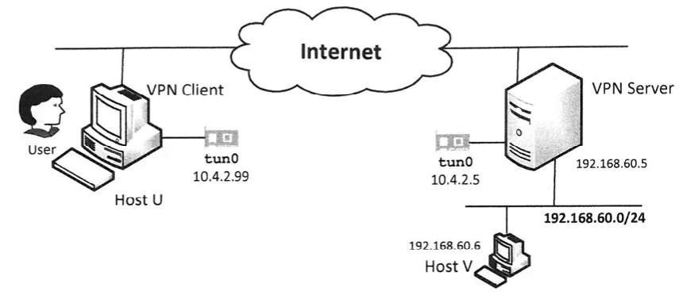

# VPN的网络配置

上一节实现了一个简单的IP隧道，这节将用这个隧道搭建一个VPN

## 实验环境的网络配置


我这边vpn服务器地址192.168.230.150， 内网地址10.0.2.69    
主机V和vpn服务器同一个子网，地址192.168.230.156  
vpn客户端内网地址10.0.2.68，因特网地址

## 配置VPN服务器

VPN服务器需要转发IP数据包给其他计算机，起到路由器的作用。但是主机不转发其他主机的包，可以通过如下配置
让主机支持转发：
```bash
sudo sysctl -w net.ipv4.ip_forward=1
```

步骤：  
1、运行服务端程序
```bash
./vpn_server
```

2、为tun0分配ip地址（10.4.2.5）