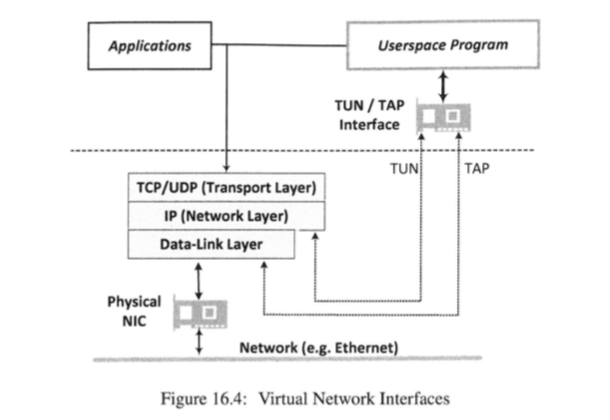
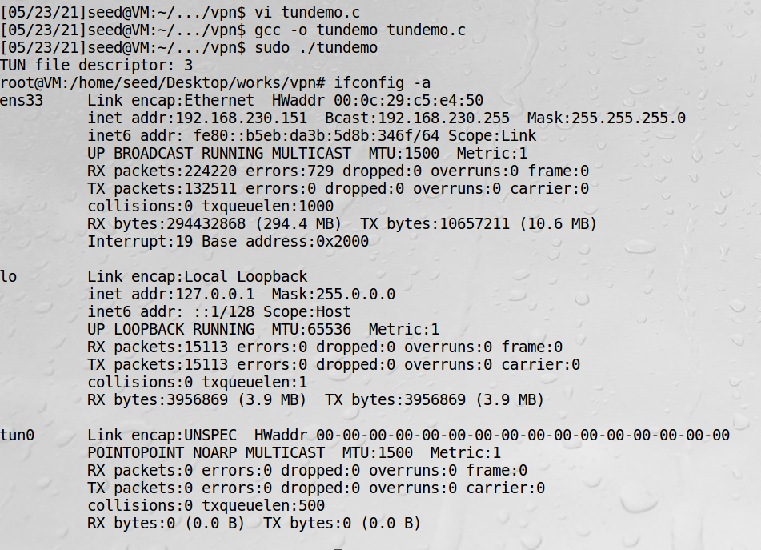
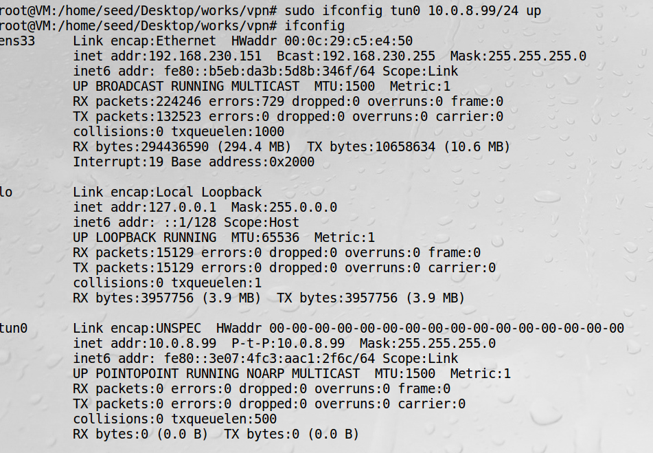
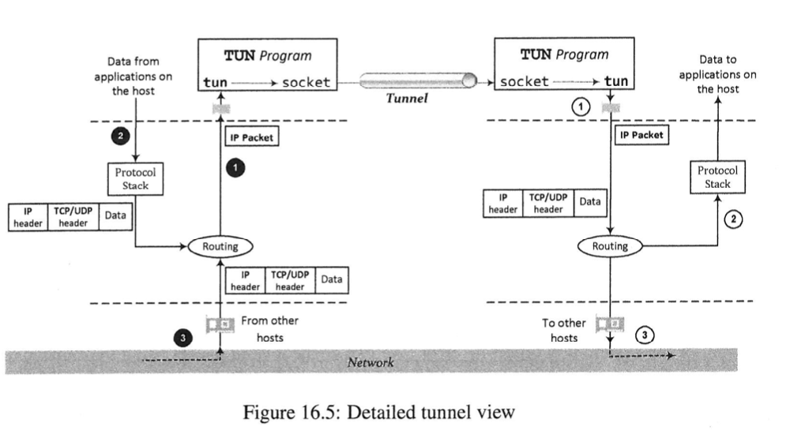
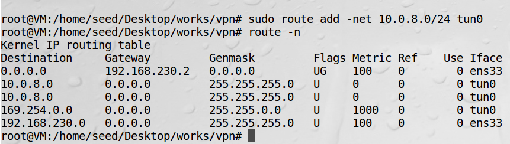
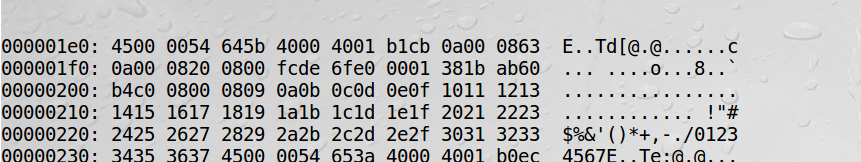
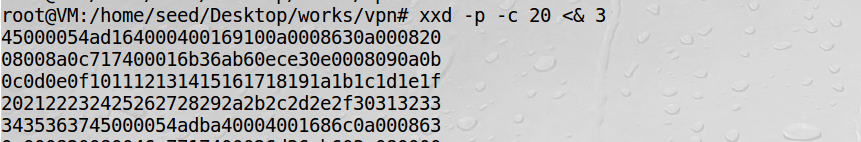

# TLS/SSL VPN原理细节

这节的重点是信道应用程序如何从系统中得到IP数据包

## 虚拟网络接口

Linux和许多操作系统都支持两种网络接口：物理网络接口和虚拟网络接口。  
物理网络接口通过硬件网卡把计算机连到网络。  
虚拟网络接口对应一个用软件实现的虚拟网卡。  

!!! 虚拟网络接口例子

    loopback接口，任何发送到该接口的流量都会返回给内核，实现数据包来自网络的效果。  
    TUN/TAP接口。
    
TUN接口作用在网络协议栈的IP层或者OSI的第三层（网络层），把数据包发送到TUN接口会使得数据包（包括IP头部）被
传递到用户空间的程序。  
TAP接口作用在OSI的第二层（数据链路层），它的作用就像一个物理网络适配器。被广泛用于创建网桥。  

物理网络接口与虚拟网络接口的区别如下：


## 建立TUN接口

TUN就是在内核和用户程序之间的代理  

```bash
#include <fcntl.h>
#include <stdio.h>
#include <unistd.h>
#include <string.h>
#include <arpa/inet.h>
#include <linux/if.h>
#include <linux/if_tun.h>
#include <sys/ioctl.h>

int createTunDevice()
{
   int tunfd;
   struct ifreq ifr;
   memset(&ifr, 0, sizeof(ifr));

   ifr.ifr_flags = IFF_TUN | IFF_NO_PI; 
   tunfd = open("/dev/net/tun", O_RDWR);
   ioctl(tunfd, TUNSETIFF, &ifr);      

   return tunfd;
}

int main () {
   int tunfd = createTunDevice();
   printf("TUN file descriptor: %d \n", tunfd);

   // We can interact with the device using this file descriptor.
   // In our experiement, we will do the interaction from a shell.
   // Therefore, we launch the bash shell here.
   char *argv[2];
   argv[0] = "/bin/bash"; argv[1] = NULL;
   execve("/bin/bash", argv, NULL);

   return 0;
}
```

程序解读：  
为了使用TUN/TAP，程序需要打开/dev/net/tun设备，并且调用对应的ioctl()函数在内核中注册一个网络设备。  
这个网络设备会以tunNN（NN代表一个数字），或tapNN的形式呈现，取决于所选的标志是什么  

!!! Note

    要创建一个网络设备，一个进程需要有root或者CAP_NET_ADMIN权限


ifconfig -a可以用来查看TUN设备是否创建成功。不加-a只会列举已被激活的接口


使用虚拟网络接口前需要先进行配置，首先需要指定接口要连接的网络并配置IP地址，然后激活接口。  
这个过程用一条命令实现，上面第一条命令把这个网络接口连接到10.0.8.0/24网络，并给这个接口
分配IP地址10.0.8.99，执行完后，可以通过ifconfig看到了

!!! Note

    注意这个接口是暂时的，程序结束后就被销毁，也可以创建永久性的TUN设备。

## 将数据包路由到TUN接口

数据包在隧道中流程如下图：

由图左边部分可知，IP数据包由私有网络内的2和3产生，需要让它们流向VPN隧道应用程序所在的计算机，则需要配置
一个路由表  


上述命令把所有目标地址是10.0.8.0/24的数据包发送到tun0接口

## TUN接口的读操作和写操作

**从TUN接口读数据**，来做一个实验，向10.0.8.32发送ping包，这个Ip数据包属于子网10.0.8.0/24，因此它
会被发给tun0接口

1、读取tun0接口的文件描述符
```bash
xxd <& 3
```

2、发送ping包
```bash
ping 10.0.8.32
```

3、从tun0接口可以读取到ping包

45通常是许多IPv4数据包的开始字节，可以看到这个数据从0a 00 08 63发往0a 00 08 20，即从
10.0.8.99发往10.0.8.32。 <& 3是把标准输出重定向到文件描述符3

**向TUN接口写数据**，因为系统内核会从这个接口接收数据包，所以需要写入合法的数据包到该接口内，否则系统会报错。  

1、准备输入文件


2、转换成16进制文件
```bash
xxd -r hexfile > packetfile
```

3、写入tun接口
```bash
cat packetfile >& 3
```

!!! warning 

    vim -b hexfile，以二进制方式打开  
    :%!xxd 转化为16进制显示  
    这个实验没有写入成功，写入时报参数错误
