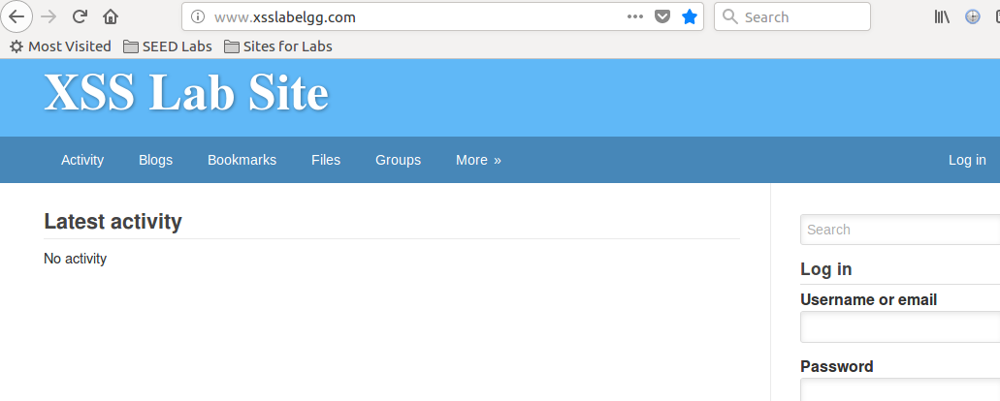
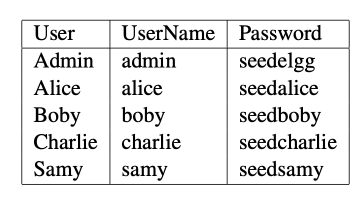

# 跨站脚本攻击

csrf攻击是要受害者访问恶意网站攻击才能得逞。而跨站脚本攻击（XSS）是攻击者必须找到将自己的恶意代码经由
目标网站注入目标用户浏览器的方法。  
将代码注入目标浏览器有两种方法：1、反射型XSS。2、存储型XSS。  

## 反射型XSS攻击

许多网站都有反射行为，就是从用户那边接收输入，执行一些操作，之后向用户发送响应网页，用户的输入也被包含在响应中。
比如搜索xyz，最后显示xyz找不到。

攻击者可以在输入中混入JavaScript代码，这样当输入被反射回浏览器时，JavaScript代码将被注入该网站的网页中。

!!! warning

    承载代码的输入必须从目标用户的计算机发出。

## 存储型XSS攻击

攻击者把数据发给目标网站，网站对数据进行持久性存储，之后，如果网站将存储数据发送给其他用户，那么就在
攻击者和其他用户之间创建了一条通道。

典型的应用比如社交网站的主页，用户评论等。

## XSS能造成的破坏

1、污染网页。比如新闻改成假新闻。  
2、欺骗请求。偷偷发添加好友请求。  
3、窃取信息。包括cookie、网页中显示的个人数据、被网络应用程序存储在本地的数据。  

## 准备实验环境

1、在/etc/hosts中配置
```bash
www.xsslabelgg.com 127.0.0.1
```
2、配置apache
```bash
vi /etc/apache2/sites-available/000-default.conf
```
```xml
<VirtualHost *:80>
    ServerName www.xsslabelgg.com
    DocumentRoot /var/www/XSS/elgg
</VirtualHost>
```

3、准备服务  

服务部署在/var/www/XSS/elgg目录  
准备好的目标网站：  
 

4、建应用服务账户  
